https://www.devbean.net/category/qt-study-road-2/page/9/

[TOC]

------


# QT 学习之路 2（6）：QT 模块简介

Qt 基础模块分为以下几个：

- **Qt Core**，提供核心的非 GUI 功能，所有模块都需要这个模块。这个模块的类包括了动画框架、定时器、各个容器类、时间日期类、事件、IO、JSON、插件机制、智能指针、图形（矩形、路径等）、线程、XML 等。所有这些类都可以通过 <QtCore> 头文件引入。
- **Qt Gui**，提供 GUI 程序的基本功能，包括与窗口系统的集成、事件处理、OpenGL 和 OpenGL ES 集成、2D 图像、字体、拖放等。这些类一般由 Qt 用户界面类内部使用，当然也可以用于访问底层的 OpenGL ES 图像 API。Qt Gui 模块提供的是所有图形用户界面程序都需要的通用功能。

- **Qt Multimedia**，提供视频、音频、收音机以及摄像头等功能。这些类可以通过 <QtMultimedia> 引入，而且需要在 pro 文件中添加 QT += multimedia。

- **Qt Network**，提供跨平台的网络功能。这些类可以通过 <QtNetwork> 引入，而且需要在 pro 文件中添加 QT += network。
- **Qt Qml**，提供供 QML（一种脚本语言，也提供 JavaScript 的交互机制） 使用的 C++ API。这些类可以通过 <QtQml> 引入，而且需要在 pro 文件中添加 QT += qml。
- **Qt Quick**，允许在 Qt/C++ 程序中嵌入 Qt Quick（一种基于 Qt 的高度动画的用户界面，适合于移动平台开发）。这些类可以通过 <QtQuick> 引入，而且需要在 pro 文件中添加 QT += quick。
- **Qt SQL**，允许使用 SQL 访问数据库。这些类可以通过 <QtSql> 引入，而且需要在 pro 文件中添加 QT += sql。
- **Qt Test**，提供 Qt 程序的单元测试功能。这些类可以通过 <QtTest> 引入，而且需要在 pro 文件中添加 QT += testlib。
- **Qt Webkit**，基于 WebKit2 的实现以及一套全新的 QML API（顺便说一下，Qt 4.8 附带的是 QtWebkit 2.2）。

Qt 扩展模块则有更多的选择(但是我还没用到)：

- **Qt 3D**，提供声明式语法，在 Qt 程序中可以简单地嵌入 3D 图像。Qt 3D 为 Qt Quick 添加了 3D 内容渲染。Qt 3D 提供了 QML 和 C++ 两套 API，用于开发 3D 程序。
- **Qt Bluetooth**，提供用于访问蓝牙无线设备的 C++ 和 QML API。
- **Qt Contacts**，用于访问地址簿或者联系人数据库的 C++ 和 QML API。
- **Qt Concurrent**，封装了底层线程技术的类库，方便开发多线程程序。
- **Qt D-Bus**，这是一个仅供 Unix 平台使用的类库，用于利用 D-Bus 协议进行进程间交互。
- **Qt Graphical Effects**，提供一系列用于实现图像特效的类，比如模糊、锐化等。
- **Qt Image Formats**，支持图片格式的一系列插件，包括 TIFF、MNG、TGA 和 WBMP。
- **Qt JS Backend**，该模块没有公开的 API，是 V8 JavaScript 引擎的一个移植。这个模块仅供 QtQml 模块内部使用。
- **Qt Location**，提供定位机制、地图和导航技术、位置搜索等功能的 QML 和 C++ API。
- **Qt OpenGL**，方便在 Qt 应用程序中使用 OpenGL。该模块仅仅为了程序从 Qt 4 移植到 Qt 5 的方便才保留下来，如果你需要在新的 Qt 5 程序中使用 OpenGL 相关技术，需要使用的是 QtGui 模块中的 QOpenGL。
- **Qt Organizer**，使用 QML 和 C++ API 访问组织事件（organizer event）。organizer API 是 Personal Information Management API 的一部分，用于访问 Calendar 信息。通过 Organizer API 可以实现：从日历数据库访问日历时间、导入 iCalendar 事件或者将自己的事件导出到 iCalendar。
- **Qt Print Support**，提供对打印功能的支持。
- **Qt Publish and Subscribe**，为应用程序提供对项目值的读取、导航、订阅等的功能。
- **Qt Quick 1**，从 Qt 4 移植过来的 QtDeclarative 模块，用于提供与 Qt 4 的兼容。如果你需要开发新的程序，需要使用 QtQuick 模块。
- **Qt Script**，提供脚本化机制。这也是为提供与 Qt 4 的兼容性，如果要使用脚本化支持，请使用 QtQml 模块的 QJS* 类。
- **Qt Script Tools**，为使用了 Qt Script 模块的应用程序提供的额外的组件。
- **Qt Sensors**，提供访问各类传感器的 QML 和 C++ 接口。
- **Qt Service Framework**，提供客户端发现其他设备的服务。Qt Service Framework 为在不同平台上发现、实现和访问服务定义了一套统一的机制。
- **Qt SVG**，提供渲染和创建 SVG 文件的功能。
- **Qt System Info**，提供一套 API，用于发现系统相关的信息，比如电池使用量、锁屏、硬件特性等。
- **Qt Tools**，提供了 Qt 开发的方便工具，包括 Qt CLucene、Qt Designer、Qt Help 以及 Qt UI Tools 。

- **Qt Versit**，提供了对 Versit API 的支持。Versit API 是 Personal Information Management API 的一部分，用于 QContacts 和 vCard 以及 QOrganizerItems 和 iCalendar 之间的相互转换。

- **Qt Wayland**，仅用于 Linux 平台，用于替代 QWS，包括 Qt Compositor API（server）和 Wayland 平台插件（clients）。
- **Qt WebKit**，从 Qt 4 移植来的基于 WebKit1 和 QWidget 的 API。
- **Qt Widgets**，使用 C++ 扩展的 Qt Gui 模块，提供了一些界面组件，比如按钮、单选框等。
- **Qt XML**，SAX 和 DOM 的 C++ 实现。该模块已经废除，请使用 QXmlStreamReader/Writer。
- **Qt XML Patterns**，提供对 XPath、XQuery、XSLT 和 XML Schema 验证的支持。

# QT 学习之路 2（7）： mainwindow简介

`QMainWindow`是 Qt 框架带来的一个预定义好的主窗口类。所谓主窗口，就是一个普通意义上的应用程序（不是指游戏之类的那种）最顶层的窗口。比如你现在正在使用的浏览器，那么主窗口就是这个浏览器窗口。试着回想一下经典的主窗口，通常是由一个标题栏，一个菜单栏，若干工具栏和一个任务栏。在这些子组件之间则是我们的工作区。事实上，`QMainWindow`正是这样的一种布局。

我们可以把窗口的部分从上到下分为:

Menu Bar,

Tool Bar Area

Dock Widget Area

Central Widget

Status Bar

# QT 学习之路 2（8）：添加动作

Qt 使用`QAction`类作为动作。顾名思义，这个类就是代表了窗口的一个“动作”，这个动作可能显示在菜单，作为一个菜单项，当用户点击该菜单项，对用户的点击做出响应；也可能在工具栏，作为一个工具栏按钮，用户点击这个按钮就可以执行相应的操作。有一点值得注意：无论是出现在菜单栏还是工具栏，用户选择之后，所执行的动作应该都是一样的。因此，Qt 并没有专门的菜单项类，只是使用一个`QAction`类，抽象出公共的动作。当我们把`QAction`对象添加到菜单，就显示成一个菜单项，添加到工具栏，就显示成一个工具按钮。用户可以通过点击菜单项、点击工具栏按钮、点击快捷键来激活这个动作。

`QAction`包含了图标、菜单文字、快捷键、状态栏文字、浮动帮助等信息。当把一个`QAction`对象添加到程序中时，Qt 自己选择使用哪个属性来显示，无需我们关心。同时，Qt 能够保证把`QAction`对象添加到不同的菜单、工具栏时，显示内容是同步的。也就是说，如果我们在菜单中修改了`QAction`的图标，那么在工具栏上面这个`QAction`所对应的按钮的图标也会同步修改。

下面我们来看看如何在`QMainWindow`中使用`QAction`：

```cpp
// ========== mainwindow.h
#ifndef MAINWINDOW_H
#define MAINWINDOW_H
#include <QMainWindow>
class MainWindow : public QMainWindow
{
    Q_OBJECT
public:
    MainWindow(QWidget *parent = 0);
    ~MainWindow();
private:
    void open();
    QAction *openAction;
};
#endif // MAINWINDOW_H

// ========== mainwindow.cpp
#include <QAction>
#include <QMenuBar>
#include <QMessageBox>
#include <QStatusBar>
#include <QToolBar>
#include "mainwindow.h"

MainWindow::MainWindow(QWidget *parent) :
    QMainWindow(parent)
{
    // 设置主窗口标题
    setWindowTitle(tr("Main Window"));//tr()函数，这是一个用于 Qt 国际化的函数.我们可以使用 Qt 提供的国际化工具，将tr()函数的字符串提取出来，进行国际化。由于所需进行国际化的文本应该被大多数人认识，所以，tr()函数里面一般会是英文文本。

    // 创建打开操作动作
    openAction = new QAction(QIcon(":/images/doc-open"), tr("&Open..."), this);//在QAction构造函数，我们传入了一个图标、一个文本和 this 指针。我们使用了QIcon，传入值是一个字符串，这个字符串对应于 Qt 资源文件中的一段路径。
        /*
        Qt 资源文件的后缀名是 qrc。如果我们使用 Qt Creator，我们可以在新建文件中看到 Qt 资源文件。Qt 资源文件其实是一个 XML 描述的文件，表示 Qt 应用程序所需要的各个资源。
        这里只需要了解，QIcon的参数，以 : 开始，意味着从资源文件中查找资源。:/images/doc-open就是找到了这里的 document-open.png 这个文件。
        QAction第二个参数中，文本值前面有一个 &，意味着这将成为一个快捷键。
        */
    openAction->setShortcuts(QKeySequence::Open);//我们使用了setShortcut()函数，用于说明这个QAction的快捷键。Qt 的QKeySequence为我们定义了很多内置的快捷键，比如我们使用的 Open。你可以通过查阅 API 文档获得所有的快捷键列表。
    openAction->setStatusTip(tr("Open an existing file"));//setStatusTip()则实现了当用户鼠标滑过这个 action 时，会在主窗口下方的状态栏显示相应的提示。
    // 连接打开操作的触发信号到槽函数
    connect(openAction, &QAction::triggered, this, &MainWindow::open);//将这个QAction的triggered()信号与MainWindow类的open()函数连接起来。当用户点击了这个QAction时，会自动触发MainWindow的open()函数。

    //下面的menuBar()、toolBar()和statusBar()三个是QMainWindow的函数，用于创建并返回菜单栏、工具栏和状态栏。
    // 创建文件菜单并添加打开操作
    QMenu *file = menuBar()->addMenu(tr("&File"));
    file->addAction(openAction);

    // 创建工具栏并添加打开操作
    QToolBar *toolBar = addToolBar(tr("&File"));
    toolBar->addAction(openAction);

    // 创建状态栏
    statusBar();//MainWindow默认没有状态栏。调用statusBar()函数的作用是创建一个状态栏并将其添加到MainWindow中。
}

MainWindow::~MainWindow()
{
}

void MainWindow::open()
{
    // 打开操作的槽函数，显示一个信息对话框
    QMessageBox::information(this, tr("Information"), tr("Open"));
}


在Qt中，QAction的位置是根据其在代码中的位置来确定其在QMenuBar或QToolBar中的位置。
在给定的代码中，QAction对象openAction首先被创建，并设置了其图标、文本和快捷键等属性。然后，该QAction对象被添加到QMenu和QToolBar中。
QAction通过QAction::triggered信号来连接到槽函数。
```


# QT 学习之路 2（9）：资源文件

这个没什么说的,很简单, Qt里面的Qt Resource File

# QT 学习之路 2（10）：对象模型

标准 C++ 对象模型在运行时效率方面卓有成效，但是在某些特定问题域下的静态特性就显得捉襟见肘。GUI 界面需要同时具有运行时的效率以及更高级别的灵活性。为了解决这一问题，Qt “扩展”了标准 C++。

所谓“扩展”，实际是在使用标准 C++ 编译器编译 Qt 源程序之前，Qt 先使用一个叫做 moc（Meta Object Compiler，元对象编译器）的工具，先对 Qt 源代码进行一次预处理（*注意，这个预处理与标准 C++ 的预处理有所不同。Qt 的 moc 预处理发生在标准 C++ 预处理器工作之前，并且 Qt 的 moc 预处理不是递归的。*），生成标准 C++ 源代码，然后再使用标准 C++ 编译器进行编译。

如果你曾经为信号函数这样的语法感到奇怪：信号函数是不需要编写实现代码的，那怎么可以通过标准 C++ 的编译呢？，这其实就是 moc 进行了处理之后的效果。


Qt 使用 moc，为标准 C++ 增加了一些特性：

- 信号槽机制，用于解决对象之间的通讯
- 可查询，并且可设计的对象属性；
- 强大的事件机制以及事件过滤器；
- 基于上下文的字符串翻译机制（国际化），也就是 tr() 函数；
- 复杂的定时器实现，用于在事件驱动的 GUI 中嵌入能够精确控制的任务集成；
- 层次化的可查询的对象树，提供一种自然的方式管理对象关系。
- 智能指针（QPointer），在对象析构之后自动设为 0，防止野指针；
- 能够跨越库边界的动态转换机制。

通过继承`QObject`类，我们可以很方便地获得上面这些特性。当然，这些特性都是由 moc 帮助我们实现的。moc 其实实现的是一个叫做元对象系统（meta-object system）的机制。正如上面所说，这是一个标准 C++ 的扩展，使得标准 C++ 更适合于进行 GUI 编程。虽然利用模板可以达到类似的效果，但是 **Qt 没有选择使用模板**。

按照 Qt 官方的说法，模板虽然是内置语言特性，但是其语法实在是复杂，并且由于 GUI 是动态的，利用静态的模板机制有时候很难处理。而自己使用 moc 生成代码更为灵活，虽然效率有些降低（一个信号槽的调用大约相当于四个模板函数调用），不过在现代计算机上，这点性能损耗实在是可以忽略。


现在我们就来解释这个 parent 到底是干什么的：

`QObject`是以对象树的形式组织起来的。当你创建一个`QObject`对象时，会看到`QObject`的构造函数接收一个`QObject`指针作为参数，这个参数就是 parent，也就是父对象指针。这相当于，在创建`QObject`对象时，可以提供一个其父对象，我们创建的这个`QObject`对象会自动添加到其父对象的`children()`列表。当父对象析构的时候，这个列表中的所有对象也会被析构。（**注意，这里的父对象并不是继承意义上的父类！**）这种机制在 GUI 程序设计中相当有用。例如，一个按钮有一个`QShortcut`（快捷键）对象作为其子对象。当我们删除按钮的时候，这个快捷键理应被删除。这是合理的。

当一个`QObject`对象在堆上创建的时候，Qt 会同时为其创建一个对象树。不过，对象树中对象的顺序是没有定义的。这意味着，销毁这些对象的顺序也是未定义的。Qt 保证的是，任何对象树中的 `QObject`对象 delete 的时候，如果这个对象有 parent，则自动将其从 parent 的`children()`列表中删除；如果有孩子，则自动 delete 每一个孩子。Qt 保证没有`QObject`会被 delete 两次，这是由析构顺序决定的。

在 Qt 中，尽量在构造的时候就指定 parent 对象，并且大胆在堆上创建。

```
{
    QPushButton quit("Quit");
    QWidget window;

    quit.setParent(&window);
}
我们看到，在上面的代码中，作为父对象的 window 会首先被析构，因为它是最后一个创建的对象。
在析构过程中，它会调用子对象列表中每一个对象的析构函数，也就是说， quit 此时就被析构了。
然后，代码继续执行，在 window 析构之后，quit 也会被析构，
又因为 quit 也是一个局部变量，在超出作用域的时候当然也需要析构。但是，这时候已经是第二次调用 quit 的析构函数了，C++ 不允许调用两次析构函数，因此，程序崩溃了。
```

# QT 学习之路 2（11）：布局管理器

```cpp
// !!! Qt 5
int main(int argc, char *argv[])
{
    QApplication app(argc, argv);

    QWidget window;
    window.setWindowTitle("Enter your age");

//引入了两个新的组件：QSpinBox和QSlider
//QSpinBox就是只能输入数字的输入框，并且带有上下箭头的步进按钮。QSlider则是带有滑块的滑竿。
    QSpinBox *spinBox = new QSpinBox(&window);
    QSlider *slider = new QSlider(Qt::Horizontal, &window);
    spinBox->setRange(0, 130);
    slider->setRange(0, 130);
    
//将 slider 的valueChanged()信号同 spinBox 的setValue()函数相连
    QObject::connect(slider, &QSlider::valueChanged, spinBox, &QSpinBox::setValue);
    
/*编译器认为QSpinBox::valueChanged是一个 overloaded 的函数。我们看一下QSpinBox的文档发现，QSpinBox的确有两个信号：
void valueChanged(int)
void valueChanged(const QString &)
当我们使用&QSpinBox::valueChanged取函数指针时，编译器不知道应该取哪一个函数的地址，因此报错。解决的方法很简单，编译器不是不能确定哪一个函数吗？那么我们就显式指定一个函数。方法就是，我们创建一个函数指针，这个函数指针参数指定为 int：*/
    void (QSpinBox:: *spinBoxSignal)(int) = &QSpinBox::valueChanged;
    QObject::connect(spinBox, spinBoxSignal, slider, &QSlider::setValue);
    //仔细观察这两个connect()的作用，它们实际完成了一个双向的数据绑定。
    spinBox->setValue(35);

    
    QHBoxLayout *layout = new QHBoxLayout;
    layout->addWidget(spinBox);
    layout->addWidget(slider);
    window.setLayout(layout);

    window.show();

    return app.exec();
}
```

Qt 提供了几种布局管理器供我们选择：

- `QHBoxLayout`：按照水平方向从左到右布局；
- `QVBoxLayout`：按照竖直方向从上到下布局；
- `QGridLayout`：在一个网格中进行布局，类似于 HTML 的 table；
- `QFormLayout`：按照表格布局，每一行前面是一段文本，文本后面跟随一个组件（通常是输入框），类似 HTML 的 form；
- `QStackedLayout`：层叠的布局，允许我们将几个组件按照 Z 轴方向堆叠，可以形成向导那种一页一页的效果。

```cpp
// !!! Qt 4

int main(int argc, char *argv[])
{
    QApplication app(argc, argv);

    QWidget window;
    window.setWindowTitle("Enter your age");

    QSpinBox *spinBox = new QSpinBox(&window);
    QSlider *slider = new QSlider(Qt::Horizontal, &window);
    spinBox->setRange(0, 130);
    slider->setRange(0, 130);

    QObject::connect(slider,  SIGNAL(valueChanged(int)),
                     spinBox, SLOT(setValue(int)));
    QObject::connect(spinBox, SIGNAL(valueChanged(int)),
                     slider,  SLOT(setValue(int)));
    spinBox->setValue(35);

    QHBoxLayout *layout = new QHBoxLayout;
    layout->addWidget(spinBox);
    layout->addWidget(slider);
    window.setLayout(layout);

    window.show();

    return app.exec();
}
```

# QT 学习之路 2（12）：菜单栏、工具栏和状态栏

Qt 将用户与界面进行交互的元素抽象为一种“动作”，使用`QAction`类表示。`QAction`可以添加到菜单上、工具栏上。期间，我们还详细介绍了一些细节问题，比如资源文件的使用、对象模型以及布局管理器。这一节则是详细介绍关于菜单栏、工具栏以及状态栏的相关内容。

我们假设窗口还是建立在`QMainWindow`类之上，这会让我们的开发简单许多。当然，在实际开发过程中，`QMainWindow`通常只作为“主窗口”，对话框窗口则更多地使用`QDialog`类。我们会在后面看到，`QDialog`类会缺少一些`QMainWindow`类提供方便的函数，比如`menuBar()`以及`toolBar()`。

下面还是回到《QT 学习之路 2（8）：添加动作》一文中的代码片段：

```cpp
openAction = new QAction(QIcon(":/images/doc-open"), tr("&Open..."), this);
openAction->setShortcuts(QKeySequence::Open);
openAction->setStatusTip(tr("Open an existing file"));//设置这个动作的描述信息
connect(openAction, &QAction::triggered, this, &MainWindow::open);

QMenu *file = menuBar()->addMenu(tr("&File"));
file->addAction(openAction);

QToolBar *toolBar = addToolBar(tr("&File"));
toolBar->addAction(openAction);
```

我们看到，使用`menuBar()`函数，Qt 为我们创建了一个菜单栏。`menuBar()`是`QMainWindow`提供的函数，因此你是不会在`QWidget`或者`QDialog`中找到它的。这个函数会返回窗口的菜单栏，如果没有菜单栏则会新创建一个。这也就解释了，为什么我们可以直接使用`menuBar()`函数的返回值，毕竟我们并没有创建一个菜单栏对象啊！原来，这就是`menuBar()`为我们创建好并且返回了的。

Qt 中，表示菜单的类是`QMenuBar`（你应该已经想到这个名字了）。`QMenuBar`代表的是窗口最上方的一条菜单栏。我们使用其`addMenu()`函数为其添加菜单。尽管我们只是提供了一个字符串作为参数，但是 Qt 为将其作为新创建的菜单的文本显示出来。至于 & 符号，我们已经解释过，这可以为菜单创建一个快捷键。当我们创建出来了菜单对象时，就可以把`QAction`添加到这个菜单上面，也就是`addAction()`函数的作用。

下面的`QToolBar`部分非常类似。顾名思义，**`QToolBar`就是工具栏**。我们使用的是`addToolBar()`函数添加新的工具栏。为什么前面一个是`menuBar()`而现在的是`addToolBar()`呢？因为一个窗口只有一个菜单栏，但是却可能有多个工具栏。如果我们将代码修改一下：

```
QToolBar *toolBar = addToolBar(tr("&File"));
toolBar->addAction(openAction);

QToolBar *toolBar2 = addToolBar(tr("Tool Bar 2"));
toolBar2->addAction(openAction);
```

现在有两个工具栏了！

工具栏可以设置成固定的、浮动的等等，具体设置可以参考 Qt 文档。

前面我们说过，使用`QAction::setStatusTip()`可以设置该动作在状态栏上的提示文本。但我们现在把鼠标放在按钮上，是看不到这个提示文本的。原因很简单，我们没有添加一个状态栏。怎么添加呢？类似前面的`QMainWindow::menuBar()`，`QMainWindow`有一个`statusBar()`函数。让我们把这个函数添加上去：

```cpp
QToolBar *toolBar2 = addToolBar(tr("Tool Bar 2"));
toolBar2->addAction(openAction);

statusBar();//添加
```

我们添加了一个孤零零的`statuBar()`显得不伦不类，但是，同前面的`menuBar()`的实现类似，这个函数会返回一个`QStatusBar`对象，如果没有则先创建再返回。

`QStatusBar`继承了`QWidget`，因此，我们可以将其它任意`QWidget`子类添加到状态栏，从而实现类似 Photoshop 窗口底部那种有比例显示、有网格开关的复杂状态栏。有关`QStatusBar`的更多信息，请参考 Qt 文档。

对于没有这些函数的`QDialog`或者`QWidget`怎么做呢？要记得，`QToolBar`以及`QStatusBar`都是`QWidget`的子类，因此我们就可以将其结合布局管理器添加到另外的`QWidget`上面。`QLayout`布局提供了`setMenuBar()`函数，可以方便的添加菜单栏。具体细节还是详见文档。


# QT 学习之路 2（13）：对话框简介[模态与非模态]

Qt 中使用`QDialog`类实现对话框。就像主窗口一样，我们通常会设计一个类继承`QDialog`。`QDialog`（及其子类，以及所有`Qt::Dialog`类型的类）的对于其 parent 指针都有额外的解释：如果 parent 为 NULL，则该对话框会作为一个顶层窗口，否则则作为其父组件的子对话框（此时，其默认出现的位置是 parent 的中心）。顶层窗口与非顶层窗口的区别在于，顶层窗口在任务栏会有自己的位置，而非顶层窗口则会共享其父组件的位置。

```cpp
MainWindow::MainWindow(QWidget *parent)
    : QMainWindow(parent)
{
    setWindowTitle(tr("Main Window"));

    openAction = new QAction(QIcon(":/images/doc-open"), tr("&Open..."), this);
    openAction->setShortcuts(QKeySequence::Open);
    openAction->setStatusTip(tr("Open an existing file"));
    connect(openAction, &QAction::triggered, this, &MainWindow::open);

    QMenu *file = menuBar()->addMenu(tr("&File"));
    file->addAction(openAction);

    QToolBar *toolBar = addToolBar(tr("&File"));
    toolBar->addAction(openAction);
}

MainWindow::~MainWindow()
{
}

void MainWindow::open()
{
    QDialog dialog;/*我们使用QDialog创建了一个对话框，设置其标题为“Hello, dialog!”，然后调用exec()将其显示出来。   
    或者写成QDialog dialog(this);我们观察到 parent指针 的有无对 QDialog实例的影响*/
    dialog.setWindowTitle(tr("Hello, dialog!"));
    dialog.exec();
}
```

对话框分为模态对话框和非模态对话框。所谓模态对话框，就是会阻塞同一应用程序中其它窗口的输入。模态对话框很常见，比如“打开文件”功能。你可以尝试一下记事本的打开文件，当打开文件对话框出现时，我们是不能对除此对话框之外的窗口部分进行操作的。

与此相反的是非模态对话框，例如查找对话框，我们可以在显示着查找对话框的同时，继续对记事本的内容进行编辑。

Qt 支持模态对话框和非模态对话框。其中，Qt 有两种级别的模态对话框：`应用程序级别的模态`和`窗口级别的模态`，默认是`应用程序级别的模态`。

- [x] **应用程序级别**的模态是指，当该种模态的对话框出现时，`用户必须首先对对话框进行交互，直到关闭对话框，然后才能访问程序中其他的窗口`。

- [x] **窗口级别**的模态是指，`该模态仅仅阻塞与对话框关联的窗口，但是依然允许用户与程序中其它窗口交互。窗口级别的模态尤其适用于多窗口模式`。(补充:这种模态只阻塞与其父窗口的交互，而不会阻塞与应用程序其他窗口的交互。例如，一个程序中每个文档都使用一个独立的窗口打开，如果使用应用程序级别的模态对话框进行保存，所有文档窗口都会被阻塞；如果使用窗口级别模态对话框，则只有打开它的那个窗口（也就是其父窗口）被阻塞。这种情况显示出，有时候，窗口级别模态要比原来那种一下子阻塞掉整个程序要方便得多。当然，使用这种模态要求对话框必须有一个父窗口。)

Qt 使用`QDialog::exec()`实现应用**程序级别的模态对话框**，使用`QDialog::open()`实现**窗口级别的模态对话框**，使用`QDialog::show()`实现**非模态对话框**。回顾一下我们的代码，在上面的示例中，我们调用了`exec()`将对话框显示出来，因此这就是一个模态对话框。当对话框出现时，我们不能与主窗口进行任何交互，直到我们关闭了该对话框。

下面我们试着将`exec()`修改为`show()`，看看非模态对话框：

```
void MainWindow::open()
{
    QDialog dialog(this);
    dialog.setWindowTitle(tr("Hello, dialog!"));
    dialog.show();
}
```

是不是事与愿违？对话框竟然一闪而过！这是因为，`show()`函数不会阻塞当前线程，对话框会显示出来，然后函数立即返回，代码继续执行。注意，dialog 是建立在栈上的，`show()`函数返回，`MainWindow::open()`函数结束，dialog 超出作用域被析构，因此对话框消失了。知道了原因就好改了，我们将 dialog 改成堆上建立，当然就没有这个问题了：

```cpp
void MainWindow::open()
{
    QDialog *dialog = new QDialog;
    dialog->setWindowTitle(tr("Hello, dialog!"));
    dialog->show();
}
```

对比一下这个非模态对话框和之前的模态对话框。我们在对话框出现的时候可以与主窗口交互，因此我们可以建立多个相同的对话框!

**但是**，如果你足够细心，应该发现上面的代码是有问题的：dialog 存在**内存泄露**！dialog 使用 new 在堆上分配空间，却一直没有 delete。解决方案也很简单：将 MainWindow 的指针赋给 dialog 即可。还记得我们前面说过的 Qt 的对象系统吗？

不过，这样做有一个问题：如果我们的对话框不是在一个界面类中出现呢？由于`QWidget`的 parent 必须是`QWidget`指针，那就限制了我们不能将一个普通的 C++ 类指针传给 Qt 对话框。另外，如果对内存占用有严格限制的话，当我们将主窗口作为 parent 时，主窗口不关闭，对话框就不会被销毁，所以会一直占用内存。在这种情景下，我们可以设置 dialog 的`WindowAttribute`：

```cpp
void MainWindow::open()
{
    QDialog *dialog = new QDialog;
    dialog->setAttribute(Qt::WA_DeleteOnClose);
    dialog->setWindowTitle(tr("Hello, dialog!"));
    dialog->show();
}
```

`setAttribute()`函数设置对话框关闭时，自动销毁对话框。另外，`QObject`还有一个`deleteLater()`函数，该函数会在当前事件循环结束时销毁该对话框（具体到这里，需要使用`exec()`开始一个新的事件循环）。关于事件循环，我们会在后面的章节中详细说明。

# QT 学习之路 2（14）：对话框数据传递

对话框的出现用于完成一个简单的或者是短期的任务。对话框与主窗口之间的数据交互相当重要。本节将讲解**如何在对话框和主窗口之间进行数据交互**。按照前文的讲解，对话框分为**模态和非模态两种**。我们也将以这两种为例，分别进行阐述。

**模态对话框**使用了`exec()`函数将其显示出来。`exec()`函数的真正含义是开启一个新的事件循环（我们会在后面的章节中详细介绍有关事件的概念）。**所谓事件循环，可以理解成一个无限循环**。

**Qt 在开启了事件循环之后，系统发出的各种事件才能够被程序监听到。**

**这个事件循环相当于一种轮询的作用**。*既然是无限循环，当然在开启了事件循环的地方，代码就会被阻塞，后面的语句也就不会被执行到。*因此，对于使用了`exec()`显示的模态对话框，我们可以在`exec()`函数之后直接从对话框的对象获取到数据值。

看一下下面的代码：

```cpp
void MainWindow::open()
{
    QDialog dialog(this);
    dialog.setWindowTitle(tr("Hello, dialog!"));
    dialog.exec();////////////////////
    qDebug() << dialog.result();
}
```

上面的代码中，我们使用`exec()`显示一个模态对话框。最后一行代码，`qDebug()`类似于`std::cout`或者 Java 的`System.out.println();`语句，将后面的信息输出到标准输出，一般就是控制台。使用`qDebug()`需要引入头文件。

在`exec()`函数之后，我们直接可以获取到 dialog 的数据值。注意，`exec()`开始了一个事件循环，代码被阻塞到这里。由于`exec()`函数没有返回，因此下面的`result()`函数也就不会被执行。直到对话框关闭，`exec()`函数返回，此时，我们就可以取得对话框的数据。

需要注意的一点是，**如果我们设置 dialog 的属性为`WA_DeleteOnClose`**，那么当对话框关闭时，对象被销毁，我们就不能使用这种办法获取数据了。在这种情况下，我们可以考虑使用 parent 指针的方式构建对话框，避免设置`WA_DeleteOnClose`属性；或者是利用另外的方式。

实际上，`QDialog::exec()`是有返回值的，其返回值是`QDialog::Accepted`或者`QDialog::Rejected`。一般我们会使用类似下面的代码：

```
QDialog dialog(this);
if (dialog.exec() == QDialog::Accepted) {
    // do something
} else {
    // do something else
}
```

**来判断对话框的返回值，也就是用户是点击了“确定”还是“取消”。**


模态对话框相对简单，如果是**非模态对话框**，`QDialog::show()`函数会立即返回，如果我们也这么写，就不可能取得用户输入的数据。因为`show()`函数不会阻塞主线程，`show()`立即返回，用户还没有来得及输入，就要执行后面的代码，当然是不会有正确结果的。那么我们就应该换一种思路获取数据，那就是使用**信号槽机制**。

由于**非模态对话框在关闭时可以调用`QDialog::accept()`或者`QDialog::reject()`或者更通用的`QDialog::done()`函数**，所以我们可以**在这里发出信号**。另外，如果找不到合适的信号发出点，我们可以**重写`QDialog::closeEvent()`函数**，在这里发出信号。在需要接收数据的窗口（这里是主窗口）连接到这个信号即可。类似的代码片段如下所示：

```cpp
//!!! Qt 5  主要是信号与槽的区别
// in dialog:
void UserAgeDialog::accept()
{
    //当对话框被接受时，通过emit关键字发射了一个userAgeChanged信号，并传递了一个newAge参数（类型为整数）。
    emit userAgeChanged(newAge); // newAge is an int
    QDialog::accept();//调用 QDialog::accept() 是用来接受对话框的用户操作。在 Qt 框架中，accept() 函数表示用户接受了对话框的内容或完成了相关操作。这将导致对话框关闭，并返回给调用方。
    //accept() 函数与“确定”按钮关联，而 reject() 函数与“取消”按钮关联。这样可以根据用户的操作选择执行相应的逻辑。
}

// in main window:
void MainWindow::showUserAgeDialog()
{
    UserAgeDialog *dialog = new UserAgeDialog(this);//一个对话框类UserAgeDialog
    connect(dialog, &UserAgeDialog::userAgeChanged, this, &MainWindow::setUserAge);
    //通过connect函数将其userAgeChanged信号与MainWindow类的setUserAge槽函数连接起来。
    
    dialog->show();
}

// ...

void MainWindow::setUserAge(int age)
{
    //setUserAge函数是MainWindow类中的一个槽函数，接受一个整数参数age，并将其赋值给userAge变量。
    userAge = age;
}
```

# QT 学习之路 2（15）：标准对话框 QMESSAGEBOX


所谓标准对话框，是 Qt 内置的一系列对话框，用于简化开发。事实上，有很多对话框都是通用的，比如打开文件、设置颜色、打印设置等。这些对话框在所有程序中几乎相同，因此没有必要在每一个程序中都自己实现这么一个对话框。

Qt 的内置对话框大致分为以下几类：

- `QColorDialog`：选择颜色；
- `QFileDialog`：选择文件或者目录；
- `QFontDialog`：选择字体；
- `QInputDialog`：允许用户输入一个值，并将其值返回；
- `QMessageBox`：模态对话框，用于显示信息、询问问题等；
- `QPageSetupDialog`：为打印机提供纸张相关的选项；
- `QPrintDialog`：打印机配置；
- `QPrintPreviewDialog`：打印预览；
- `QProgressDialog`：显示操作过程。


这里我们简单地介绍一下标准对话框`QMessageBox`的使用:

`QMessageBox`用于显示消息提示。我们一般会使用其提供的几个 static 函数：

- `void about(QWidget * parent, const QString & title, const QString & text)`：显示关于对话框。这是一个最简单的对话框，其标题是 title，内容是 text，父窗口是 parent。对话框只有一个 OK 按钮。
- `void aboutQt(QWidget * parent, const QString & title = QString())`：显示关于 Qt 对话框。该对话框用于显示有关 Qt 的信息。
- `StandardButton critical(QWidget * parent, const QString & title, const QString & text, StandardButtons buttons = Ok, StandardButton defaultButton = NoButton)`：显示严重错误对话框。这个对话框将显示一个红色的错误符号。我们可以通过 buttons 参数指明其显示的按钮。默认情况下只有一个 Ok 按钮，我们可以使用`StandardButtons`类型指定多种按钮。
- `StandardButton information(QWidget * parent, const QString & title, const QString & text, StandardButtons buttons = Ok, StandardButton defaultButton = NoButton)`：`QMessageBox::information()`函数与`QMessageBox::critical()`类似，不同之处在于这个对话框提供一个普通信息图标。
- `StandardButton question(QWidget * parent, const QString & title, const QString & text, StandardButtons buttons = StandardButtons( Yes | No ), StandardButton defaultButton = NoButton)`：`QMessageBox::question()`函数与`QMessageBox::critical()`类似，不同之处在于这个对话框提供一个问号图标，并且其显示的按钮是“是”和“否”两个。
- `StandardButton warning(QWidget * parent, const QString & title, const QString & text, StandardButtons buttons = Ok, StandardButton defaultButton = NoButton)`：`QMessageBox::warning()`函数与`QMessageBox::critical()`类似，不同之处在于这个对话框提供一个黄色叹号图标。

我们可以通过下面的代码来演示下如何使用`QMessageBox`。

```cpp
if (QMessageBox::Yes == QMessageBox::question(this,
                                              tr("Question"),
                                              tr("Are you OK?"),
                                              QMessageBox::Yes | QMessageBox::No,
                                              QMessageBox::Yes)) {
    QMessageBox::information(this, tr("Hmmm..."), tr("I'm glad to hear that!"));
} else {
    QMessageBox::information(this, tr("Hmmm..."), tr("I'm sorry!"));
}
```

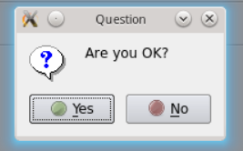


`QMessageBox`类的 static 函数优点是方便使用，缺点也很明显：非常不灵活。我们只能使用简单的几种形式。为了能够定制`QMessageBox`细节，我们必须使用`QMessageBox`的属性设置 API。如果我们希望制作一个询问是否保存的对话框，我们可以使用如下的代码：

```cpp
QMessageBox msgBox;
msgBox.setText(tr("The document has been modified."));
msgBox.setInformativeText(tr("Do you want to save your changes?"));

msgBox.setDetailedText(tr("Differences here..."));
msgBox.setStandardButtons(QMessageBox::Save
                          | QMessageBox::Discard
                          | QMessageBox::Cancel);
msgBox.setDefaultButton(QMessageBox::Save);

int ret = msgBox.exec();
switch (ret) {
case QMessageBox::Save:
    qDebug() << "Save document!";
    break;
case QMessageBox::Discard:
    qDebug() << "Discard changes!";
    break;
case QMessageBox::Cancel:
    qDebug() << "Close document!";
    break;
}
```


# QT 学习之路 2（16）：深入 QT5 信号槽新语法

## 基本用法

Qt 5 引入了信号槽的新语法：使用函数指针能够获得编译期的类型检查。使用我们在自定义信号槽中设计的`Newspaper`类，我们来看看其基本语法：

```cpp
//!!! Qt5
#include <QObject>

////////// newspaper.h
class Newspaper : public QObject
{
    Q_OBJECT
public:
    Newspaper(const QString & name) :
        m_name(name)
    {
    }

    void send() const
    {
        emit newPaper(m_name);
    }

signals://等待发送的信号 =》 邱小姐，小男孩
    void newPaper(const QString &name) const;

private:
    QString m_name;
};

////////// reader.h
#include <QObject>
#include <QDebug>

class Reader : public QObject
{
    Q_OBJECT
public:
    Reader() {}

public slots://槽函数 邱小姐与小男孩携手在小日子的上方绽放
    void receiveNewspaper(const QString & name) const
    {
        qDebug() << "Receives Newspaper: " << name;
    }
};

////////// main.cpp
#include <QCoreApplication>

#include "newspaper.h"
#include "reader.h"

int main(int argc, char *argv[])
{
    QCoreApplication app(argc, argv);

    Newspaper newspaper("Newspaper A");
    Reader reader;
    QObject::connect(&newspaper, &Newspaper::newPaper,//邱小姐带上嫁妆准备出发
                     &reader,    &Reader:: receiveNewspaper);//绽放！
    newspaper.send();

    return app.exec();
}
```

在`main()`函数中，我们使用`connect()`函数将`newspaper`对象的`newPaper()`信号与`reader`对象的`receiveNewspaper()`槽函数联系起来。

当`newspaper`发出这个信号时，`reader`相应的槽函数就会自动被调用。这里我们使用了取址操作符，取到`Newspaper::newPaper()`信号的地址，同样类似的取到了`Reader::receiveNewspaper()`函数地址。

编译器能够利用这两个地址，在编译期对这个连接操作进行检查，如果有个任何错误（包括对象没有这个信号，或者信号参数不匹配等），编译时就会发现。<font color=orange>相比Qt4，Qt5这个是一个巨大的进步！</font>

## 有重载的信号

如果信号有重载，比如我们向`Newspaper`类增加一个新的信号：

```
void newPaper(const QString &name, const QDate &date);
```

此时如果还是按照前面的写法，编译器会报出一个错误：由于这个函数有重载，因此不能用一个取址操作符获取其地址(<font color=orange>两个函数名一样，不能仅仅只靠函数名来确定是那个函数（两个都叫小男孩该，但一个是原子弹，另外一个是热核弹，到底应该发射哪一个呢？）</font>)。回想一下 Qt 4 中的处理。在 Qt 4 中，我们使用`SIGNAL`和`SLOT`两个宏来连接信号槽。如果有一个带有两个参数的信号，像上面那种，那么，我们就可以使用下面的代码：

```
QObject::connect(&newspaper, SIGNAL(newPaper(QString, QDate)),
                 &reader,    SLOT(receiveNewspaper(QString, QDate)));
```

注意，我们临时增加了一个`receiveNewspaper()`函数的重载，以便支持两个参数的信号。在 Qt 4 中不存在我们所说的错误，因为 Qt 4 的信号槽连接是带有参数的。因此，Qt 能够自己判断究竟是哪一个信号对应了哪一个槽。

对此，我们也给出了一个解决方案，使用一个函数指针来指明到底是哪一个信号：

```cpp
void (Newspaper:: *newPaperNameDate)(const QString &, const QDate &) = &Newspaper::newPaper;

QObject::connect(&newspaper, newPaperNameDate,
                 &reader,    &Reader::receiveNewspaper);
```

这样，我们使用了函数指针`newspaperNameDate`声明一个带有`QString`和`QDate`两个参数，返回值是 void 的函数，将该函数作为信号，与`Reader::receiveNewspaper()`槽连接起来。这样，我们就回避了之前编译器的错误。归根结底，这个错误是因为函数重载，编译器不知道要取哪一个函数的地址，而我们显式指明一个函数就可以了。

如果你觉得这种写法很难看，想像前面一样写成一行，当然也是由解决方法的：

```cpp
QObject::connect(&newspaper,//参数一
                 (void (Newspaper:: *)(const QString &, const QDate &))&Newspaper::newPaper,//参数二
                 &reader,//参数三
                 &Reader::receiveNewspaper);//参数四
```

这是一种换汤不换药的做法：我们只是声明了一个匿名的函数指针，而之前我们的函数指针是有名字的。不过，我们并不推荐这样写，而是希望以下的写法：

```cpp
QObject::connect(&newspaper,//参数一
                 static_cast< void (Newspaper:: *)(const QString &, const QDate &) >(&Newspaper::newPaper),//参数二
                 &reader,//参数三
                 &Reader::receiveNewspaper);//参数四
```

对比上面两种写法。第一个使用的是 C 风格的强制类型转换。此时，如果你改变了信号的类型，那么你就会有一个潜在的运行时错误。例如，如果我们把

`(const QString &, const QDate &)`

两个参数修改成

`(const QDate &, const QString &)`，

**C 风格的强制类型转换就会失败**，并且**这个错误只能在运行时发现**。而第二种则是 C++ 推荐的风格，**当参数类型改变时，编译器会检测到这个错误**。

## 带有默认参数的槽函数

Qt 允许信号和槽的参数数目不一致：**槽函数的参数数目可以比信号的参数少。**

**（仔细想想也知道，eg：信号给我们提供了三个参数，但是我们只用到了其中两个，也是可以的！）**

这是因为，我们信号的参数实际是作为一种返回值。正如普通的函数调用一样，我们可以选择忽略函数返回值，但是不能使用一个并不存在的返回值。

如果槽函数的参数数目比信号的多，在槽函数中就使用到这些参数的时候，实际这些参数并不存在（因为信号的参数比槽的少，因此并没有传过来），函数就会报错。

这种情况往往有两个原因：一是槽的参数就是比信号的少，此时我们可以像前面那种写法直接连接。另外一个原因是，信号的参数带有默认值。比如

```cpp
void QPushButton::clicked(bool checked = false)
```

就是这种情况。

然而，有一种情况，槽函数的参数可以比信号的多，那就是槽函数的参数带有默认值。比如，我们的`Newspaper`和`Reader`有下面的代码：

```cpp
// Newspaper
signals:
    void newPaper(const QString &name);
// Reader
    void receiveNewspaper(const QString &name, const QDate &date = QDate::currentDate());
```

虽然`Reader::receiveNewspaper()`的参数数目比`Newspaper::newPaper()`多，但是由于`Reader::receiveNewspaper()`后面一个参数带有默认值，所以该参数不是必须提供的。但是，如果你按照前面的写法，比如如下的代码：

```cpp
QObject::connect(&newspaper,//参数一
                 static_cast<void (Newspaper:: *)(const QString &)>(&Newspaper::newPaper),//参数二
                 &reader,//参数三
                 static_cast<void (Reader:: *)(const QString &, const QDate & =QDate::currentDate())>(&Reader::receiveNewspaper));//参数四
```

你会得到一个断言错误：

```
The slot requires more arguments than the signal provides.
```

**我们不能在函数指针中使用函数参数的默认值**。这是 C++ 语言的限制：**参数默认值只能使用在直接地函数调用中。当使用函数指针取其地址的时候，默认参数是不可见的！**

当然，此时你可以选择 Qt 4 的连接语法。如果你还是想使用 Qt 5 的新语法，目前的办法只有一个：Lambda 表达式。于是，我们的代码就变成了：

```cpp
QObject::connect(&newspaper,//参数一
                 static_cast<void (Newspaper:: *)(const QString &)>(&Newspaper::newPaper),//参数二
                 [=](const QString &name) { /* Your code here. */ });//参数三
```

# QT 学习之路 2（17）：文件对话框

在前面的章节中，我们讨论了 Qt 标准对话框`QMessageBox`的使用。所谓标准对话框，其实也就是一个普通的对话框。

但是，我们同样可以将`QDialog`所提供的其它特性应用到这种标准对话框上面。

今天，我们来讨论另外一个标准对话框：`QFileDialog`，也就是文件对话框。

在本节中，我们将尝试编写一个简单的文本文件编辑器，我们将使用`QFileDialog`来打开一个文本文件，并将修改过的文件保存到硬盘。

首先，我们需要创建一个带有文本编辑功能的窗口。借用我们前面的程序代码，应该可以很方便地完成：

```cpp
openAction = new QAction(QIcon(":/images/file-open"), tr("&Open..."), this);//打开的动作
openAction->setShortcuts(QKeySequence::Open);//快捷键
openAction->setStatusTip(tr("Open an existing file"));//状态栏

saveAction = new QAction(QIcon(":/images/file-save"), tr("&Save..."), this);//保存的动作
saveAction->setShortcuts(QKeySequence::Save);
saveAction->setStatusTip(tr("Save a new file"));

QMenu *file = menuBar()->addMenu(tr("&File"));//给菜单栏添加一个File
file->addAction(openAction);
file->addAction(saveAction);

QToolBar *toolBar = addToolBar(tr("&File"));//给工具栏添加一个File
toolBar->addAction(openAction);
toolBar->addAction(saveAction);

/*
一个`QTextEdit`类，这个类用于显示富文本文件。也就是说，它不仅仅用于显示文本，还可以显示图片、表格等等。不过，我们现在只用它显示纯文本文件。`QMainWindow`有一个`setCentralWidget()`函数，可以将一个组件作为窗口的中心组件，放在窗口中央显示区。显然，在一个文本编辑器中，文本编辑区就是这个中心组件，因此我们将`QTextEdit`作为这种组件。
*/
textEdit = new QTextEdit(this);
setCentralWidget(textEdit);
```

我们使用`connect()`函数，为这两个`QAction`对象添加响应的动作：

```cpp
/// !!!Qt5
connect(openAction, &QAction::triggered, this, &MainWindow::openFile);
connect(saveAction, &QAction::triggered, this, &MainWindow::saveFile);

/// !!!Qt4
connect(openAction, SIGNAL(triggered()), this, SLOT(openFile()));
connect(saveAction, SIGNAL(triggered()), this, SLOT(saveFile()));
```

下面是最主要的`openFile()`和`saveFile()`这两个函数的代码：

```cpp
void MainWindow::openFile()
{
    QString path = QFileDialog::getOpenFileName(this,
                                                tr("Open File"),
                                                ".",
                                                tr("Text Files(*.txt)"));
    if(!path.isEmpty()) {
        /*
		如果选择了一个文件并且可以成功打开它，则其内容将加载到QTextEdit名为 的对象中textEdit。
        */
        QFile file(path);
        if (!file.open(QIODevice::ReadOnly | QIODevice::Text)) {
            QMessageBox::warning(this, tr("Read File"),
                                 tr("Cannot open file:\n%1").arg(path));
            return;
        }
        QTextStream in(&file);
        textEdit->setText(in.readAll());
        file.close();
    } else {
        /* 如果打开文件时出错或未选择文件，则会显示错误消息框。*/
        QMessageBox::warning(this, tr("Path"),
                             tr("You did not select any file."));
    }
}

void MainWindow::saveFile()
{
    QString path = QFileDialog::getSaveFileName(this,
                                                tr("Open File"),
                                                ".",
                                                tr("Text Files(*.txt)"));
    if(!path.isEmpty()) {
        QFile file(path);
        if (!file.open(QIODevice::WriteOnly | QIODevice::Text)) {
            QMessageBox::warning(this, tr("Write File"),
                                       tr("Cannot open file:\n%1").arg(path));
            return;
        }
        QTextStream out(&file);
        out << textEdit->toPlainText();
        file.close();
    } else {
        QMessageBox::warning(this, tr("Path"),
                             tr("You did not select any file."));
    }
}
```

在`openFile()`函数中，我们使用`QFileDialog::getOpenFileName()`来获取需要打开的文件的路径。这个函数具有一个长长的签名：

```cpp
QString getOpenFileName(QWidget * parent = 0,
                        const QString & caption = QString(),
                        const QString & dir = QString(),
                        const QString & filter = QString(),
                        QString * selectedFilter = 0,
                        Options options = 0)
```

不过注意，它的所有参数都是可选的，因此在一定程度上说，这个函数也是简单的。这六个参数分别是：

- parent：父窗口。我们前面介绍过，Qt 的标准对话框提供静态函数，用于返回一个模态对话框（在一定程度上这就是外观模式的一种体现）；
- caption：对话框标题；
- dir：对话框打开时的默认目录，“.” 代表程序运行目录，“/” 代表当前盘符的根目录（特指 Windows 平台；Linux 平台当然就是根目录），这个参数也可以是平台相关的，比如“C:\\”等；
- filter：过滤器。我们使用文件对话框可以浏览很多类型的文件，但是，很多时候我们仅希望打开特定类型的文件。比如，文本编辑器希望打开文本文件，图片浏览器希望打开图片文件。过滤器就是用于过滤特定的后缀名。如果我们使用“Image Files(*.jpg *.png)”，则只能显示后缀名是 jpg 或者 png 的文件。如果需要多个过滤器，使用“;;”分割，比如“JPEG Files(*.jpg);;PNG Files(*.png)”；
- selectedFilter：默认选择的过滤器；
- options：对话框的一些参数设定，比如只显示文件夹等等，它的取值是`enum QFileDialog::Option`，每个选项可以使用 | 运算组合起来。

`QFileDialog::getOpenFileName()`返回值是选择的文件路径。我们将其赋值给 path。通过判断 path 是否为空，可以确定用户是否选择了某一文件。只有当用户选择了一个文件时，我们才执行下面的操作。在`saveFile()`中使用的`QFileDialog::getSaveFileName()`也是类似的。

首先，我们创建一个`QFile`对象，将用户选择的文件路径传递给这个对象。然后我们需要打开这个文件，使用的是`QFile::open()`，其参数是指定的打开方式，这里我们使用只读方式和文本方式打开这个文件（因为我们选择的是后缀名 txt 的文件，可以认为是文本文件。当然，在实际应用中，可能需要进行进一步的判断）。`QFile::open()`打开成功则返回 true，由此继续进行下面的操作：使用`QTextStream::readAll()`读取文件**所有**内容，然后将其**赋值给`QTextEdit`**显示出来。最后**不要忘记关闭文件**。另外，`saveFile()`函数也是类似的，只不过最后一步，我们使用`<<`重定向，**将`QTextEdit`的内容输出到一个文件中**。关于文件操作，我们会在后面的章节中进一步介绍。

至此，我们的代码已经介绍完毕，马上可以编译运行一下了：

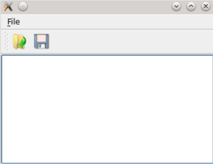

# QT 学习之路 2（18）：事件

**事件（event）是由系统或者 Qt 本身在不同的时刻发出的。**当用户**按下鼠标、敲下键盘，或者是窗口需要重新绘制**的时候，都会**发出一个相应的事件**。一些事件在对用户操作**做出响应**时发出，如**键盘事件**等；另一些事件则是由**系统**自动发出，如**计时器事件**。

**事件**也就是我们通常说的**事件驱动程序设计**的基础概念。**事件的出现**，使得程序代码**不会**按照**原始的线性顺序执行**。想想看，从**最初的 C 语言开始**，我们的程序就是**以一种线性的顺序**执行代码：**这一条语句执行之后，开始执行下一条语句**；**这一个函数执行过后，开始执行下一个函数**。这种类似“**批处理**”的**程序设计风格**显然不适合于处理**复杂的用户交互**。我们来想象一下**用户交互**的情景：我们设计了**一堆功能**放在界面上，**用户点击了“打开文件”**，于是**开始执行打开文件的操作**；**用户点击了“保存文件”**，于是**开始执行保存文件的操作**。我们不知道用户究竟想进行什么操作，因此也就不能预测接下来将会调用哪一个函数。**如果我们设计了一个“文件另存为”的操作，如果用户不点击，这个操作将永远不会被调用**。这就是所谓的**“事件驱动”**，**我们的程序的执行顺序不再是线性的**，而是由**一个个事件驱动着程序**继续执行。*没有事件，程序将阻塞在那里，不执行任何代码。*

<font color=red>在 Qt 中，**事件的概念**似乎同**信号槽**类似。</font>的确如此，一般来说，**使用 Qt 组件时，我们并不会把主要精力放在事件上**。因为在 Qt 中，我们关心的更多的是**事件关联的一个信号**。比如，对于`QPushButton`的鼠标点击，我们**不需要关心这个鼠标点击事件**，而是**关心它的`clicked()`信号的发出**。

但是，**Qt 中的事件和信号槽却并不是可以相互替代的**。**信号**由**具体的对象**发出，然后会马上交给由`connect()`函数**连接的槽**进行处理；而对于**事件**，Qt 使用**一个事件队列**对所有发出的事件进行维护，当**新的事件产生**时，会**被追加到事件队列的尾部**。*前一个事件完成后，取出后面的事件进行处理。*

但是，**必要的时候，Qt 的事件也可以不进入事件队列，而是直接处理**。信号一旦发出，对应的槽函数一定会被执行。但是，事件则可以使用**“事件过滤器”**进行过滤，**对于有些事件进行额外的处理，另外的事件则不关心**。

总的来说，如果我们**使用**组件，我们关心的是**信号槽**；如果我们**自定义**组件，我们关心的是**事件**。

因为我们可以**通过事件**来改变**组件的默认操作**。比如，如果我们要**自定义**一个**能够响应鼠标事件**的`EventLabel`，我们就需要**重写`QLabel`的鼠标事件**，**做出我们希望的操作**，有可能还得**在恰当的时候发出一个类似按钮的`clicked()`信号**（如果我们希望让这个`EventLabel`能够被其它组件使用）或者其它的信号。

在前面我们也曾经简单提到，Qt 程序需要在`main()`函数创建一个`QCoreApplication`对象，然后调用它的`exec()`函数。这个函数就是开始 **Qt 的事件循环**。在执行`exec()`函数之后，**程序将进入事件循环来监听应用程序的事件**。**当事件发生时，Qt 将创建一个事件对象**。**Qt 中所有事件类**都继承于`QEvent`。**在事件对象创建完毕后**，Qt 将这个**事件对象**传递给`QObject`的`event()`函数。`event()`函数并**不直接处理**事件，而是按照事件对象的类型分派给**特定**的**事件处理函数**（event handler）。关于这一点，我们会在以后的章节中详细说明。

在所有组件的父类`QWidget`中，定义了很多事件处理的回调函数，如`keyPressEvent()`、`keyReleaseEvent()`、`mouseDoubleClickEvent()`、`mouseMoveEvent()`、`mousePressEvent()`、`mouseReleaseEvent()`等。这些函数都是 protected virtual 的，也就是说，我们可以**在子类中重新实现这些函数**。下面来看一个例子：

```cpp
class EventLabel : public QLabel
{
protected:
    void mouseMoveEvent(QMouseEvent *event);//移动
    void mousePressEvent(QMouseEvent *event);//按下
    void mouseReleaseEvent(QMouseEvent *event);//抬起
};

void EventLabel::mouseMoveEvent(QMouseEvent *event)
{
    this->setText(QString("<center><h1>Move: (%1, %2)</h1></center>")
                  .arg(QString::number(event->x()), QString::number(event->y())));
}

void EventLabel::mousePressEvent(QMouseEvent *event)
{
    this->setText(QString("<center><h1>Press: (%1, %2)</h1></center>")
                  .arg(QString::number(event->x()), QString::number(event->y())));
}

void EventLabel::mouseReleaseEvent(QMouseEvent *event)
{
    QString msg;
    msg.sprintf("<center><h1>Release: (%d, %d)</h1></center>",
                event->x(), event->y());//写入msg
    this->setText(msg);
}

int main(int argc, char *argv[])
{
    QApplication a(argc, argv);

    EventLabel *label = new EventLabel;
    label->setWindowTitle("MouseEvent Demo");
    label->resize(300, 200);
    label->show();

    return a.exec();
}
```

我们编译运行上面的代码，就可以理解到**有关事件的使用方法**。

`EventLabel`继承了`QLabel`，覆盖了`mousePressEvent()`、`mouseMoveEvent()`和`MouseReleaseEvent()`三个函数。我们并没有添加什么功能，**只是在鼠标按下（press）、鼠标移动（move）和鼠标释放（release）的时候，把当前鼠标的坐标值显示在这个`Label`上面**。由于`QLabel`是**支持 HTML** 代码的，因此我们直接**使用了 HTML 代码来格式化文字**。

`QString`的`arg()`函数可以自动替换掉`QString`中出现的占位符。其占位符以 % 开始，后面是占位符的位置，例如 %1，%2 这种。

```cpp
QString("[%1, %2]").arg(x, y);
```

语句将会使用 **x 替换 %1，y 替换 %2**，因此，这个语句生成的`QString`为 [x, y]。

在`mouseReleaseEvent()`函数中，我们使用了另外一种`QString`的构造方法。我们使用类似 C 风格的格式化函数`sprintf()`来构造`QString`。

运行上面的代码，**当我们点击了一下鼠标之后，label 上将显示鼠标当前坐标值。**

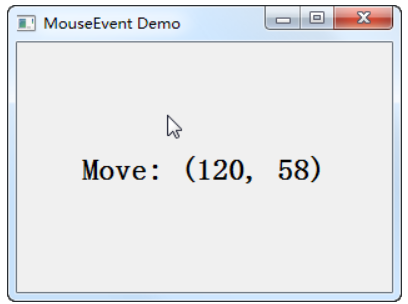

**为什么要点击鼠标之后才能在`mouseMoveEvent()`函数中显示鼠标坐标值**？这是因为`QWidget`中有一个`mouseTracking`属性，**该属性用于设置是否追踪鼠标**。只有鼠标被追踪时，`mouseMoveEvent()`才会发出。如果`mouseTracking`是 **false**（默认即是），组件在**至少一次鼠标点击之后**，才能够被追踪，也就是能够发出`mouseMoveEvent()`事件。如果`mouseTracking`为 true，则`mouseMoveEvent()`直接可以被发出。知道了这一点，我们就可以在`main()`函数中直接设置下：

```cpp
EventLabel *label = new EventLabel;
label->setWindowTitle("MouseEvent Demo");
label->resize(300, 200);
label->setMouseTracking(true);
label->show();
```

这样子就没有这个问题了。

# QT 学习之路 2（19）：事件的接受与忽略

我们曾经提到，事件可以依情况接受和忽略。

首先来看一段代码：

```cpp
//!!! Qt5
// ---------- custombutton.h ---------- //
class CustomButton : public QPushButton
{
    Q_OBJECT
public:
    CustomButton(QWidget *parent = 0);
private:
    void onButtonCliecked();
};

// ---------- custombutton.cpp ---------- //
CustomButton::CustomButton(QWidget *parent) :
    QPushButton(parent)
{
    connect(this, &CustomButton::clicked,
            this, &CustomButton::onButtonCliecked);
}

void CustomButton::onButtonCliecked()
{
    qDebug() << "You clicked this!";
}

// ---------- main.cpp ---------- //
int main(int argc, char *argv[])
{
    QApplication a(argc, argv);

    CustomButton btn;
    btn.setText("This is a Button!");
    btn.show();

    return a.exec();
}
```

这是一段简单的代码，经过我们前面一段时间的学习，我们已经能够知道这段代码的运行结果：点击按钮，会在控制台打印出“You clicked this!”字符串。

下面，我们向`CustomButton`类添加一个事件函数：

```cpp
// CustomButton
...
protected:
    void mousePressEvent(QMouseEvent *event);//事件最好用protected
...

// ---------- custombutton.cpp ---------- //
...
void CustomButton::mousePressEvent(QMouseEvent *event)
{
    if (event->button() == Qt::LeftButton) {
        qDebug() << "left";
    } else {
        QPushButton::mousePressEvent(event);//调用父类的同名函数
    }
}
...
```

我们重写了`CustomButton`的`mousePressEvent()`函数，也就是**鼠标按下**。在这个函数中，我们判断如果鼠标按下的是**左键**，则**打印出来“left”字符串**，否则，**调用父类的同名函数**。编译运行这段代码，**当我们点击左键按钮时，“You clicked this!”字符串不再出现，只有一个“left”。**

也就是说，**我们把父类的实现覆盖掉了**（<font color=red>重写事件会覆盖掉原有的信号</font>）。由此可以看出，**父类`QPushButton`的`mousePressEvent()`函数中肯定发出了`clicked()`信号**，否则的话，我们的槽函数怎么会不执行了呢？

这暗示我们一个非常重要的细节：**当重写事件回调函数时，时刻注意是否需要通过调用父类的同名函数来确保原有实现仍能进行！**比如我们的`CustomButton`类，如果像我们这么覆盖函数，**`clicked()`信号永远不会发生，你连接到这个信号的槽函数也就永远不会被执行**。**这个错误非常隐蔽，很可能会浪费你很多时间才能找到**。因为**这个错误不会有任何提示**。这一定程度上说，**我们的组件“忽略”了父类的事件**，但这更多的是一种违心之举，一种错误。

通过调用**父类的同名函数**，我们可以把 **Qt 的事件传递**看成**链状**：如果**子类没有处理这个事件，就会继续向其父类传递**。**Qt 的事件对象**有两个函数：`accept()`和`ignore()`。正如它们的名字一样，前者用来告诉 Qt，这个类的事件处理函数**想要**处理这个事件；后者则告诉 Qt，这个类的事件处理函数**不想要**处理这个事件。在事件处理函数中，可以使用`isAccepted()`来查询这个事件**是不是已经被接收**了。具体来说：如果一个事件处理函数调用了一个事件对象的`accept()`函数，这个事件就**不会被继续传播**给其**父组件**；如果它调用了事件的`ignore()`函数，Qt 会**从其父组件中寻找另外的接受者**。（<font color=red>儿子要了，就不再往上找了；如果儿子不要，就找爸爸. 爸爸不要再找爷爷...</font>）

事实上，我们**很少会使用`accept()`和`ignore()`函数**，而是像上面的示例一样，如果**希望忽略事件（所谓忽略，是指自己不想要这个事件），只要调用父类的响应函数即可**。记得我们曾经说过，<font color=red>Qt 中的事件都是 protected 的</font>，因此，**重写的函数必定存在着其父类中的响应函数**，所以，这个方法是可行的。**为什么要这么做，而不是自己去手动调用这两个函数呢**？因为我们**无法确认父类中的这个处理函数有没有额外的操作**。如果我们在子类中**直接忽略事件**，Qt 会去寻找**其他的接收者**，**该子类的父类的操作会被忽略**（因为**没有调用父类的同名函数**），这可能会有潜在的危险。**为了避免自己去调用`accept()`和`ignore()`函数，而是尽量调用父类实现**，Qt 做了特殊的设计：**事件对象默认是 accept 的，而作为所有组件的父类`QWidget`的默认实现则是调用`ignore()`。**这么一来，如果**你自己实现事件处理函数**，不调用`QWidget`的默认实现，你就等于是**接受**了事件；如果你要**忽略**事件，**只需调用`QWidget`的默认实现**。这一点我们前面已经说明。下面可以从代码级别来理解这一点，我们可以查看一下`QWidget`的`mousePressEvent()`函数的实现：

```cpp
//!!! Qt5
void QWidget::mousePressEvent(QMouseEvent *event)
{
    event->ignore();
    if ((windowType() == Qt::Popup)) {//////////Popup/////////////
        event->accept();
        QWidget* w;
        while ((w = QApplication::activePopupWidget()) && w != this){
            w->close();
            if (QApplication::activePopupWidget() == w)
                w->hide(); // hide at least
        }
        if (!rect().contains(event->pos())){
            close();
        }
    }
}
```

这段代码在 Qt4 和 Qt5 中基本一致（区别在于`activePopupWidget()`一行，Qt4 的版本是`qApp->activePopupWidget()`）。

注意函数的第一个语句：`event->ignore()`，如果子类都没有重写这个函数，Qt 会默认忽略这个事件，继续寻找下一个事件接收者。

如果我们在子类的`mousePressEvent()`函数中**直接调用**了`accept()`或者`ignore()`，而没有**调用父类的同名函数**，`QWidget::mousePressEvent()`函数中关于`Popup`判断的那段代码就不会被执行，因此可能会出现默认其妙的怪异现象。

针对`accept()`和`ignore()`，我们再来看一个例子：

```cpp
class CustomButton : public QPushButton
{
    Q_OBJECT
public:
    CustomButton(QWidget *parent) : QPushButton(parent)
    {
    }
protected:
    void mousePressEvent(QMouseEvent *event)
    {
        qDebug() << "CustomButton";
    }
};


class CustomButtonEx : public CustomButton
{
    Q_OBJECT
public:
    CustomButtonEx(QWidget *parent) : CustomButton(parent)
    {
    }
protected:
    void mousePressEvent(QMouseEvent *event)
    {
    	event->accept();//event->ignore()
        qDebug() << "CustomButtonEx";
    }
};


class CustomWidget : public QWidget
{
    Q_OBJECT
public:
    CustomWidget(QWidget *parent) : QWidget(parent)
    {
    }
protected:
    void mousePressEvent(QMouseEvent *event)
    {
		QWidget::mousePressEvent(event);//如果你把QWidget::mousePressEvent(event)改成event->ignore()，结果也是一样的。这正如我们前面说的，QWidget的默认是调用event->ignore()。
        qDebug() << "CustomWidget";
    }
};

class MainWindow : public QMainWindow
{
    Q_OBJECT
public:
    MainWindow(QWidget *parent = 0) : QMainWindow(parent)
    {
        CustomWidget *widget = new CustomWidget(this);
        CustomButton *cbex = new CustomButton(widget);
        cbex->setText(tr("CustomButton"));
        CustomButtonEx *cb = new CustomButtonEx(widget);
        cb->setText(tr("CustomButtonEx"));
        QVBoxLayout *widgetLayout = new QVBoxLayout(widget);
        widgetLayout->addWidget(cbex);
        widgetLayout->addWidget(cb);
        this->setCentralWidget(widget);
    }
protected:
    void mousePressEvent(QMouseEvent *event)
    {
        qDebug() << "MainWindow";
    }
};
```

这段代码在一个`MainWindow`中添加了一个`CustomWidget`，里面有两个按钮对象：`CustomButton`和`CustomButtonEx`。**每一个类都重写了`mousePressEvent()`函数**。运行程序点击 CustomButtonEx，结果是

```
CustomButtonEx
```

这是因为我们重写了**鼠标按下**的事件，但是并没有调用父类函数或者显式设置`accept()`或`ignore()`。下面我们在`CustomButtonEx`的`mousePressEvent()`第一行增加一句`event->accept()`，重新运行，发现结果不变。正如我们前面所说，`QEvent`默认是`accept`的，调用这个函数并没有什么区别。然后我们将`CustomButtonEx`的`event->accept()`改成`event->ignore()`。这次运行结果是

```
CustomButtonEx
CustomWidget
```

`ignore()`说明我们想让事件继续传播，于是`CustomButtonEx`的父组件`CustomWidget`也收到了这个事件，所以输出了自己的结果。同理，`CustomWidget`又没有调用父类函数或者显式设置`accept()`或`ignore()`，所以事件传播就此打住。这里值得注意的是，`CustomButtonEx`的事件传播给了父组件`CustomWidget`，而不是它的父类`CustomButton`。**事件的传播是在组件层次上面的，而不是依靠类继承机制。**

接下来我们继续测试，在`CustomWidget`的`mousePressEvent()`中增加`QWidget::mousePressEvent(event)`。这次的输出是

```
CustomButtonEx
CustomWidget
MainWindow
```

如果你把`QWidget::mousePressEvent(event)`改成`event->ignore()`，结果也是一样的。这正如我们前面说的，`QWidget`的默认是调用`event->ignore()`。

在一个特殊的情形下，**我们必须使用`accept()`和`ignore()`函数**，那就是**窗口关闭**的事件。对于窗口关闭`QCloseEvent`事件，**调用`accept()`意味着 Qt 会停止事件的传播，窗口关闭**；调用`ignore()`则意味着事件**继续**传播，即**阻止**窗口关闭。回到我们前面写的简单的文本编辑器。我们在构造函数中添加如下代码：

```cpp
//!!! Qt5
...
textEdit = new QTextEdit(this);
setCentralWidget(textEdit);
connect(textEdit, &QTextEdit::textChanged, [=]() {
    this->setWindowModified(true);
});

setWindowTitle("TextPad [*]");
...

void MainWindow::closeEvent(QCloseEvent *event)
{
    if (isWindowModified()) {
        bool exit = QMessageBox::question(this,
                                      tr("Quit"),
                                      tr("Are you sure to quit this application?"),
                                      QMessageBox::Yes | QMessageBox::No,
                                      QMessageBox::No) == QMessageBox::Yes;
        if (exit) {
            event->accept();
        } else {
            event->ignore();
        }
    } else {
        event->accept();
    }
}
```

上面的操作是在 Qt GUI 应用程序中实现一个常见的特性：当窗口中的文本被修改时，在窗口标题栏中显示一个特殊的标记（"*"），并且当关闭这个已被修改的窗口时，提示用户是否确实要退出。

代码中的关键部分是：

- `setWindowTitle("TextPad [*]");` ：为窗口设置标题，通过使用 "[\*]"，此处是用来表明如果窗口内容发生改变，Qt 会自动在标题的 "\*" 位置换成 "\*"，以表明窗口已经被修改过。

- `connect(textEdit, &QTextEdit::textChanged, [=]() {this->setWindowModified(true);});` ：

  这是一个连接，当 `textEdit` 对象中的文本发生改变时，它将调用 `setWindowModified(true)`。这将窗口状态设置为已修改，触发在窗口标题上显示 "*"。

- 重写的 `closeEvent(QCloseEvent *event)` 函数：

  在这个函数中，你首先检查窗口是否被修改（ `isWindowModified()` ） 。如果是，就显示一个消息框询问用户是否确定要退出。

  如果用户点击 “Yes”，就接受关闭事件，窗口将被关闭；

  如果用户点击 “No”，就忽略这个事件，窗口将保持打开。

  如果窗口没有被修改，就直接接受关闭事件，窗口将被关闭。

这代表了一个普遍的设计模式，让用户在退出之前确认他们的更改，因此在诸如文本编辑器这样的应用程序中很常见。  

# QT 学习之路 2（20）：EVENT()

前面的章节中我们曾经提到`event()`函数。

事件对象创建完毕后，Qt 将这个事件对象传递给`QObject`的`event()`函数。

`event()`函数并不直接处理事件，而是将这些事件对象按照它们不同的类型，分发给不同的事件处理器（event handler）。

如上所述，`event()`函数主要用于事件的分发。

所以，如果你希望在**事件分发之前**做一些操作，就可以重写这个`event()`函数了。例如，我们希望在一个`QWidget`组件中监听 tab 键的按下，那么就可以继承`QWidget`，并重写它的`event()`函数，来达到这个目的：

```cpp
bool CustomWidget::event(QEvent *e)
{
    if (e->type() == QEvent::KeyPress) {//按下
        QKeyEvent *keyEvent = static_cast<QKeyEvent *>(e);
        if (keyEvent->key() == Qt::Key_Tab) {//Tab键
            qDebug() << "You press tab.";
            return true;
        }
    }
    return QWidget::event(e);
}
```

`CustomWidget`是一个普通的`QWidget`子类。

我们重写了它的`event()`函数，这个函数有一个`QEvent`对象作为参数，也就是需要转发的事件对象。

函数返回值是 bool 类型。如果传入的事件已被识别并且处理，则需要返回 true，否则返回 false。

如果返回值是 true，并且，该事件对象设置了`accept()`，那么 Qt 会认为这个事件已经处理完毕，不会再将这个事件发送给其它对象，而是会继续处理事件队列中的下一事件。

注意，在`event()`函数中，调用事件对象的`accept()`和`ignore()`函数是没有作用的，不会影响到事件的传播。

**在Qt中，事件对象的accept()和ignore()函数在event()函数内部调用是没有直接影响的。**


我们可以通过使用`QEvent::type()`函数可以检查事件的实际类型，其返回值是`QEvent::Type`类型的枚举。我们处理过自己感兴趣的事件之后，可以直接返回 true，表示我们已经对此事件进行了处理；

对于其它我们不关心的事件，则需要调用父类的`event()`函数继续转发，否则这个组件就只能处理我们定义的事件了。为了测试这一种情况，我们可以尝试下面的代码：

```
bool CustomTextEdit::event(QEvent *e)
{
    if (e->type() == QEvent::KeyPress) {
        QKeyEvent *keyEvent = static_cast< QKeyEvent * >(e);
        if (keyEvent->key() == Qt::Key_Tab) {
            qDebug() << "You press tab.";
            return true;
        }
    }
    return false;
}
```

`CustomTextEdit`是`QTextEdit`的一个子类。我们重写了其`event()`函数，却没有调用父类的同名函数。

这样，我们的组件就只能处理 Tab 键，再也无法输入任何文本，也不能响应其它事件，比如鼠标点击之后也不会有光标出现。

这是因为我们只处理的`KeyPress`类型的事件，并且如果不是`KeyPress`事件，则直接返回 false，鼠标事件根本不会被转发，也就没有了鼠标事件。

通过查看`QObject::event()`的实现，我们可以理解，`event()`函数同前面的章节中我们所说的事件处理器有什么联系：

```
//!!! Qt5
bool QObject::event(QEvent *e)
{
    switch (e->type()) {
    case QEvent::Timer:
        timerEvent((QTimerEvent*)e);
        break;

    case QEvent::ChildAdded:
    case QEvent::ChildPolished:
    case QEvent::ChildRemoved:
        childEvent((QChildEvent*)e);
        break;
    // ...
    default:
        if (e->type() >= QEvent::User) {
            customEvent(e);
            break;
        }
        return false;
    }
    return true;
}
```

这是 Qt 5 中`QObject::event()`函数的源代码。我们可以看到，同前面我们所说的一样，Qt 也是使用`QEvent::type()`判断事件类型，然后调用了特定的事件处理器。比如，如果`event->type()`返回值是`QEvent::Timer`，则调用`timerEvent()`函数。

事实也的确如此。`timerEvent()`和`mouseMoveEvent()`这样的函数，就是我们前面章节所说的事件处理器 event handler。

也就是说，`event()`函数中实际是通过事件处理器来响应一个具体的事件。这相当于`event()`函数将具体事件的处理“委托”给具体的事件处理器。而这些事件处理器是 protected virtual 的，因此，我们重写了某一个事件处理器，即可让 Qt 调用我们自己实现的版本。

由此可以见，`event()`是一个集中处理不同类型的事件的地方。如果你不想重写一大堆事件处理器，就可以重写这个`event()`函数，通过`QEvent::type()`判断不同的事件。

鉴于重写`event()`函数需要十分小心注意父类的同名函数的调用，一不留神就可能出现问题，所以一般还是建议只重写事件处理器（当然，也必须记得是不是应该调用父类的同名处理器）。

这其实暗示了`event()`函数的另外一个作用：屏蔽掉某些不需要的事件处理器。正如我们前面的`CustomTextEdit`例子看到的那样，我们创建了一个只能响应 tab 键的组件。这种作用是重写事件处理器所不能实现的。


# QT 学习之路 2（21）：事件过滤器

有时候，对象需要查看、甚至要拦截发送到另外对象的事件。例如，对话框可能想要拦截按键事件，不让别的组件接收到；或者要修改回车键的默认处理。


Qt 创建了`QEvent`事件对象之后，会调用`QObject`的`event()`函数处理事件的分发。

我们可以在`event()`函数中实现拦截的操作。由于`event()`函数是 protected 的，因此，需要继承已有类。

如果组件很多，就需要重写很多个`event()`函数。这当然相当麻烦，更不用说重写`event()`函数还得小心一堆问题。好在 Qt 提供了另外一种机制来达到这一目的：事件过滤器。

`QObject`有一个`eventFilter()`函数，用于建立事件过滤器。这个函数的签名如下：

**virtual** bool QObject::eventFilter **(** QObject * watched, QEvent * event **)**;

这个函数正如其名字显示的那样，是一个“事件过滤器”。所谓事件过滤器，可以理解成一种过滤代码。想想做化学实验时用到的过滤器，可以将杂质留到滤纸上，让过滤后的液体溜走。

事件过滤器也是如此：它会检查接收到的事件。如果这个事件是我们感兴趣的类型，就进行我们自己的处理；如果不是，就继续转发。这个函数返回一个 bool 类型，如果你想将参数 event 过滤出来，比如，不想让它继续转发，就返回 true，否则返回 false。

事件过滤器的调用时间是      目标对象（参数里面的`watched`对象）接收到事件对象之前。也就是说，如果你在事件过滤器中停止了某个事件，那么，`watched`对象以及以后所有的事件过滤器根本不会知道这么一个事件。

我们来看一段简单的代码：


```cpp
class MainWindow : public QMainWindow
 {
 public:
     MainWindow();
 protected:
     bool eventFilter(QObject *obj, QEvent *event);
 private:
     QTextEdit *textEdit;
 };
 MainWindow::MainWindow()
 {
     textEdit = new QTextEdit;
     setCentralWidget(textEdit);
     textEdit->installEventFilter(this);
 }
 bool MainWindow::eventFilter(QObject *obj, QEvent *event)
 {
     if (obj == textEdit) {
         if (event->type() == QEvent::KeyPress) {
             QKeyEvent *keyEvent = static_cast<QKeyEvent *>(event);
             qDebug() << "Ate key press" << keyEvent->key();
             return true;
         } else {
             return false;
         }
     } else {
         // pass the event on to the parent class
         return QMainWindow::eventFilter(obj, event);
     }
 }
```

`MainWindow`是我们定义的一个类。我们重写了它的`eventFilter()`函数。为了过滤特定组件上的事件，首先需要判断这个对象是不是我们感兴趣的组件，然后判断这个事件的类型。在上面的代码中，我们不想让`textEdit`组件处理键盘按下的事件。所以，**首先我们找到这个组件，如果这个事件是键盘事件，则直接返回 true，也就是过滤掉了这个事件，其他事件还是要继续处理，所以返回 false**。对于其它的组件，我们并不保证是不是还有过滤器，于是最保险的办法是调用父类的函数。

`eventFilter()`函数相当于创建了过滤器，然后我们需要安装这个过滤器。安装过滤器需要调用`QObject::installEventFilter()`函数。这个函数的签名如下：

```
void QObject::installEventFilter ( QObject * filterObj )
```

这个函数接受一个`QObject *`类型的参数。记得刚刚我们说的，`eventFilter()`函数是`QObject`的一个成员函数，因此，任意`QObject`都可以作为事件过滤器（问题在于，如果你没有重写`eventFilter()`函数，这个事件过滤器是没有任何作用的，因为默认什么都不会过滤）。已经存在的过滤器则可以通过`QObject::removeEventFilter()`函数移除。

我们可以向一个对象上面安装多个事件处理器，只要调用多次`installEventFilter()`函数。如果一个对象存在多个事件过滤器，那么，最后一个安装的会第一个执行，也就是后进先执行的顺序。

还记得我们前面的那个例子吗？我们使用`event()`函数处理了 Tab 键：

```
bool CustomWidget::event(QEvent *e)
{
    if (e->type() == QEvent::KeyPress) {
        QKeyEvent *keyEvent = static_cast<QKeyEvent *>(e);
        if (keyEvent->key() == Qt::Key_Tab) {
            qDebug() << "You press tab.";
            return true;
        }
    }
    return QWidget::event(e);
}
```


现在，我们可以给出一个使用事件过滤器的版本：

```
bool FilterObject::eventFilter(QObject *object, QEvent *event)
{
    if (object == target && event->type() == QEvent::KeyPress) {
        QKeyEvent *keyEvent = static_cast<QKeyEvent *>(event);
        if (keyEvent->key() == Qt::Key_Tab) {
            qDebug() << "You press tab.";
            return true;
        } else {
            return false;
        }
    }
    return false;
}
```

事件过滤器的强大之处在于，我们可以为整个应用程序添加一个事件过滤器。记得，`installEventFilter()`函数是`QObject`的函数，`QApplication`或者`QCoreApplication`对象都是`QObject`的子类，因此，我们可以向`QApplication`或者`QCoreApplication`添加事件过滤器。这种全局的事件过滤器将会在所有其它特性对象的事件过滤器之前调用。尽管很强大，但这种行为会严重降低整个应用程序的事件分发效率。因此，除非是不得不使用的情况，否则的话我们不应该这么做。

**注意，如果你在事件过滤器中 delete 了某个接收组件，务必将函数返回值设为 true。否则，Qt 还是会将事件分发给这个接收组件，从而导致程序崩溃。**

事件过滤器和被安装过滤器的组件必须在同一线程，否则，过滤器将不起作用。另外，如果在安装过滤器之后，这两个组件到了不同的线程，那么，只有等到二者重新回到同一线程的时候过滤器才会有效。

# QT 学习之路 2（22）：事件总结

Qt 的事件是整个 Qt 框架的核心机制之一，也比较复杂。说它复杂，更多是因为它涉及到的函数众多，而处理方法也很多，有时候让人难以选择。现在我们简单总结一下 Qt 中的事件机制。

Qt 中有很多种事件：鼠标事件、键盘事件、大小改变的事件、位置移动的事件等等。如何处理这些事件，实际有两种选择：

第一，所有事件对应一个事件处理函数，在这个事件处理函数中用一个很大的分支语句进行选择

第二，每一种事件对应一个事件处理函数。Qt 就是使用的这么一种机制：

- `mouseEvent()`
- `keyPressEvent()`
- ...

Qt 具有这么多种事件处理函数，肯定有一个地方对其进行分发，否则，Qt 怎么知道哪一种事件调用哪一个事件处理函数呢？这个分发的函数，就是`event()`。显然，当`QMouseEvent`产生之后，`event()`函数将其分发给`mouseEvent()`事件处理器进行处理。

`event()`函数会有两个问题：省略。

于是，Qt 提供了另外一种解决方案：事件过滤器。事件过滤器给我们一种能力，让我们能够完全移除某种事件。事件过滤器可以安装到任意`QObject`类型上面，并且可以安装多个。如果要实现全局的事件过滤器，则可以安装到`QApplication`或者`QCoreApplication`上面。这里需要注意的是，如果使用`installEventFilter()`函数给一个对象安装事件过滤器，那么该事件过滤器只对该对象有效，只有这个对象的事件需要先传递给事件过滤器的`eventFilter()`函数进行过滤，其它对象不受影响。如果给`QApplication`对象安装事件过滤器，那么该过滤器对程序中的每一个对象都有效，任何对象的事件都是先传给`eventFilter()`函数。

事件过滤器可以解决刚刚我们提出的`event()`函数的两点不足：首先，事件过滤器不是 protected 的，因此我们可以向任何`QObject`子类安装事件过滤器；其次，事件过滤器在目标对象接收到事件之前进行处理，如果我们将事件过滤掉，目标对象根本不会见到这个事件。


现在我们可以总结一下 Qt 的事件处理，实际上是有五个层次：

1. 重写`paintEvent()`、`mousePressEvent()`等事件处理函数。这是最普通、最简单的形式，同时功能也最简单。
2. 重写`event()`函数。`event()`函数是所有对象的事件入口，`QObject`和`QWidget`中的实现，默认是把事件传递给特定的事件处理函数。
3. 在特定对象上面安装事件过滤器。该过滤器仅过滤该对象接收到的事件。
4. 在`QCoreApplication::instance()`上面安装事件过滤器。该过滤器将过滤所有对象的所有事件，因此和`notify()`函数一样强大，但是它更灵活，因为可以安装多个过滤器。全局的事件过滤器可以看到 disabled 组件上面发出的鼠标事件。全局过滤器有一个问题：只能用在主线程。
5. 重写`QCoreApplication::notify()`函数。这是最强大的，和全局事件过滤器一样提供完全控制，并且不受线程的限制。但是全局范围内只能有一个被使用（因为`QCoreApplication`是单例的）。

为了进一步了解这几个层次的事件处理方式的调用顺序，我们可以编写一个测试代码：

```cpp
class Label : public QWidget
{
public:
    Label()
    {
        installEventFilter(this);
    }

    bool eventFilter(QObject *watched, QEvent *event)
    {
        if (watched == this) {
            if (event->type() == QEvent::MouseButtonPress) {
                qDebug() << "eventFilter";
            }
        }
        return false;
    }

protected:
    void mousePressEvent(QMouseEvent *)
    {
        qDebug() << "mousePressEvent";
    }

    bool event(QEvent *e)
    {
        if (e->type() == QEvent::MouseButtonPress) {
            qDebug() << "event";
        }
        return QWidget::event(e);
    }
};

class EventFilter : public QObject
{
public:
    EventFilter(QObject *watched, QObject *parent = 0) :
        QObject(parent),
        m_watched(watched)
    {
    }

    bool eventFilter(QObject *watched, QEvent *event)
    {
        if (watched == m_watched) {
            if (event->type() == QEvent::MouseButtonPress) {
                qDebug() << "QApplication::eventFilter";
            }
        }
        return false;
    }

private:
    QObject *m_watched;
};

int main(int argc, char *argv[])
{
    QApplication app(argc, argv);
    Label label;
    app.installEventFilter(new EventFilter(&label, &label));
    label.show();
    return app.exec();
}
```

我们可以看到，鼠标点击之后的输出结果是：

```cpp
QApplication::eventFilter 
eventFilter 
event 
mousePressEvent
```

因此可以知道，全局事件过滤器被第一个调用，之后是该对象上面的事件过滤器，其次是`event()`函数，最后是特定的事件处理函数。

# QT 学习之路 2（23）：自定义事件

Qt 自定义事件很简单，同其它类库的使用很相似，都是要继承一个类进行扩展。在 Qt 中，你需要继承的类是`QEvent`。

创建自定义事件类型是通过继承QEvent类并提供自定义事件类型，可以定义新的事件对象。

继承QEvent类，最重要的是提供一个QEvent::Type类型的参数，作为自定义事件的类型值。回忆一下，这个 type 是我们在处理事件时用于识别事件类型的代号。比如在event()函数中，我们使用QEvent::type()获得这个事件类型，然后与我们定义的实际类型对比。

`QEvent::Type`是`QEvent`定义的一个枚举。因此，我们可以传递一个 int 值。但是需要注意的是，我们的自定义事件类型不能和已经存在的 type 值重复，否则会有不可预料的错误发生。因为系统会将你新增加的事件当做系统事件进行派发和调用。

在 Qt 中，**0 ~ 999 是系统自己用的**，也就是说，你的事件 type 要大于 999。这种数值当然非常难记，所以 Qt 定义了两个边界值：**`QEvent::User`和`QEvent::MaxUser`。我们的自定义事件的 type 应该在这两个值的范围之间。其中，`QEvent::User`的值是 1000，`QEvent::MaxUser`的值是 65535。从这里知道，我们最多可以定义 64536 个事件。**

通过这两个枚举值，我们可以保证我们自己的事件类型**不会覆盖系统定义的事件类型**。但是，这样并不能保证自定义事件相互之间不会被覆盖。为了解决这个问题，Qt 提供了一个函数：`registerEventType()`，用于自定义事件的注册。该函数签名如下：

```
static int QEvent::registerEventType ( int hint = -1 );
```

这个函数是 static 的，因此可以使用`QEvent`类直接调用。函数接受一个 int 值，其默认值是 -1；**函数返回值是向系统注册的新的 Type 类型的值**。如果 hint 是合法的，也就是说这个 hint 不会发生任何覆盖（系统的以及其它自定义事件的），则会直接返回这个值；否则，系统会自动分配一个合法值并返回。因此，使用这个函数即可完成 type 值的指定。**这个函数是线程安全的，不必另外添加同步。**

我们可以在`QEvent`子类中添加自己的事件所需要的数据，然后进行事件的发送。Qt 中提供了两种事件发送方式：

1

```
static bool QCoreApplication::sendEvent(QObject *receiver, QEvent *event);
```

直接将`event`事件发送给`receiver`接受者，使用的是`QCoreApplication::notify()`函数。函数返回值就是事件处理函数的返回值。在事件被发送的时候，`event`对象并不会被销毁。通常我们会在栈上创建`event`对象，例如：

```cpp
QMouseEvent event(QEvent::MouseButtonPress, pos, 0, 0, 0);
QApplication::sendEvent(mainWindow, &event);
```

2

```
static void QCoreApplication::postEvent(QObject *receiver, QEvent *event);
```

将`event`事件及其接受者`receiver`一同追加到事件队列中，函数立即返回。

因为 post 事件队列会持有事件对象，并且在其 post 的时候将其 delete 掉，因此，我们必须在堆上创建`event`对象。当对象被发送之后，再试图访问`event`对象就会出现问题（因为 post 之后，`event`对象就会被 delete）。

当控制权返回到主线程循环时，保存在事件队列中的所有事件都通过`notify()`函数发送出去。

事件会根据 post 的顺序进行处理。如果你想要改变事件的处理顺序，可以考虑为其指定一个优先级。默认的优先级是`Qt::NormalEventPriority`。


Qt 还提供了一个函数：

```
static void QCoreApplication::sendPostedEvents(QObject *receiver, int event_type);
```

这个函数的作用是，将事件队列中的接受者为`receiver`，事件类似为 event_type 的所有事件立即发送给 receiver 进行处理。需要注意的是，来自窗口系统的事件并不由这个函数进行处理，而是`processEvent()`。详细信息请参考 Qt API 手册。

现在，我们已经能够自定义事件对象，已经能够将事件发送出去，还剩下最后一步：处理自定义事件。处理自定义事件，同前面我们讲解的那些处理方法没有什么区别。我们可以重写`QObject::customEvent()`函数，该函数接收一个`QEvent`对象作为参数：

```
void QObject::customEvent(QEvent *event);
```

我们可以通过转换 event 对象类型来判断不同的事件：

```
void CustomWidget::customEvent(QEvent *event) {
    CustomEvent *customEvent = static_cast<CustomEvent *>(event);
    // ...
}
```

当然，我们也可以在`event()`函数中直接处理：

```
bool CustomWidget::event(QEvent *event) {
    if (event->type() == MyCustomEventType) {
        CustomEvent *myEvent = static_cast<CustomEvent *>(event);
        // processing...
        return true;
    }
    return QWidget::event(event);
}
```


# QT 学习之路 2（24）：QT 绘制系统简介

Qt 的绘图系统允许使用相同的 API 在屏幕和其它打印设备上进行绘制。整个绘图系统基于`QPainter`，`QPainterDevice`和`QPaintEngine`三个类。


`QPainter`用来执行绘制的操作；`QPaintDevice`是一个二维空间的抽象，这个二维空间允许`QPainter`在其上面进行绘制，也就是`QPainter`工作的空间；`QPaintEngine`提供了画笔（`QPainter`）在不同的设备上进行绘制的统一的接口。

`QPaintEngine`类应用于`QPainter`和`QPaintDevice`之间，通常对开发人员是透明的。除非你需要自定义一个设备，否则你是不需要关心`QPaintEngine`这个类的。

<font color=orange>我们可以把`QPainter`理解成**画笔**；把`QPaintDevice`理解成**使用画笔的地方，比如纸张、屏幕等**；而对于纸张、屏幕而言，肯定要使用不同的画笔绘制，为了统一使用一种画笔，我们设计了`QPaintEngine`类，**这个类让不同的纸张、屏幕都能使用一种画笔。**</font>

下图给出了这三个类之间的层次结构（出自 Qt API 文档）：

QPainter->QPainterDevice->QPaintEngine

这告诉我们，Qt 的绘图系统实际上是，使用`QPainter`在`QPainterDevice`上进行绘制，它们之间使用`QPaintEngine`进行通讯（也就是翻译`QPainter`的指令）。

下面我们通过一个实例来介绍`QPainter`的使用：

```cpp
//!!! Qt4/Qt5

class PaintedWidget : public QWidget
{
    Q_OBJECT
public:
    PaintedWidget(QWidget *parent = 0);//构造
protected:
    void paintEvent(QPaintEvent *);
};
```

注意我们重写了`QWidget`的`paintEvent()`函数。这或许是我们在理解了 Qt 事件系统之后首次实际应用。接下来就是`PaintedWidget`的源代码：

```cpp
//!!! Qt4/Qt5

PaintedWidget::PaintedWidget(QWidget *parent) :
    QWidget(parent)//构造
{
    resize(800, 600);
    setWindowTitle(tr("Paint Demo"));
}

void PaintedWidget::paintEvent(QPaintEvent *)//成员函数，重写PaintedWidget事件函数
{
    QPainter painter(this);
    painter.drawLine(80, 100, 650, 500);
    painter.setPen(Qt::red);
    painter.drawRect(10, 10, 100, 400);
    painter.setPen(QPen(Qt::green, 5));
    painter.setBrush(Qt::blue);
    painter.drawEllipse(50, 150, 400, 200);
}
```

在构造函数中，我们仅仅设置了窗口的大小和标题。而`paintEvent()`函数则是绘制的代码。首先，我们在栈上创建了一个`QPainter`对象，也就是说，每次运行`paintEvent()`函数的时候，都会重建这个`QPainter`对象。注意，这一点可能会引发某些细节问题：由于我们每次重建`QPainter`，因此第一次运行时所设置的画笔颜色、状态等，第二次再进入这个函数时就会全部丢失。有时候我们希望保存画笔状态，就必须自己保存数据，否则的话则需要将`QPainter`作为类的成员变量。

paintEvent() 作为重绘函数，会在需要重绘时由 Qt 自动调用。“需要重绘”可能发生在很多地方，比如**组件刚刚创建出来的时候就需要重绘；组件最大化、最小化的时候也需要重新绘制**；**组件由遮挡变成完全显示的时候**也需要等等。

`QPainter`接收一个`QPaintDevice`指针作为参数。`QPaintDevice`有很多子类，比如`QImage`，以及`QWidget`。

<font color=orange>注意回忆一下，`QPaintDevice`可以理解成要在哪里去绘制，而现在我们希望画在这个组件，因此传入的是 this 指针。</font>

`QPainter`有很多以 draw 开头的函数，用于各种图形的绘制，比如这里的`drawLine()`，`drawRect()`以及`drawEllipse()`等。

<font color=orange>当绘制轮廓线时，使用`QPainter`的`pen()`属性。</font>

比如，我们调用了`painter.setPen(Qt::red)`将 pen 设置为红色，则下面绘制的矩形具有红色的轮廓线。接下来，我们将 pen 修改为绿色，5 像素宽（`painter.setPen(QPen(Qt::green, 5))`），又设置了画刷为蓝色。这时候再调用 draw 函数，则是具有绿色 5 像素宽轮廓线、蓝色填充的椭圆。

运行一下我们的程序，可以看到最终效果：

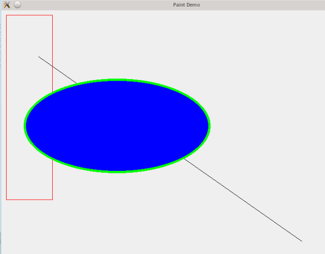


我们会在后面的章节详细介绍画笔`QPen`和画刷`QBrush`的属性。

<font color=orange>另外要说明一点，请注意我们的绘制顺序，首先是直线，然后是矩形，最后是椭圆。</font>按照这样的绘制顺序，可以看到直线是第一个绘制，位于最下一层；矩形是第二个绘制，在中间一层；椭圆是最后绘制，在最上层。

如果了解 OpenGL，肯定听说过这么一句话：<font color=orange>OpenGL 是一个状态机</font>。所谓状态机，就是说，<font color=orange>OpenGL 保存的只是各种状态</font>。比如，将画笔颜色设置成红色，那么，除非你重新设置另外的颜色，它的颜色会一直是红色。<font color=orange>`QPainter`也是这样</font>，它的状态不会自己恢复，除非你使用了各种设置函数。

因此，如果在上面的代码中，我们在椭圆绘制之后再画一个矩形，它的样式还会是绿色 5 像素的轮廓线以及蓝色的填充，除非你显式地调用了设置函数进行状态的更新。这是大多数绘图系统的实现方式，包括 OpenGL、`QPainter`以及 Java2D。

正因为`QPainter`是一个状态机，才会引出我们前面曾经介绍过的一个细节问题：由于`paintEvent()`是需要重复进入的，<font color=orange>因此，需要注意第二次进入时，`QPainter`的状态是不是和第一次一致，否则的话可能会造成闪烁的现象。这个闪烁并不是由于双缓冲的问题，而是由于绘制状态的快速切换。</font>

# QT 学习之路 2（25）：画刷和画笔

前面一章我们提到，Qt 绘图系统定义了两个绘制时使用的关键属性：画刷和画笔。<font color=orange>前者使用`QBrush`描述，大多用于填充；后者使用`QPen`描述，大多用于绘制轮廓线。</font>

`QBrush`定义了`QPainter`的填充模式，具有样式、颜色、渐变以及纹理等属性。

画刷的`style()`定义了填充的样式，使用`Qt::BrushStyle`枚(<font color=red>表示一直类型，就和int一样</font>)举，默认值是`Qt::NoBrush`，也就是不进行任何填充。我们可以从下面的图示中看到各种填充样式的区别：

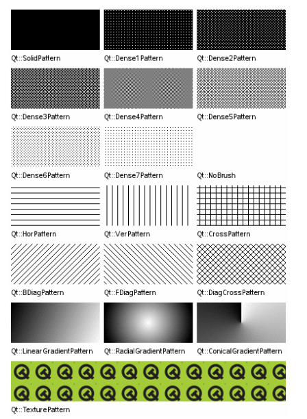

画刷的**`color()`**定义了填充模式的颜色。这个颜色可以是 Qt 预定义的颜色常量，也就是`Qt::GlobalColor`，也可以是任意`QColor`对象。

画刷的**`gradient()`**定义了渐变填充。这个属性只有在样式是`Qt::LinearGradientPattern`、`Qt::RadialGradientPattern`或者`Qt::ConicalGradientPattern`之一时才有效。渐变可以由`QGradient`对象表示。Qt 提供了三种渐变：`QLinearGradient`、`QConicalGradient`和`QRadialGradient`，它们都是`QGradient`的子类。我们可以使用如下代码片段来定义一个渐变的画刷：

```cpp
QRadialGradient gradient(50, 50, 50, 50, 50);
gradient.setColorAt(0, QColor::fromRgbF(0, 1, 0, 1));
gradient.setColorAt(1, QColor::fromRgbF(0, 0, 0, 0));

QBrush brush(gradient);//画刷填充
```

当画刷样式是 `Qt::TexturePattern`时，**`texture()`**定义了用于填充的纹理。注意，即使你没有设置样式为`Qt::TexturePattern`，当你调用**`setTexture()`**函数时，`QBrush`会自动将**`style()`**设置为`Qt::TexturePattern`。

`QPen`定义了用于`QPainter`应该怎样画线或者轮廓线。画笔具有样式、宽度、画刷、笔帽样式和连接样式等属性。画笔的样式**`style()`**定义了线的样式。画刷`brush()`用于填充画笔所绘制的线条。笔帽样式**`capStyle()`**定义了使用`QPainter`绘制的线的末端；连接样式`joinStyle()`则定义了两条线如何连接起来。画笔宽度**`width()`**或**`widthF()`**定义了画笔的宽。

**注意，不存在宽度为 0 的线。假设你设置 width 为 0，`QPainter`依然会绘制出一条线，而这个线的宽度为 *1* 像素**。也就是说，<font color=orange>画笔宽度通常至少是 1 像素。</font>

这么多参数既可以在**构造**时指定，也可以使用**set 函数**指定，完全取决于你的习惯，例如：

```cpp
QPainter painter(this);
QPen pen(Qt::green, 3, Qt::DashDotLine, Qt::RoundCap, Qt::RoundJoin);
painter.setPen(pen);
```

等价于

```cpp
QPainter painter(this);
QPen pen;  // creates a default pen

pen.setStyle(Qt::DashDotLine);//5个参数
pen.setWidth(3);
pen.setBrush(Qt::green);
pen.setCapStyle(Qt::RoundCap);
pen.setJoinStyle(Qt::RoundJoin);

painter.setPen(pen);//画笔绘制轮廓
```

默认的画笔属性是纯黑色，0 像素，方形笔帽（`Qt::SquareCap`），斜面型连接（`Qt::BevelJoin`）。

下面是画笔样式的示例：

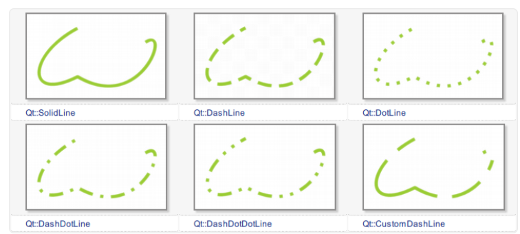

你也可以使用**`setDashPattern()`函数自定义样式**，例如如下代码片段：

```cpp
 QPen pen;
 QVector<qreal> dashes;
 qreal space = 4;

 dashes << 1 << space << 3 << space << 9 << space
        << 27 << space << 9 << space;

 pen.setDashPattern(dashes);//自定义样式
```

笔帽定义了画笔末端的样式，例如：


他们之间的区别是，`Qt::SquareCap`是一种包含了最后一个点的方形端点，使用半个线宽覆盖；`Qt::FlatCap`不包含最后一个点；`Qt::RoundCap`是包含最后一个点的圆形端点。

<font color=orange>注意，我们前面说了，`QPainter`也是一个状态机，这里我们所说的这些属性都是处于这个状态机之中的，因此，我们应该记得是否要将其保存下来或者是重新构建。</font>

# QT 学习之路 2（26）：反走样

我们在光栅图形显示器上绘制非水平、非垂直的直线或多边形边界时，或多或少会呈现锯齿状外观。这是因为直线和多边形的边界是连续的，而光栅则是由离散的点组成。在光栅显示设备上表现直线、多边形等，必须在离散位置采样。

由于采样不充分重建后造成的信息失真，就叫走样；<font color=orange>用于减少或消除这种效果的技术，就称为反走样。</font>

反走样是图形学中的重要概念，<font color=orange>用以防止通常所说的“锯齿”现象的出现。</font>很多系统的绘图 API 里面都内置了有关反走样的算法，不过由于性能问题，默认一般是关闭的，Qt 也不例外。下面我们来看看代码：

```cpp
void paintEvent(QPaintEvent *)
{
    QPainter painter(this);
    painter.setPen(QPen(Qt::black, 5, Qt::DashDotLine, Qt::RoundCap));
    painter.setBrush(Qt::yellow);
    painter.drawEllipse(50, 150, 200, 150);

    painter.setRenderHint(QPainter::Antialiasing, true);
    painter.setPen(QPen(Qt::black, 5, Qt::DashDotLine, Qt::RoundCap));
    painter.setBrush(Qt::yellow);
    painter.drawEllipse(300, 150, 200, 150);
}
```

看看运行后的结果：

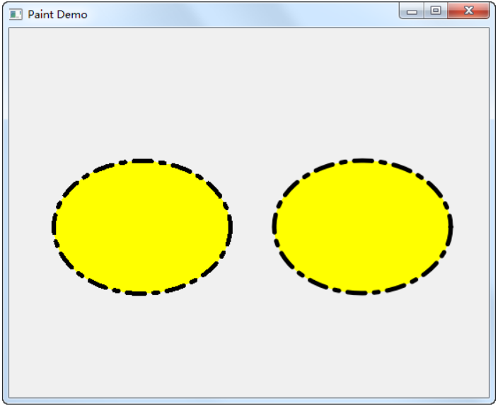

注意看左侧椭圆与右侧椭圆在边界处的区别。<font color=orange>左侧没有使用反锯齿，明细显示出锯齿的样子；右侧则增加了反锯齿代码。</font>确实如此！！！

在这段代码中，我们创建了一个<font color=orange>黑色 5 像素宽的画笔，使用了点线的样式，圆形笔帽</font>：

```cpp
painter.setPen(QPen(Qt::black, 5, Qt::DashDotLine, Qt::RoundCap));//cap就是“帽”的意思，cup才是“杯子”的意思，cpu是“中央处理器”的意思
```

然后我们使用一个黄色的画刷填充，绘制一个椭圆。

第二个椭圆的绘制与第一个十分相似，唯一的区别是多了一句

```cpp
painter.setRenderHint(QPainter::Antialiasing, true);
```

显然，我们通过这条语句，<font color=orange>将`Antialiasing`属性（也就是反走样）设置为 true。</font>经过这句设置，我们就打开了`QPainter`的反走样功能。还记得我们曾经说过，<font color=orange>`QPainter`是一个状态机，因此，只要这里我们打开了它，之后所有的代码都会是反走样绘制的了</font>。由于反走样需要比较复杂的算法，在一些对图像质量要求不是很高的应用中，是不需要进行反走样的。<font color=orange>为了提高效率，一般的图形绘制系统，如 Java2D、OpenGL 之类都是默认不进行反走样的。</font>

虽然反走样比不反走样的图像质量高很多，但是，没有反走样的图形绘制还是有很大用处的。首先，就像前面说的一样，在一些对图像质量要求不高的环境下，或者说性能受限的环境下，比如<font color=orange>嵌入式和手机环境，一般是不进行反走样的</font>。另外，在一些必须精确操作像素的应用中，也是不能进行反走样的。这是由于反走样技术本身的限制的。


# QT 学习之路 2（27）：渐变

渐变是绘图中很常见的一种功能，简单来说就是可以把几种颜色混合在一起，让它们能够自然地过渡，而不是一下子变成另一种颜色。渐变的算法比较复杂，写得不好的话效率会很低，好在很多绘图系统都内置了渐变的功能，Qt 也不例外。<font color=orange>渐变一般是用在填充里面的，所以，设置渐变是在`QBrush`里面。</font>


Qt 提供了三种渐变：<font color=orange>线性渐变（`QLinearGradient`）、辐射渐变（`QRadialGradient`）和角度渐变（`QConicalGradient`）。</font>我们可以在 Qt API 手册中看到这几种渐变的区别：

线性渐变：

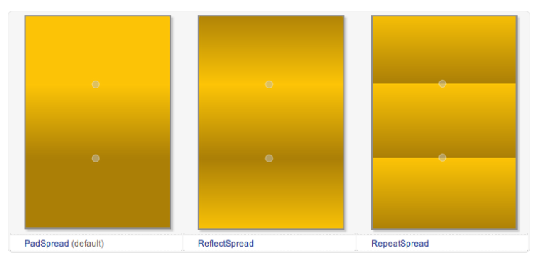

辐射渐变：

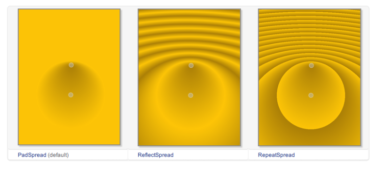

角度渐变：

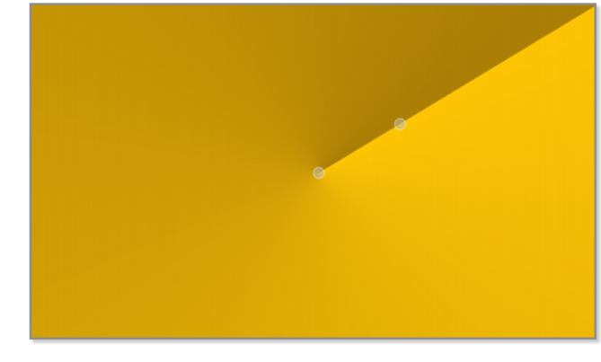

具体细节可以参考文档。下面我们通过一个示例看看如何使用渐变进行填充：

```cpp
void paintEvent(QPaintEvent *)
{
    QPainter painter(this);

    painter.setRenderHint(QPainter::Antialiasing, true);//反走样
    QLinearGradient linearGradient(60, 50, 200, 200);//线性渐变(x1,y1),(x2,y2)
    linearGradient.setColorAt(0.2, Qt::white);
    linearGradient.setColorAt(0.6, Qt::green);
    linearGradient.setColorAt(1.0, Qt::black);
    painter.setBrush(QBrush(linearGradient));
    painter.drawEllipse(50, 50, 200, 150);
}
```

像以前一样，我们也只给出了**`paintEvent()`**的代码。这段代码看起来也相当清晰：首先我们打开了反走样，然后创建一个`QLinearGradient`对象实例。`QLinearGradient`也就是线性渐变，其构造函数有四个参数，分别是 x1，y1，x2，y2，即渐变的起始点和终止点。在这里，我们从 (60, 50) 点开始渐变，到 (200, 200) 点止。

关于坐标的具体细节，我们会在后面的章节中详细介绍。

**渐变的颜色是在`setColorAt()`函数中指定的**。下面是这个函数的签名：

```cpp
void QGradient::setColorAt ( qreal position, const QColor & color )
```

这个函数的作用是，**把 position 位置的颜色设置成 color**。其中，position 是一个 [0, 1] 闭区间的数字。也就是说，position 是相对于我们建立渐变对象时做的那个起始点和终止点区间的一个比例。以这个线性渐变为例，在从 (60, 50) 到 (200, 200) 的线段上，在 0.2，也就五分之一处设置成白色，在 0.6 也就是五分之三处设置成绿色，在 1.0 也就是终点处设置成黑色。创建`QBrush`对象时，把这个渐变对象传递进去，然后就可以运行了：

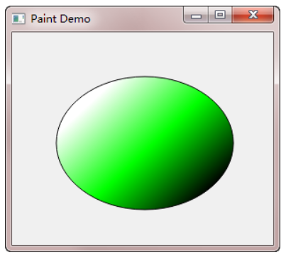

下面我们开始一个更复杂，也更实用一些的例子：绘制一个色轮（color wheel）。所谓色轮，其实就是一个带有颜色的圆盘（或许你没听说过这个名字，但是你肯定见过这个东西），下面是色轮的运行结果：

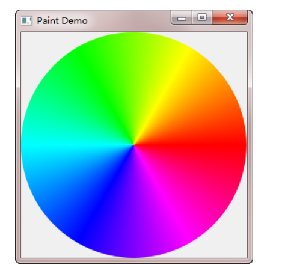

我们来看看它的代码：

```cpp
#include <QApplication>
#include <QWidget>
#include <QPainter>

class ColorWheel : public QWidget
{
protected:
    void paintEvent(QPaintEvent *) override
    {
        QPainter painter(this);
        painter.setRenderHint(QPainter::Antialiasing);//走反样

        const int r = 150;//圆的半径
        QConicalGradient conicalGradient(0, 0, 0);//渐变实例

        conicalGradient.setColorAt(0.0, Qt::red);
        conicalGradient.setColorAt(60.0/360.0, Qt::yellow);
        conicalGradient.setColorAt(120.0/360.0, Qt::green);
        conicalGradient.setColorAt(180.0/360.0, Qt::cyan);
        conicalGradient.setColorAt(240.0/360.0, Qt::blue);
        conicalGradient.setColorAt(300.0/360.0, Qt::magenta);
        conicalGradient.setColorAt(1.0, Qt::red);

        painter.translate(r, r);//将坐标原点设为（r，r）【注：原来是（0，0）】

        QBrush brush(conicalGradient);//将渐变实例传给画刷
        painter.setPen(Qt::NoPen);//不要画笔
        painter.setBrush(brush);//要画刷
        painter.drawEllipse(QPoint(0, 0), r, r);//画一个圆
    }
};

int main(int argc, char *argv[])
{
    QApplication app(argc, argv);

    ColorWheel colorWheel;
    colorWheel.show();

    return app.exec();
}
```

  **首先还是新建 QPainter 对象，开启反走样。然后我们将圆盘半径定义为 150**。下面创建一个角度渐变实例，其构造函数同样接受三个参数：

```
QConicalGradient::QConicalGradient ( qreal cx, qreal cy, qreal angle )
```

**前两个参数 cx 和 cy 组成角度渐变的中心点，第三个参数是渐变的起始角度**。在我们的例子中，我们将<font color=red>渐变中心点设置为 (0, 0)，起始角度为 0</font>。类似线性渐变，角度渐变的`setColorAt()`函数同样接受两个参数，第一个是角度比例，第二个是颜色。例如，

```
conicalGradient.setColorAt(0.0, Qt::red);
```

将 0 度角设置为红色；

```
conicalGradient.setColorAt(60.0/360.0, Qt::yellow);
```

将 60 度角设置为黄色。由于一个圆周是 360 度，所以 60.0/360.0 即是这个角度的比例。其余代码以此类推。最后一句，我们将 1.0 处设置为红色，也就是重新回到起始处。至于颜色的分布，这是由颜色空间定义的，有兴趣的朋友可以查阅有关颜色模型的理论。

> painter.translate(r, r);

这是我们唯一不熟悉的函数。<font color=red>`QPainter::translate(x, y)`函数意思是，将坐标系的原点设置到 (x, y) 点。原本坐标系原点位于左上角，我们使用`translate(r, r)`，将坐标原点设置为 (r, r)。这么一来，左上角的点的坐标就应该是 (-r, -r)。</font>

最后，<font color=orange>我们使用`drawEllipse()`函数绘制圆盘。注意，由于我们已经把坐标原点设置为 (r, r)，因此，在绘制时，圆心应该是新的坐标 (0, 0)，而不是原来的 (r, r)。</font>

PS：为了理解`translate()`函数的作用，可以思考下，如果去掉`translate()`函数的调用，我们的程序应该如何修改。答案是：

```cpp
void ColorWheel::paintEvent(QPaintEvent *)
{
    QPainter painter(this);
    painter.setRenderHint(QPainter::Antialiasing);

    const int r = 150;
    QConicalGradient conicalGradient(r, r, 0);

    conicalGradient.setColorAt(0.0, Qt::red);
    conicalGradient.setColorAt(60.0/360.0, Qt::yellow);
    conicalGradient.setColorAt(120.0/360.0, Qt::green);
    conicalGradient.setColorAt(180.0/360.0, Qt::cyan);
    conicalGradient.setColorAt(240.0/360.0, Qt::blue);
    conicalGradient.setColorAt(300.0/360.0, Qt::magenta);
    conicalGradient.setColorAt(1.0, Qt::red);

    QBrush brush(conicalGradient);
    painter.setPen(Qt::NoPen);
    painter.setBrush(brush);
    painter.drawEllipse(QPoint(r, r), r, r);///////////////!!!!!此时圆心在(r,r)
}
```

不仅我们需要修改最后的绘制语句，还需要注意修改`QConicalGradient`定义时传入的中心点的坐标。

> QConicalGradient conicalGradient(r, r, 0);
>
> (r,r)就是渐变中心点!!!

# QT 学习之路 2（28）：坐标系统

在经历过实际操作，以及前面一节中我们见到的那个`translate()`函数之后，我们可以详细了解下 Qt 的坐标系统了。

坐标系统是由`QPainter`控制的。我们前面说过，`QPaintDevice`、`QPaintEngine`和`QPainter`是 Qt 绘制系统的三个核心类。`QPainter`用于进行绘制的实际操作；`QPaintDevice`是那些能够让`QPainter`进行绘制的“东西”（准确的术语叫做，二维空间）的抽象层（其子类有`QWidget`、`QPixmap`、`QPicture`、`QImage`和`QPrinter`等）；`QPaintEngine`提供 "供`QPainter`使用" 的用于在不同设备上绘制的统一的接口。

由于`QPaintDeice`是进行绘制的对象，因此，所谓坐标系统，也就是`QPaintDevice`上面的坐标。默认坐标系统位于设备的<font color=orange>左上角</font>，也就是坐标原点 (0, 0)。x 轴方向向右；y 轴方向向下。在基于像素的设备上（比如显示器），坐标的默认单位是像素，在打印机上则是点（1/72 英寸）。

将`QPainter`的逻辑坐标与`QPaintDevice`的物理坐标进行映射的工作，是由`QPainter`的变换矩阵（transformation matrix）、视口（viewport）和窗口（window）完成的。

实际上，对图形的操作，底层的数学都是进行的矩阵变换、相乘等运算。

在 Qt 的坐标系统中，每个像素占据 1x1 的空间。你可以把它想象成一张方格纸，每个小格都是1个像素。方格的焦点定义了坐标，也就是说，像素 (x, y) 的中心位置其实是在 (x + 0.5, y + 0.5) 的位置上。这个坐标系统实际上是一个“半像素坐标系”。我们可以通过下面的示意图来理解这种坐标系：  

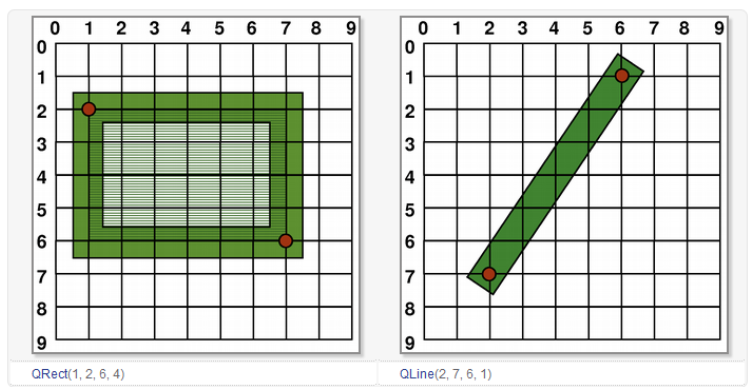

我们使用一个像素的画笔进行绘制，可以看到，每一个绘制像素都是以坐标点为中心的矩形。**注意，这是坐标的逻辑表示，实际绘制则与此不同。**因为在实际设备上，像素是最小单位，我们不能像上面一样，在两个像素之间进行绘制。所以在实际绘制时，Qt 的定义是，绘制点所在像素是逻辑定义点的右下方的像素。

我们前面已经介绍过，Qt 的绘制分为走样和反走样两种。对此，我们必须分别对待。

一个像素的绘制最简单，我们从这里开始：

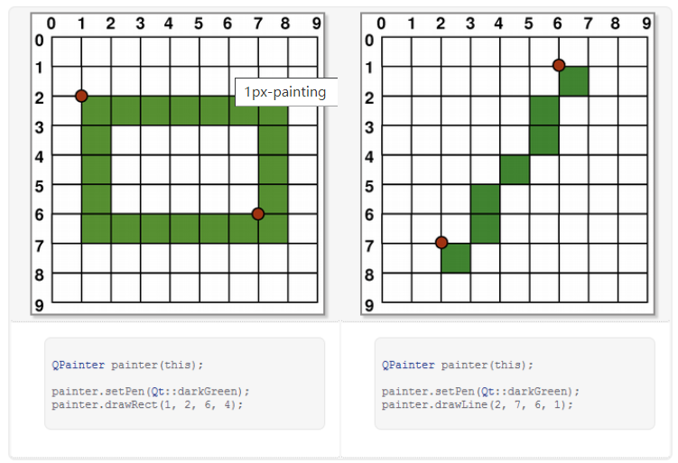

从上图可以看出，当我们绘制矩形左上角 (1, 2) 时，实际绘制的像素是在右下方。

当绘制大于1个像素时，情况比较复杂：如果绘制像素是偶数，则实际绘制会包裹住逻辑坐标值；如果是奇数，则是包裹住逻辑坐标值，再加上右下角一个像素的偏移。具体请看下面的图示：

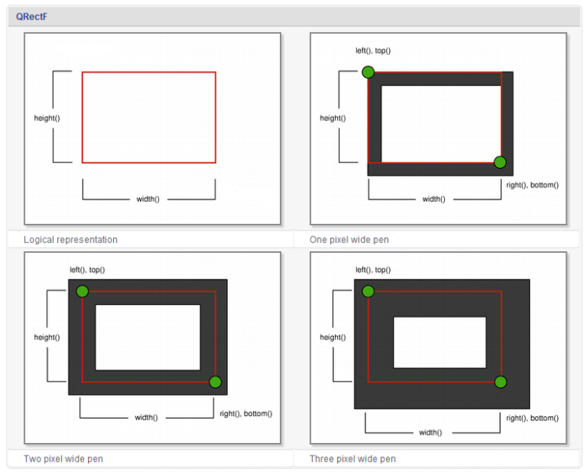

从上图可以看出，如果实际绘制是偶数像素，则会将逻辑坐标值夹在相等的两部分像素之间；如果是奇数，则会在右下方多出一个像素。

Qt 的这种处理，带来的一个问题是，我们可能获取不到真实的坐标值。<font color=orange>由于历史原因，`QRect::right()`和`QRect::bottom()`的返回值并不是矩形右下角点的真实坐标值：`QRect::right()`返回的是 left() + width() - 1；`QRect::bottom()`则返回 top() + height() - 1，上图的绿色点指出了这两个函数的返回点的坐标。</font>

为避免这个问题，我们建议是使用`QRectF`。`QRectF`使用浮点值，而不是整数值，来描述坐标。这个类的两个函数`QRectF::right()`和`QRectF::bottom()`是正确的。如果你不得不使用`QRect`，那么可以利用 x() + width() 和 y() + height() 来替代 right() 和 bottom() 函数。

对于反走样，实际绘制会包裹住逻辑坐标值：

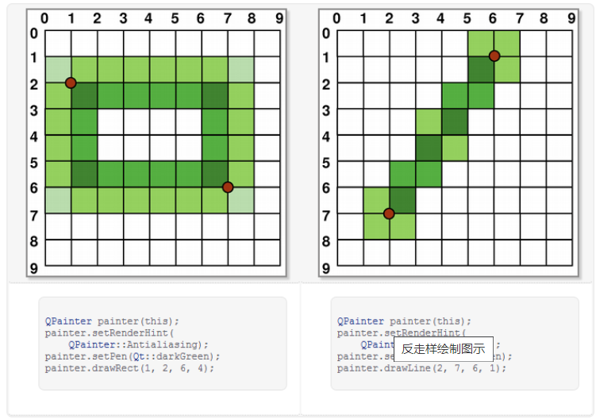

Qt 同样提供了坐标变换。前面说，图形学大部分算法依赖于矩阵计算，坐标变换便是其中的代表：每一种变换都对应着一个矩阵乘法

（如果你想知道学的线性代数有什么用处，这就是应用之一了 ）

我们会以一个实际的例子来了解坐标变换。在此之前，我们需要了解两个函数：`QPainter::save()`和`QPainter::restore()`。

前面说过，**`QPainter`是一个状态机。**那么，有时我想保存下当前的状态：当我临时绘制某些图像时，就可能想这么做。**当然，我们有最原始的办法：将可能改变的状态，比如画笔颜色、粗细等，在临时绘制结束之后再全部恢复。**对此，`QPainter`提供了内置的函数：`save()`和`restore()`。**`save()`就是保存下当前状态；`restore()`则恢复上一次保存的结果。**这两个函数**必须**成对出现：`QPainter`使用<font color=orange>栈</font>来保存数据，每一次`save()`，将当前状态压入栈顶，`restore()`则弹出栈顶进行恢复。

在了解了这两个函数之后，我们就可以进行示例代码了：

```cpp
void PaintDemo::paintEvent(QPaintEvent *)
{
    QPainter painter(this);
    painter.fillRect(10, 10, 50, 100, Qt::red);//red
    
    painter.save();
    painter.translate(100, 0); // 向右平移 100px
    painter.fillRect(10, 10, 50, 100, Qt::yellow);//yellow
    painter.restore();
    
    painter.save();
    painter.translate(300, 0); // 向右平移 300px
    painter.rotate(30); // 顺时针旋转 30 度
    painter.fillRect(10, 10, 50, 100, Qt::green);//green
    painter.restore();
    
    painter.save();
    painter.translate(400, 0); // 向右平移 400px
    painter.scale(2, 3); // 横坐标单位放大 2 倍，纵坐标放大 3 倍
    painter.fillRect(10, 10, 50, 100, Qt::blue);//blue
    painter.restore();
    
    painter.save();
    painter.translate(600, 0); // 向右平移 600px
    painter.shear(0, 1); // 横向不变，纵向扭曲 1 倍
    painter.fillRect(10, 10, 50, 100, Qt::cyan);//cyan
    painter.restore();
}
```

Qt 提供了四种坐标变换：平移 translate，旋转 rotate，缩放 scale 和扭曲 shear。在这段代码中，我们首先在 (10, 10) 点绘制一个红色的 50x100 矩形。保存当前状态，将坐标系平移到 (100, 0)，绘制一个黄色的矩形。

注意，`translate()`操作平移的是坐标系，不是矩形。

因此，我们还是在 (10, 10) 点绘制一个 50x100 矩形，现在，它跑到了右侧的位置。然后恢复先前状态，也就是把坐标系重新设为默认坐标系（相当于进行`translate(-100, 0)`），再进行下面的操作。之后也是类似的。由于我们只是保存了默认坐标系的状态，因此我们之后的`translate()`横坐标值必须增加，否则就会覆盖掉前面的图形。所有这些操作都是针对坐标系的，因此在绘制时，我们提供的矩形的坐标参数都是不变的。

运行结果如下：

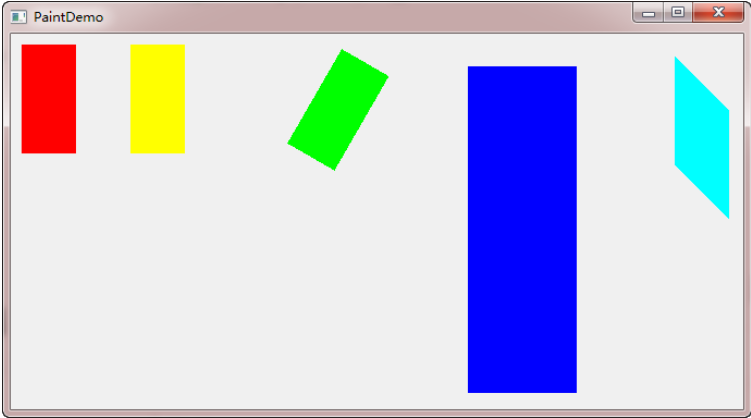

Qt 的坐标分为逻辑坐标和物理坐标。在我们绘制时，提供给`QPainter`的都是逻辑坐标。之前我们看到的坐标变换，也是针对逻辑坐标的。所谓物理坐标，就是绘制底层`QPaintDevice`的坐标。单单只有逻辑坐标，我们是不能在设备上进行绘制的。


下面我们再来理解下视口的含义。还是以一段代码为例：

```
void PaintDemo::paintEvent(QPaintEvent *)
{
    QPainter painter(this);
    painter.setViewport(0, 0, 200, 200);
    painter.fillRect(0, 0, 200, 200, Qt::red);
}
```

这段代码和前面一样，只是把`setWindow()`换成了`setViewport()`。

前面我们说过，window 代表窗口坐标，viewport 代表物理坐标。


# QT 学习之路 2（29）：绘制设备

绘图设备是继承`QPainterDevice`的类。`QPaintDevice`就是能够进行绘制的类，也就是说，<font color=orange>`QPainter`可以在任何`QPaintDevice`的子类上进行绘制。</font>现在，Qt 提供了若干这样的类：

Qt5：

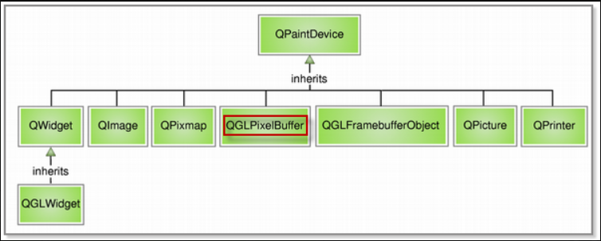

Qt4和Qt5大致相同，只是在 Qt5 中，`QGLPixelBuffer`已经被废弃。

本章我们关注的是`QPixmap`、`QBitmap`、`QImage`和`QPicture`这几个类。

另外的部分，`QWidget`就是所有组件的父类，我们已经在前面的章节中使用过，这里不再赘述。

`QGLWidget`和`QGLFramebufferObject`，顾名思义，就是关于 OpenGL 的相关类。在 Qt 中，我们可以方便地结合 OpenGL 进行绘制。由于这部分需要牵扯到 OpenGL 的相关内容，现在也不再深入。在我们选择的几个类中，大多与图像密切相关。

`QPixmap`专门为图像在屏幕上的显示做了优化；**`QBitmap`是`QPixmap`的一个子类**，它的色深限定为1，**你可以使用`QPixmap`的`isQBitmap()`函数来确定这个`QPixmap`是不是一个`QBitmap`**。**`QImage`专门为图像的像素级访问做了优化。`QPicture`则可以记录和重现`QPainter`的各条命令。**

下面我们将分两部分介绍这**四种**绘图设备。

`QPixmap`继承了`QPaintDevice`，因此，<font color=orange>你可以使用`QPainter`直接在上面绘制图形。</font>

<font color=orange>`QPixmap`也可以接受一个字符串作为一个文件的路径来显示这个文件，比如你想在程序之中打开 png、jpeg 之类的文件，就可以使用`QPixmap`。</font>

<font color=orange>使用`QPainter::drawPixmap()`函数可以把这个文件绘制到一个`QLabel`、`QPushButton`或者其他的设备上面。</font>正如前面所说的那样，`QPixmap`是针对屏幕进行特殊优化的，因此，它与实际的<font color=orange>底层</font>显示设备息息相关。注意，<font color=orange>这里说的显示设备并不是硬件，而是操作系统提供的原生的绘图引擎</font>。所以，在不同的操作系统平台下，`QPixmap`的显示可能会有所差别。

`QPixmap`提供了静态的`grabWidget()`和`grabWindow()`函数，用于将自身图像绘制到目标上。同时，在使用`QPixmap`时，你可以<font color=orange>直接使用传值的形式，不需要传指针</font>，因为`QPixmap`提供了“隐式数据共享”。简单来说，就是一般对于大型数据（图像无疑就是这种“大型数据”），为性能起见，通常会采用传指针的方式，但是由于`QPixmap`内置了隐式数据共享，所以只要知道`QPixmap`传递值即可。

前面说过，`QBitmap`继承自`QPixmap`，因此具有`QPixmap`的所有特性。不同之处在于，`QBitmap`的色深始终为 1。

色深这个概念来自计算机图形学，是指用于表现颜色的二进制的位数。

我们知道，计算机里面的数据都是使用<font color=orange>二进制</font>表示的。为了表示一种颜色，我们也会使用二进制。比如我们要表示 8 种颜色，需要用 3 个二进制位（2^3=8），这时我们就说色深是 3。因此，所谓色深为 1，也就是使用 1 个二进制位表示颜色。1 个位只有两种状态：0 和 1，因此它所表示的颜色就有两种，黑和白。所以说，<font color=orange>`QBitmap`实际上是只有黑白两色的图像数据</font>。由于`QBitmap`色深小，因此只占用很少的存储空间，所以适合做光标文件和笔刷。

下面我们来看同一个图像文件在`QPixmap`和`QBitmap`下的不同表现：

```cpp
void paintEvent(QPaintEvent *)
{
    QPainter painter(this);
    QPixmap pixmap("./qt-logo.png");//qt-logo.png 具有透明背景
    QBitmap bitmap("./qt-logo.png");
    painter.drawPixmap(10, 10, 250, 125, pixmap);//pixmap
    painter.drawPixmap(270, 10, 250, 125, bitmap);//bitmap
    QPixmap whitePixmap("qt-logo-white.png");//qt-logo-white.png 具有白色背景。
    QBitmap whiteBitmap("qt-logo-white.png");
    painter.drawPixmap(10, 140, 250, 125, whitePixmap);//pixmap
    painter.drawPixmap(270, 140, 250, 125, whiteBitmap);//bitmap
}
```

先来看一下运行结果：

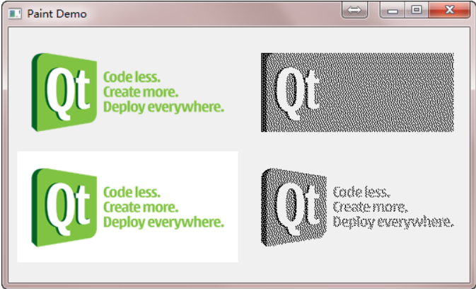

这里我们给出了两张 png 图片。我们分别使用`QPixmap`和`QBitmap`来加载它们。

注意看它们的区别：白色的背景在`QBitmap`中消失了，而透明色在`QBitmap`中转换成了黑色（“黑色”，记住，`QBitmap`只有两种颜色：黑色和白色）；其他颜色则是使用点的疏密程度来体现的。


<font color=orange>`QPixmap`使用底层平台的绘制系统进行绘制，无法提供像素级别的操作</font>，而<font color=orange>`QImage`则是使用独立于硬件的绘制系统</font>，实际上是自己绘制自己，因此<font color=orange>提供了像素级别的操作，并且能够在不同系统之上提供一个一致的显示形式</font>。

> 简单来说，就是QImage更吊一些，Qimage不会根据设备的不同而不同；QPixmap会根据设备的不同而不同。

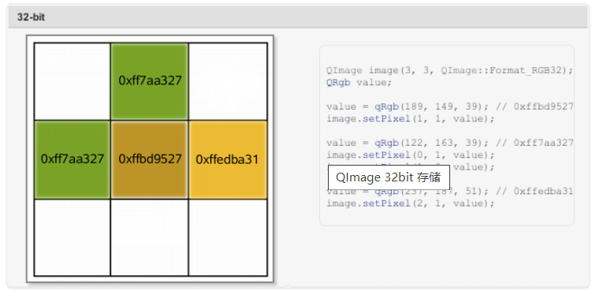

`QImage`与`QPixmap`相比，最大的优势在于能够进行像素级别的操作。我们通过上面的示意图可以看到，我们声明一个 3 x 3 像素的`QImage`对象，然后利用<font color=orange>`setPixel()`</font>函数进行颜色的设置。你可以把`QImage`想象成一个<font color=orange> RGB 颜色的二维数组</font>，记录了每一像素的颜色。<font color=orange>值得注意的是，在`QImage`上进行绘制时，不能使用`QImage::Format_Indexed8`这种格式。</font>

最后一种`QPicture`是和平台无关的，因此它可以使用在多种设备之上，比如 svg、pdf、ps、打印机或者屏幕。回忆下我们曾经说的`QPaintDevice`，实际上是说可以由`QPainter`进行绘制的对象。`QPicture`使用系统分辨率，并且<font color=orange>可以调整`QPainter`来消除不同设备之间的显示差异</font>。如果我们要记录下`QPainter`的命令，<font color=orange>首先要使用`QPainter::begin()`函数，将`QPicture`实例作为参数传递进去，以便告诉系统开始记录，记录完毕后使用`QPainter::end()`命令终止</font>。代码示例如下：

```cpp
QPicture picture;

QPainter painter;

painter.begin(&picture);             // 在 picture 进行绘制
painter.drawEllipse(10, 20, 80, 70); // 绘制一个椭圆
painter.end();                       // 绘制完成
picture.save("drawing.pic");         // 保存 picture
```

如果我们要重现命令，首先要使用 QPicture::load() 函数进行装载：

```cpp
	// 创建一个 QPicture，并将绘图命令保存到其中
    QPicture picture;
    QPainter painter;
    painter.begin(&picture);
    painter.drawText(50, 50, "Hello, World!");
    painter.end();

    // 保存 QPicture 到文件
    picture.save("drawing.pic");

	/***********************************************/
/*
* 将之前保存的绘图命令重新绘制到 QLabel 上，并显示在屏幕上。
* 通过加载 QPicture 对象并使用 play() 函数，可以重现之前绘制的图形。
* 这样，你可以在不需要重新执行绘制命令的情况下，直接加载并显示之前保存的绘图结果。
*/
    // 加载 QPicture，并重现绘图命令
    QPicture loadedPicture;
    loadedPicture.load("drawing.pic");//至此，要绘的图片已经准备好了

    // 创建一个绘图设备（这里使用 QLabel）
    QLabel label;
    label.resize(200, 200);//至此，要往哪里画也已经准备好了

    // 创建一个 QPainter，并将绘图设备作为绘制目标
    QPainter labelPainter(&label);//至此，画家也准备好了，而且画家也知道往哪里画了

    // 将加载的 QPicture 绘制到绘图设备上
    loadedPicture.play(&labelPainter);//让画家开始将画作完成

    // 显示绘制结果
    label.show();//展示画家画出来的结果
```

我们也可以直接使用`QPicture::play()`进行绘制。这个函数接受一个`QPainter`对象，也就是进行绘制的画笔。

# QT 学习之路 2（30）：GRAPHICS VIEW FRAMEWORK

Graphics View Framework 有三个主要部分：

- `QGraphicsScene`：能够管理元素的非 GUI 容器；
- `QGraphicsItem`：能够被添加到场景的元素；
- `QGraphicsView`：能够观察场景的可视化组件视图。


对于游戏而言，我们需要一个`QGraphicsScene`，作为游戏发生的舞台；一个`QGraphicsView`，作为观察游戏舞台的组件；以及若干元素，用于表示游戏对象，比如蛇、食物以及障碍物等。

这当然是一个 GUI 工程，主窗口应该是一个`QGraphicsView`。为了以后的实现方便（比如，我们希望向工具栏添加按钮等），我们不会直接以`QGraphicsView`作为顶层窗口，而是将其添加到一个主窗口上。


Graphics View 提供了一种接口，用于管理大量自定义的 2D 图形元素，并与之进行交互；还提供了用于将这些元素进行可视化显示的观察组件，并支持缩放和旋转。我们通常所说的 Linux 的 KDE 桌面环境，就是建立在 Graphics View 基础之上的（尽管新版本的 KDE 有向 QML 迁移的趋势）。

Graphics View 框架包含了一套完整的事件体系，可以用于与场景中的元素进行双精度的交互。这些元素同样支持键盘事件、鼠标事件等。Graphics View 使用了 BSP 树（Binary Space Partitioning tree，这是一种被广泛应用于图形学方面的数据结构）来提供非常快速的元素发现，也正因为如此，才能够实现一种上百万数量级元素的实时显示机制。

Graphics View 最初在 Qt 4.2 引入，来取代 Qt 3 中的 QCanvas。当然，在最新的 Qt5 中，Qt3 的代码已经不能继续使用了。


Graphics View 是一个基于元素（item）的 MV 架构的框架。它可以分成三个部分：<font color=orange>元素 item、场景 scene 和视图 view</font>。

基于元素的意思是，<font color=orange>它的每一个组件都是一个独立的元素</font>。这是与我们之前讲到过的`QPainter`状态机<font color=orange>机制不同</font>。

回忆一下，使用`QPainter`绘图，大多是采用一种<font color=orange>面向过程</font>的描述方式：首先使用`drawLine()`画一条直线，然后使用`drawPolygon()`画一个多边形。对于 Graphics View<font color=orange>【发音：哥软飞可思维奥】</font>，

**相同的过程**可以是，<font color=orange>首先</font>创建一个场景（scene），<font color=orange>然后</font>创建一个直线对象和一个多边形对象，<font color=orange>再</font>使用场景的`add()`函数，将直线和多边形添加到场景中，<font color=orange>最后</font>通过视图进行观察，就可以看到了。

乍看起来，后者似乎更加复杂，但是，<font color=orange>如果你的图像中包含了成千上万的直线、多边形之类，管理这些对象要比管理`QPainter`的绘制语句容易得多</font>。并且，这些图形对象也更加符合面向对象的设计要求：一个很复杂的图形可以很方便的复用。

MV 架构的意思是，Graphics View 提供一个 model 和一个 view（正如 MVC 架构，只不过 MV 架构少了 C 这么一个组件）。<font color=orange>所谓模型（model）就是我们添加的种种对象</font>；<font color=orange>所谓视图（view）就是我们观察这些对象的视口</font>。**同一个模型可以由很多视图从不同的角度进行观察，这是很常见的需求**。<font color=orange>使用 QPainter 很难实现这一点，这需要很复杂的计算，而 Graphics View 可以很容易的实现。</font>

<font color=RED>Graphics View 提供了`QGraphicsScene`作为场景，即是允许我们添加图形的空间，相当于整个世界；`QGraphicsView`作为视口，也就是我们的观察窗口，相当于照相机的取景框，这个取景框可以覆盖整个场景，也可以是场景的一部分；`QGraphicsItem`作为图形元件，以便添加到场景中去，Qt 内置了很多图形，比如直线、多边形等，它们都是继承自`QGraphicsItem`。</font>

下面我们通过一段代码看看 Graphics View 的使用。

```cpp
int main(int argc, char *argv[])
{
    QApplication app(argc, argv);

    QGraphicsScene scene;//first，create a scence。   this is a 场景。
    scene.addLine(0, 0, 150, 150);//then，add a line。      this is a 元素。

    QGraphicsView view(&scene);//next，将相机与场景绑定。  this is our 要拍的风景。
    view.setWindowTitle("Graphics View");//title 标题
    view.resize(500, 500);//size 长宽
    view.show();//来吧，展示

    return app.exec();//开启事件循环
}
```

这段代码很简单：首先创建一个场景，也就是`QGraphicsScene`对象。然后我们使用`addLine()`函数向场景中添加了一个直线，起始点和终点坐标分别是 (0, 0) 和 (150, 150)。可以想象，这是一个边长 150px 的正方形的对角线。通过这两步，我们已经有了场景和元素。

之后，我们创建一个`GraphicsView`对象，绑定到一个场景上（也就是我们前面创建的 scene 对象）。<font color=orange>注意，`QGraphicsScene`不是`QWidget`的子类，</font>因此该构造函数并不是调用的`QGraphicsView(QWidget *parent)`。接下来，我们可以运行一下代码：

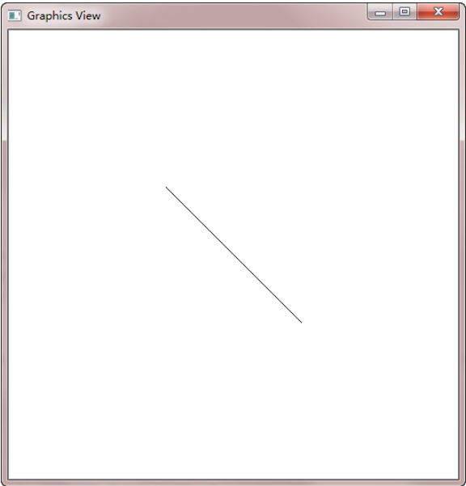

<font color=orange>我们看到，这个直线自动在视图居中显示。这并不需要我们进行任何额外的代码！！！</font>如果不想这么做，我们可以给 scene 设置一下`sceneRect()`属性：

```cpp
    QGraphicsScene scene//first，create a scence。   this is a 场景。
    scene.setSceneRect(0, 0, 500, 500);//指定场景的边界矩形，即场景可见区域的大小和位置。(0, 0) 是矩形左上角的坐标，500 是矩形的宽度，而第二个 500 是矩形的高度。
    scene.addLine(0, 0, 150, 150);//then，add a line。      this is a 元素。

    QGraphicsView view(&scene//next，将相机与场景绑定。  this is our 要拍的风景。
    //view.resize(600,600);如果加上这个，效果并不会是我们想也要的，他会以左上角为中心点进行扩充                  
    view.setWindowTitle("Graphics View");//title 标题
    view.show();
```

不仅如此，我们还去掉了`view.resize()`一行。`QGraphicsScene`的`sceneRect`属性供`QGraphicsView`确定视图默认的滚动条区域，并且协助`QGraphicsScene`管理元素索引。之所以去掉`view.resize()`一行，是因为我们让系统去决定视图的最小尺寸（否则的话，我们需要手动将窗口标题栏等的大小同时考虑设置）。

注释掉view.resize(600,600);的效果：


不注释掉view.resize(600,600);的效果：

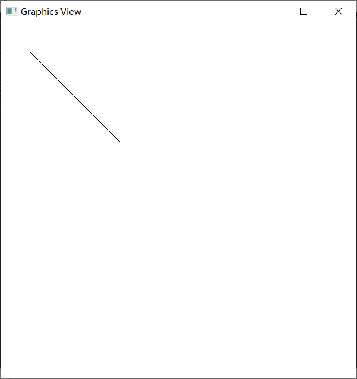

使用QGraphicsScene写一个贪吃蛇的小游戏：可以用来练手
https://github.com/devbean/snake-game

教程：https://www.devbean.net/2012/12/qt-study-road-2-snake-4/

# QT 学习之路 2（35）：文件

https://www.devbean.net/2013/01/qt-study-road-2-file/


文件操作是应用程序必不可少的部分。Qt 作为一个通用开发库，提供了跨平台的文件操作能力。从本章开始，我们来了解下 Qt 的文件以及输入输出的功能，也就是 I/O 系统。

Qt 通过`QIODevice`提供了对 I/O 设备的抽象，这些设备具有读写字节块的能力。下面是 I/O 设备的类图：

Qt5：

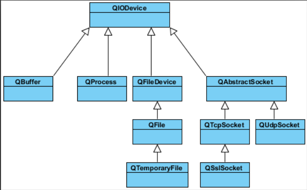

 Qt5相对于Qt4 新增加了一个`QFileDevice`类。途中所涉及的类及其用途简要说明如下：

- `QIODevice`：所有 I/O 设备类的父类，提供了字节块读写的通用操作以及基本接口；
- `QFlie`：访问本地文件或者嵌入资源；
- `QTemporaryFile`：创建和访问本地文件系统的临时文件；
- `QBuffer`：读写`QByteArray`；
- `QProcess`：运行外部程序，处理进程间通讯；
- `QAbstractSocket`：所有套接字类的父类；
- `QTcpSocket：TCP`协议网络数据传输；
- `QUdpSocket`：传输 UDP 报文；
- `QSslSocket`：使用 SSL/TLS 传输数据；
- `QFileDevice：Qt5`新增加的类，提供了有关文件操作的通用实现。

这其中，`QProcess`、`QTcpSocket`、`QUdpSoctet`和`QSslSocket`是顺序访问设备。<font color=orange>所谓“顺序访问”，是指它们的数据只能访问一遍：从头走到尾，从第一个字节开始访问，直到最后一个字节，中途不能返回去读取上一个字节</font>；`QFile`、`QTemporaryFile`和`QBuffer`是随机访问设备，可以访问任意位置任意次数，还可以使用`QIODevice::seek()`函数来重新定位文件访问位置指针。

本章将主要介绍`QFile`及其相关类，后面的章节则开始介绍有关输入输出的流。

在所有的 I/O 设备中，文件 I/O 是最重要的部分之一。因为我们大多数的程序依旧需要首先访问本地文件（当然，在云计算大行其道的将来，这一观点可能改变）。

`QFile`提供了从文件中读取和写入数据的能力。

Qt5 新加入的`QFileDevice`类，则将这部分公共操作放到了这个单独的类中。

我们通常会将文件路径作为参数传给`QFile`的构造函数。不过也可以在创建好对象最后，使用`setFileName()`来修改。`QFile`需要使用 / 作为文件分隔符，不过，它会自动将其转换成操作系统所需要的形式。例如 C:/windows 这样的路径在 Windows 平台下同样是可以的。

`QFile`主要提供了有关文件的各种操作，比如打开文件、关闭文件、刷新文件等。我们可以使用`QDataStream`或`QTextStream`类来读写文件，也可以使用`QIODevice`类提供的`read()`、`readLine()`、`readAll()`以及`write()`这样的函数。<font color=orange>值得注意的是，有关文件本身的信息，比如文件名、文件所在目录的名字等，则是通过`QFileInfo`获取，而不是自己分析文件路径字符串。</font>

下面我们使用一段代码来看看`QFile`的有关操作：

```cpp
int main(int argc, char *argv[])
{
    QApplication app(argc, argv);

    QFile file("in.txt");
    if (!file.open(QIODevice::ReadOnly | QIODevice::Text)) {
        qDebug() << "Open file failed.";
        return -1;
    } else {
        while (!file.atEnd()) {
            qDebug() << file.readLine();
        }
    }

    QFileInfo info(file);
    qDebug() << info.isDir();
    qDebug() << info.isExecutable();
    qDebug() << info.baseName();
    qDebug() << info.completeBaseName();
    qDebug() << info.suffix();
    qDebug() << info.completeSuffix();

    return app.exec();
}
```

在这段代码中，我们首先使用`QFile`创建了一个文件对象。这个文件名字是 in.txt。<font color=orange>如果你不知道应该把它放在哪里，可以使用`QDir::currentPath()`来获得应用程序执行时的当前路径</font>。只要将这个文件放在与当前路径一致的目录下即可。然后，我们使用`open()`函数打开这个文件，<font color=orange>打开形式是只读方式，文本格式</font>。这个类似于`fopen()`的 r 这样的参数。`open()`函数返回一个 bool 类型，如果打开失败，我们在控制台输出一段提示然后程序退出。否则，我们利用 while 循环，将每一行读到的内容输出。


程序的第二部分，我们使用`QFileInfo`获取有关该文件的信息。`QFileInfo`有很多类型的函数，我们只举出一些例子。<font color=orange>比如这里，`isDir()`检查该文件是否是目录；`isExecutable()`检查该文件是否是可执行文件等。`baseName()`可以直接获得文件名；`suffix()`则直接获取文件后缀名</font>。我们可以由下面的示例看到，`baseName()`和`completeBaseName()`，以及`suffix()`和`completeSuffix()`的区别：

```cpp
QFileInfo fi("/tmp/archive.tar.gz");
QString base  = fi.baseName();  // base = "archive"
QString cbase = fi.completeBaseName();  // base = "archive.tar"
QString ext   = fi.suffix();  // ext = "gz"
QString ext   = fi.completeSuffix();  // ext = "tar.gz"
```