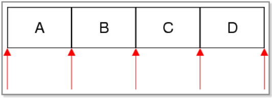
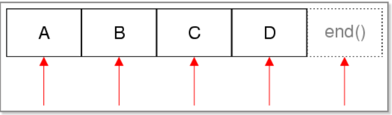

https://www.devbean.net/2013/01/qt-study-road-2-binary-file-io/

[TOC]


# QT 学习之路 2（36）：二进制文件读写

https://www.devbean.net/2013/01/qt-study-road-2-binary-file-io/

上一章介绍了`QFile`和`QFileInfo`两个类。

上章提到，`QIODevice`提供了`read()`、`readLine()`等基本的操作。

同时，Qt 还提供了更高一级的操作：<font color=orange>用于二进制的流`QDataStream`</font>和<font color=orange>用于文本流的`QTextStream`</font>。

<FONT COLOR=BLUE>本章节，我们将讲解有关`QDataStream`的使用以及一些技巧。下一章则是`QTextStream`的相关内容。</FONT>

**下面开讲！！！**

`QDataStream`提供了基于`QIODevice`的二进制数据的<font color=orange>序列化</font>。数据流是一种二进制流，这种流**完全不依赖**于底层操作系统、CPU 或者字节顺序（大端或小端）。例如，在安装了 Windows 平台的 PC 上面写入的一个数据流，可以不经过任何处理，直接拿到运行了 Solaris 的 SPARC 机器上读取。<font color=orange>由于数据流就是二进制流，因此我们也可以直接读写没有编码的二进制数据，例如图像、视频、音频等</font>>。

`QDataStream`既能够存取 C++ 基本类型，如 int、char、short 等，也可以存取复杂的数据类型，例如自定义的类。实际上，`QDataStream`对于类的存储，是将复杂的类分割为很多基本单元实现的。

结合`QIODevice`，`QDataStream`可以很方便地对文件、网络套接字等进行读写操作。我们从代码开始看起：

```cpp
QFile file("file.dat");
file.open(QIODevice::WriteOnly);
QDataStream out(&file);//可以理解创建了一个流入file文件的二进制数据流
//下面这两行操作都将流入file文件
out << QString("the answer is");
out << (qint32)42;
```

在这段代码中，我们首先打开一个名为 file.dat 的文件（**注意，我们为简单起见，并没有检查文件打开是否成功，这在正式程序中是不允许的**）。然后，我们将刚刚创建的 **`file`对象的地址** 传递给一个`QDataStream`实例`out`。类似于`std::cout`标准输出流，`QDataStream`也重载了输出重定向`<<`运算符。后面的代码就很简单了：将“the answer is”和数字 42 输出到数据流。**由于我们的 out 对象建立在`file`之上，因此相当于将宇宙终极问题的答案就是：写入`file`**。

需要指出一点：最好使用 **Qt 整型**来进行读写，比如程序中的**`qint32`**。这保证了**在任意平台和任意编译器都能够有相同的行为**。（<font color=red>跨平台！！！</font>）

我们通过一个例子来看看 **Qt 是如何存储数据**的。例如`char *`字符串，在存储时，会首先存储该字符串包括 \0 结束符的**长度**（32位整型），然后是**字符串的内容以及结束符 \0**。*在读取时，先以 32 位整型读出整个的长度，然后按照这个长度取出整个字符串的内容。*

但是，如果你直接运行这段代码，你会得到一个空白的 file.dat，并没有写入任何数据。这是因为我们的`file`没有正常关闭。**为性能起见，数据只有在文件关闭时才会真正写入**。因此，我们必须在最后添加一行代码：  

```
file.close(); // 如果不想关闭文件，可以使用 file.flush();
```

重新运行一下程序，你就得到宇宙终极问题的答案了。

我们已经获得宇宙终极问题的答案了，下面，我们要将这个答案读取出来：

```cpp
QFile file("file.dat");
file.open(QIODevice::ReadOnly);
QDataStream in(&file);//out是流入文件，in是流出文件
QString str;
qint32 a;
in >> str >> a;//将文件的内容流出到变量str和a
```

这段代码没什么好说的。唯一需要注意的是，**你必须按照写入的顺序，将数据读取出来**。也就是说，程序数据写入的顺序**必须预先定义好**。在这个例子中，我们首先写入字符串，然后写入数字，那么就首先读出来的就是字符串，然后才是数字。**顺序颠倒的话，程序行为是不确定的，严重时会直接造成程序崩溃**。

由于二进制流是纯粹的字节数据，带来的问题是，如果**程序不同版本之间按照不同的方式读取**（前面说过，Qt 保证读写内容的一致，但是并不能保证不同 Qt 版本之间的一致），数据就会出现错误。因此，我们必须提供一种机制来确保不同版本之间的一致性。通常，我们会使用如下的代码写入：

```cpp
QFile file("file.dat");
file.open(QIODevice::WriteOnly);
QDataStream out(&file);//将数据流入文件（我也不知道为啥out是流入，in是流出，这和out与in的本意完全相反！！！）

// 写入魔术数字和版本
out << (quint32)0xA0B0C0D0;
out << (qint32)123;

out.setVersion(QDataStream::Qt_4_0);

// 写入数据
out << lots_of_interesting_data;
```

这里，我们增加了两行代码：第一次流入文件一个二进制数，另外一次流入一个qint32的整型

```
out << (quint32)0xA0B0C0D0;
```

  用于写入魔术数字。所谓魔术数字，是二进制输出中经常使用的一种技术。二进制格式是人不可读的，并且通常具有相同的后缀名（比如 dat 之类），因此我们没有办法区分两个二进制文件哪个是合法的。所以，我们定义的二进制格式通常具有一个魔术数字，用于标识文件的合法性。在本例中，我们在文件最开始写入 0xA0B0C0D0，在读取的时候首先检查这个数字是不是 0xA0B0C0D0。**如果不是的话，说明这个文件不是可识别格式，因此根本不需要去继续读取**。*一般二进制文件都会有这么一个魔术数字*，例如 Java 的 class 文件的魔术数字就是 0xCAFEBABE，使用二进制查看器就可以查看。**魔术数字是一个 32 位的无符号整型**，因此我们使用`quint32`来得到一个平台无关的 32 位无符号整型。

接下来一行，

```
out << (qint32)123;
```

是**标识文件的版本**。我们**用魔术数字标识文件的类型**，从而**判断文件是不是合法的**。但是，文件的不同版本之间也可能存在差异：我们**可能在第一版保存整型，第二版可能保存字符串**。为了标识不同的版本，我们只能将版本写入文件。比如，现在我们的版本是 123。

下面一行还是有关版本的：

```cpp
out.setVersion(QDataStream::Qt_4_0);
```

上面一句是文件的版本号，但是，Qt 不同版本之间的读取方式可能也不一样。这样，我们就得指定 Qt 按照哪个版本去读。这里，我们指定以 Qt 4.0 格式去读取内容。

当我们这样写入文件之后，我们在读取的时候就需要增加一系列的判断：

```cpp
QFile file("file.dat");
file.open(QIODevice::ReadOnly);
QDataStream in(&file);//数据流出文件

// 检查魔术数字
quint32 magic;
in >> magic;
if (magic != 0xA0B0C0D0) {
    return BAD_FILE_FORMAT;
}//能到这，说明文件有效

////////////下面这些应该没啥用///////////////////
// 检查版本
qint32 version;
in >> version;
if (version < 100) {
    return BAD_FILE_TOO_OLD;
}
if (version > 123) {
    return BAD_FILE_TOO_NEW;
}

//////////100 <= version <= 123///////////
if (version <= 110) {
    in.setVersion(QDataStream::Qt_3_2);
} else {
    in.setVersion(QDataStream::Qt_4_0);
}
// 读取数据
in >> lots_of_interesting_data;
if (version >= 120) {
    in >> data_new_in_version_1_2;
}
in >> other_interesting_data;
```

这段代码就是按照前面的解释进行的。首先读取魔术数字，检查文件是否合法。如果合法，读取文件版本：小于 100 或者大于 123 都是不支持的。如果在支持的版本范围内（100 <= version <= 123），则当是小于等于 110 的时候，按照`Qt_3_2`的格式读取，否则按照`Qt_4_0`的格式读取。当设置完这些参数之后，开始读取数据。

至此，我们介绍了有关`QDataStream`的相关内容。那么，*既然`QIODevice`提供了`read()`、`readLine()`之类的函数，为什么还要有`QDataStream`呢？`QDataStream`同`QIODevice`有什么区别？区别在于，`QDataStream`提供流的形式*，**性能上一般比直接调用原始 API 更好一些**。我们通过下面一段代码看看什么是流的形式：

```cpp
QFile file("file.dat");
file.open(QIODevice::ReadWrite);//文件权限：可读写

QDataStream stream(&file);//stream表示可流入亦可流出
QString str = "the answer is 42";
QString strout;

stream << str;//str流入到stream
file.flush();
stream >> strout;//stream流出到strout
```

在这段代码中，我们首先向文件中写入数据，紧接着把数据读出来。有什么问题吗？**运行之后你会发现，`strout`实际是空的**。为什么没有读取出来？我们不是已经添加了`file.flush();`语句吗？

原因并**不在于文件有没有写入，而是在于我们使用的是“流”**。所谓流，就像水流一样，它的游标会随着输出向后移动。当使用`<<`操作符输出之后，流的游标已经到了最后，此时你再去读，当然什么也读不到了。所以你需要在输出之后重新把游标设置为 0 的位置才能够继续读取。具体代码片段如下：

```cpp
stream << str;
stream.device()->seek(0);
stream >> strout;
```


--------------------------

<font color=orange>**运行之后你会发现，`strout`实际是空的**。为什么没有读取出来？我们不是已经添加了`file.flush();`语句吗？</font>

我没理解上面的一些话，接下来是一些更加通俗易懂的理解：

问题可能出在**文件指针的位置**。在将字符串 "the answer is 42" 写入文件**之后**，文件指针位于**文件的末尾**。*当你尝试从文件中读取数据时，文件指针仍然位于末尾，因此无法读取任何数据。*

为了解决这个问题，**你可以在读取之前将文件指针移回文件的开头**。可以通过调用 **file.seek(0)** 将文件指针移动到文件的开头，然后再次尝试读取数据。修改后的代码如下所示：


```cpp
QFile file("file.dat");
file.open(QIODevice::ReadWrite);

QDataStream stream(&file);
QString str = "the answer is 42";
QString strout;

stream << str;
file.flush();

file.seek(0); // 将文件指针移动到文件开头
stream >> strout;

// 现在 strout 应该包含从文件中读取的数据
```

<font color=orange>使用 stream.device()->seek(0) 也是一种有效的方法，它会将底层设备（即文件）的指针移动到文件开头。</font>

```cpp
stream.device()->seek(0); // 将文件指针移动到文件开头
stream >> strout;
```


# QT 学习之路 2（37）：文本文件读写

上一章我们介绍了有关二进制文件的读写。

<font color=orange>二进制文件虽然小巧，却不是人可读的格式。</font>

而文本文件是一种人可读的文件。为了操作这种文件，<font color=orange>我们需要使用`QTextStream`类</font>。`QTextStream`和`QDataStream`的使用类似，只不过它是<font color=orange>操作纯文本</font>文件的。另外，像 XML、HTML 这种，虽然也是文本文件，可以由`QTextStream`生成，但 Qt 提供了更方便的 XML 操作类，这里就不包括这部分内容了。

`QTextStream`会自动将 Unicode 编码同操作系统的编码进行转换，这一操作对开发人员是透明的。它也会将换行符进行转换，同样不需要自己处理。<font color=orange>`QTextStream`使用 16 位的`QChar`作为基础的数据存储单位</font>，同样，<font color=orange>它也支持 C++ 标准类型，如 int 等</font>。实际上，<font color=orange>这是将这种标准类型与字符串进行了相互转换</font>。

`QTextStream`同`QDataStream`的使用基本一致，例如下面的代码将把“The answer is 42”写入到 file.txt 文件中：

```cpp
QFile data("file.txt");
if (data.open(QFile::WriteOnly | QIODevice::Truncate)) {
    QTextStream out(&data);
    out << "The answer is " << 42;
}
```


这里，我们在`open()`函数中<font color=orange>增加了`QIODevice::Truncate`打开方式</font>。我们可以从下表中看到这些打开方式的区别：

| 枚举值                  | 描述                                                         |
| ----------------------- | ------------------------------------------------------------ |
| `QIODevice::NotOpen`    | 未打开                                                       |
| `QIODevice::ReadOnly`   | 以只读方式打开                                               |
| `QIODevice::WriteOnly`  | 以只写方式打开                                               |
| `QIODevice::ReadWrite`  | 以读写方式打开                                               |
| `QIODevice::Append`     | 以追加的方式打开，新增加的内容将被追加到文件末尾             |
| `QIODevice::Truncate`   | 以重写的方式打开，在写入新的数据时会将原有数据全部清除，游标设置在文件开头。 |
| `QIODevice::Text`       | 在读取时，将行结束符转换成 \n；在写入时，将行结束符转换成本地格式，例如 Win32 平台上是 \r\n |
| `QIODevice::Unbuffered` | 忽略缓存                                                     |

我们在这里使用了`QFile::WriteOnly | QIODevice::Truncate`，也就是以<font color=orange>只写并且覆盖</font>已有内容的形式操作文件。注意，<font color=orange>`QIODevice::Truncate`会直接将文件内容清空</font>。

虽然`QTextStream`的写入内容与`QDataStream`一致，但是读取时却会有些困难：

```
QFile data("file.txt");
if (data.open(QFile::ReadOnly)) {
    QTextStream in(&data);
    QString str;
    int ans = 0;
    in >> str >> ans;
}
```

在使用`QDataStream`的时候，这样的代码很方便，但是使用了`QTextStream`时却有所不同：读出的时候，str 里面将是 The answer is 42，ans 是 0。这是因为以文本形式写入数据，是没有数据之间的分隔的。还记得我们前面曾经说过，<font color=orange>使用`QDataStream`写入的时候，实际上会在要写入的内容前面，额外添加一个这段内容的长度值</font>。而**文本文件则没有类似的操作**。因此，使用文本文件时，很少会将其分割开来读取，而是<font color=orange>使用诸如`QTextStream::readLine()`读取一行，使用`QTextStream::readAll()`读取所有文本这种函数，之后再对获得的`QString`对象进行处理</font>。

默认情况下，`QTextStream`的编码格式是 Unicode，如果我们需要使用另外的编码，可以使用

```cpp
stream.setCodec("UTF-8");///////////////////////////////很重要!!!
```

这样的函数进行设置。

另外，为方便起见，`QTextStream`同`std::cout`一样提供了很多描述符，被称为 stream manipulators。因为文本文件是供人去读的，自然需要良好的格式（相比而言，二进制文件就没有这些问题，只要数据准确就可以了）。这些描述符是一些函数的简写，我们可以从文档中找到：

| 描述符            | 等价于                                             |
| ----------------- | -------------------------------------------------- |
| `bin`             | `setIntegerBase(2)`                                |
| `oct`             | `setIntegerBase(8)`                                |
| `dec`             | `setIntegerBase(10)`                               |
| `hex`             | `setIntegerBase(16)`                               |
| `showbase`        | `setNumberFlags(numberFlags() | ShowBase)`         |
| `forcesign`       | `setNumberFlags(numberFlags() | ForceSign)`        |
| `forcepoint`      | `setNumberFlags(numberFlags() | ForcePoint)`       |
| `noshowbase`      | `setNumberFlags(numberFlags() & ~ShowBase)`        |
| `noforcesign`     | `setNumberFlags(numberFlags() & ~ForceSign)`       |
| `noforcepoint`    | `setNumberFlags(numberFlags() & ~ForcePoint)`      |
| `uppercasebase`   | `setNumberFlags(numberFlags() | UppercaseBase)`    |
| `uppercasedigits` | `setNumberFlags(numberFlags() | UppercaseDigits)`  |
| `lowercasebase`   | `setNumberFlags(numberFlags() & ~UppercaseBase)`   |
| `lowercasedigits` | `setNumberFlags(numberFlags() & ~UppercaseDigits)` |
| `fixed`           | `setRealNumberNotation(FixedNotation)`             |
| `scientific`      | `setRealNumberNotation(ScientificNotation)`        |
| `left`            | `setFieldAlignment(AlignLeft)`                     |
| `right`           | `setFieldAlignment(AlignRight)`                    |
| `center`          | `setFieldAlignment(AlignCenter)`                   |
| `endl`            | `operator<<('\n')`和`flush()`                      |
| `flush`           | `flush()`                                          |
| `reset`           | `reset()`                                          |
| `ws`              | `skipWhiteSpace()`                                 |
| `bom`             | `setGenerateByteOrderMark(true)`                   |

这些描述符只是一些函数的简写。例如，我们想要输出 12345678 的二进制形式，那么可以直接使用

```cpp
out << bin << 12345678;
```

  就可以了。这<font color=orange>等价于</font>

```cpp
out.setIntegerBase(2);
out << 12345678;
```

更复杂的，如果我们想要使用 1234567890 的带有前缀、全部字母大写的十六进制格式（0xBC614E），那么只要使用

```cpp
out << showbase << uppercasedigits << hex << 12345678;
```

​    即可。

不仅是`QIODevice`，<font color=orange>`QTextStream`也可以直接把内容输出到`QString`</font>。例如

```cpp
QString str;
QTextStream(&str) << oct << 31 << " " << dec << 25 << endl;
```

这提供了一种简单的处理字符串内容的方法。


# QT 学习之路 2（38）：存储容器

存储**容器（containers）**有时候也被称为**集合（collections）**，是能够在内存中存储其它特定类型的对象，通常是一些常用的数据结构，一般是**通用模板类**的形式。C++ 提供了一套完整的解决方案，作为标准模板库（Standard Template Library）的组成部分，也就是常说的 STL。

Qt 提供了另外一套**基于模板的容器类**。相比 STL，这些容器类通常**更轻量、更安全、更容易使用**。

你可以使用**Qt 风格STL的 API**，你也可以**在 Qt 中使用 STL 容器，没有任何问题**。


**Qt 的容器类都不继承`QObject`**，都提供了**隐式数据共享、不可变的特性**，并且**为速度做了优化**，具有较低的内存占用量等。另外一点比较重要的，它们是<font color=orange>线程安全的</font>。这些容器类是<font color=orange>与平台无关</font>的，即不因编译器的不同而具有不同的实现；<font color=orange>隐式数据共享，有时也被称作“写时复制（copy on write）”，这种技术允许在容器类中使用传值参数，但却**不会**出现额外的性能损失</font>。

遍历是容器类的重要操作。Qt 容器类提供了类似 Java 的遍历器语法，同样也提供了类似 STL 的遍历器语法，以方便用户选择自己习惯的编码方式。相比而言，Java 风格的遍历器更易用，是一种高层次的函数；而 STL 风格的遍历器更高效，同时能够支持 Qt 和 STL 的通用算法。<font color=orange>最后一点，在一些嵌入式平台，STL 往往是不可用的</font>，这时你就只能使用 Qt 提供的容器类，除非你想自己创建。顺便提一句，除了遍历器，Qt 还提供了自己的 foreach 语法。

Qt 提供了顺序存储容器：`QList`，`QLinkedList`，`QVector`，`QStack`和`QQueue`。

- <font color=orange>对于绝大多数应用程序，`QList`是最好的选择</font>。虽然它是<font color=orange>基于数组实现的链表</font>，但它提供了**快速的向前添加和向后追加的操作**。

- 如果你需要链表，可以使用`QLinkedList`。

- 如果你希望所有元素占用连续地址空间，可以选择`QVector`。
- `QStack`和`QQueue`则是 LIFO 和 FIFO 的。


Qt 还提供了关联容器：`QMap`，`QMultiMap`，`QHash`，`QMultiHash`和`QSet`。

- <font color=orange>带有“Multi”字样的容器支持在一个键上面关联多个值</font>。

- “Hash”容器提供了基于散列函数的更快的查找，

- 而非 Hash 容器则是基于二分搜索的有序集合。


另外两个特例：`QCache`和`QContiguousCache`提供了在有限缓存空间中的高效 hash 查找。

我们将 Qt 提供的各个容器类总结如下：

- `QList<T>`：这是至今为止提供的最通用的容器类。它将给定的类型 T 的对象以列表的形式进行存储，与一个整型的索引关联。`QList`在内部使用数组实现，同时提供基于索引的快速访问。我们可以使用 `QList::append()`和`QList::prepend()`在列表尾部或头部添加元素，也可以使用`QList::insert()`在中间插入。相比其它容器类，`QList`专门为这种修改操作作了优化。`QStringList`继承自`QList<QString>`。
- `QLinkedList<T>`：类似于 `QList`，除了它是使用遍历器进行遍历，而不是基于整数索引的随机访问。对于在中部插入大量数据，它的性能要优于`QList`。同时具有更好的遍历器语义（只要数据元素存在，`QLinkedList`的遍历器就会指向一个合法元素，相比而言，当插入或删除数据时，`QList`的遍历器就会指向一个非法值）。

- `QVector<T>`：用于在内存的连续区存储一系列给定类型的值。在头部或中间插入数据可能会非常慢，因为这会引起大量数据在内存中的移动。

- - `QStack<T>`：这是`QVector`的子类，提供了后进先出（LIFO）语义。相比`QVector`，它提供了额外的函数：`push()`，`pop()`和`top()`。
  - `QQueue<T>`：这是`QList`的子类，提供了先进先出（FIFO）语义。相比`QList`，它提供了额外的函数：`enqueue()`，`dequeue()`和`head()`。
  - `QSet<T>`：提供单值的数学上面的集合，具有快速的查找性能。
  - `QMap<Key, T>`：提供了字典数据结构（关联数组），将类型 T 的值同类型 Key 的键关联起来。通常，每个键与一个值关联。`QMap`以键的顺序存储数据；如果顺序无关，`QHash`提供了更好的性能。
  - `QMultiMap<Key, T>`：这是`QMap`的子类，提供了多值映射：一个键可以与多个值关联。
  - `QHash<Key, T>`：该类同`QMap`的接口几乎相同，但是提供了更快的查找。`QHash`以字母顺序存储数据。
  - `QMultiHash<Key, T>`：这是`QHash`的子类，提供了多值散列。

- 所有的容器都可以嵌套。例如，`QMap<QString, QList<int> >`是一个映射，其键是`QString`类型，值是`QList<int>`类型，也就是说，每个值都可以存储多个 int。这里需要注意的是，C++ 编译器会将连续的两个 > 当做输入重定向运算符，因此，这里的两个 > 中间必须有一个空格。

- 能够存储在容器中的数据必须是**可赋值数据类型**。所谓<font color=orange>可赋值数据类型</font>，<font color=red>是指具有默认构造函数、拷贝构造函数和赋值运算符的类型。绝大多数数据类型，包括基本类型，比如 int 和 double，指针，Qt 数据类型，例如`QString`、`QDate`和`QTime`，**也都是**可赋值数据类型</font>。

- 但是，`QObject`及其子类（`QWidget`、`QTimer`等）都不是。

- 也就是说，你不能使用`QList<QWidget>`这种容器，因为`QWidget`的拷贝构造函数和赋值运算符不可用。如果你需要这种类型的容器，只能存储其指针，也就是`QList<QWidget *>`。


如果要使用`QMap`或者`QHash`，作为键的类型必须提供额外的辅助函数。<font color=orange>`QMap`的**键**必须提供`operator<()`重载，`QHash`的**键**必须提供`operator==()`重载和一个名字是`qHash()`的全局函数。</font>

(简单解释一下:QMap是基于红黑树,需要排序,需要开发者来制定比较规则,否则红黑树就不知道谁大谁小,eg:
```cpp
bool operator<(const MyKey& other) const {
    // 比较逻辑，根据自定义类的需要进行实现
}
```
对于QHash函数:

> operator==()重载用于比较键的相等性。在查找和碰撞处理过程中，QHash需要比较键的相等性以确定键是否已经存在。
> qHash()是一个全局函数，用于计算键的哈希值。哈希值决定了键在哈希表中的存储位置，确保快速的查找和插入操作。eg:
```cpp
bool operator==(const MyKey& other) const {
    // 比较逻辑，根据自定义类的需要进行实现
}

uint qHash(const MyKey& key) {
    // 哈希计算逻辑，根据自定义类的需要进行实现
}
```

)


作为例子，我们考虑如下的代码：

```cpp
struct Movie
{
    int id;
    QString title;
    QDate releaseDate;
};
```

作为 struct，我们当做纯数据类使用。这个类没有额外的构造函数，因此编译器会为我们生成**一个默认构造函数**。同时，编译器还会生成**默认的拷贝构造函数**和**赋值运算符**。这就满足了将其放入容器类存储的条件：

```cpp
QList<Movie> movs;
```

Qt 容器类可以**直接使用`QDataStream`进行存取**。此时，**容器中所存储的类型**必须也能够使用`QDataStream`进行存储。这意味着，我们需要**重载`operator<<()`和`operator>>()`运算符**：

```cpp
QDataStream &operator<<(QDataStream &out, const Movie &movie)
{
    out << (quint32)movie.id << movie.title
        << movie.releaseDate;//流入数据流
    
    return out;
}

QDataStream &operator>>(QDataStream &in, Movie &movie)
{
    quint32 id;
    QDate date;

    in >> id >> movie.title >> date;//流出数据流
    
    movie.id = (int)id;
    movie.releaseDate = date;
    
    return in;
}
```

根据数据结构的相关内容，我们有必要对这些容器类的算法复杂性进行定量分析。算法复杂度关心的是在数据量增长时，容器的每一个函数究竟有多快（或者多慢）。例如，**向`QLinkedList`中部插入数据是一个相当快的操作，并且与`QLinkedList`中已经存储的数据量无关**。另一方面，**如果`QVector`中已经保存了大量数据，向`QVector`中部插入数据会非常慢，因为在内存中，有一半的数据必须移动位置**。

为了描述算法复杂度，我们引入 O 记号（大写字母 O，读作“大 O”）：

- 常量时间：O(1)。如果一个函数的运行时间与容器中数据量无关，我们说这个函数是常量时间的。`QLinkedList::insert()`就是常量时间的。
- 对数时间：O(log n)。如果一个函数的运行时间是容器数据量的对数关系，我们说这个函数是对数时间的。`qBinaryFind()`就是对数时间的。

- 线性时间：O(n)。如果一个函数的运行时间是容器数据量的线性关系，也就是说直接与数量相关，我们说这个函数是线性时间的。`QVector::insert()`就是线性时间的。
- 线性对数时间：O(n log n)。线性对数时间要比线性时间慢，但是要比平方时间快。
- 平方时间：O(n²)。平方时间与容器数据量的平方关系。

基于上面的表示，我们来看看 Qt 顺序容器的算法复杂度：

|                  | 查找 | 插入 | 前方添加  | 后方追加  |
| ---------------- | ---- | ---- | --------- | --------- |
| `QLinkedList<T>` | O(n) | O(1) | O(1)      | O(1)      |
| `QList<T>`       | O(1) | O(n) | 统计 O(1) | 统计 O(1) |
| `QVector<T>`     | O(1) | O(n) | O(n)      | 统计 O(1) |

上表中，所谓“统计”，意思是统计意义上的数据。例如“统计 O(1)”是说，如果只调用一次，其运行时间是 O(n)，但是如果调用多次（例如 n 次），则平均时间是 O(1)。

下表则是关联容器的算法复杂度：

|                   | 查找键    | 插入     |          |           |
| ----------------- | --------- | -------- | -------- | --------- |
|                   | 平均      | 最坏     | 平均     | 最坏      |
| QMap<Key, T>      | O(log n)  | O(log n) | O(log n) | O(log n)  |
| QMultiMap<Key, T> | O(log n)  | O(log n) | O(log n) | O(log n)  |
| QHash<Key, T>     | 统计 O(1) | O(n)     | O(1)     | 统计 O(n) |
| QSet<Key, T>      | 统计 O(1) | O(n)     | O(1)     | 统计 O(n) |

`QVector`、`QHash`和`QSet`的头部添加是统计意义上的 O(log n)。然而，通过给定插入之前的元素个数来调用`QVector::reserve()`、`QHash::reserve()`和`QSet::reserve()`，我们可以把复杂度降到 O(1)。我们会在下面详细讨论这个问题。

`QVector<T>`、`QString`和`QByteArray`在连续内存空间中存储数据。`QList<T>`维护指向其数据的指针数组，提供基于索引的快速访问（如果 T 就是指针类型，或者是与指针大小相同的其它类型，那么 QList 的内部数组中存的就是其实际值，而不是其指针）。`QHash<Key, T>`维护一张散列表，其大小与散列中数据量相同。为避免每次插入数据都要重新分配数据空间，这些类都提供了多余实际值的数据位。

我们通过下面的代码来了解这一算法：

```
QString onlyLetters(const QString &in)
{
    QString out;
    for (int j = 0; j < in.size(); ++j) {
        if (in[j].isLetter())
            out += in[j];
    }
    return out;
}
```

我们创建了一个字符串，每次动态追加一个字符。假设我们需要追加 15000 个字符。在算法运行过程中，当达到以下空间时，会进行重新分配内存空间，一共会有 18 次：4，8，12，16，20，52，116，244，500，1012，2036，4084，6132，8180，10228，12276，14324，16372。最后，这个 out 对象一共有 16372 个 Unicode 字符，其中 15000 个是有实际数据的。

上面的分配数据有些奇怪，其实是有章可循的：

- `QString`每次分配 4 个字符，直到达到 20。
- 在 20 到 4084 期间，每次分配大约一倍。准确地说，每次会分配下一个 2 的幂减 12。（某些内存分配器在分配 2 的幂数时会有非常差的性能，因为他们会占用某些字节做预订）
- 自 4084 起，每次多分配 2048 个字符（4096 字节）。这是有特定意义的，因为现代操作系统在重新分配一个缓存时，不会复制整个数据；物理内存页只是简单地被重新排序，只有第一页和最后一页的数据会被复制。

`QByteArray`和`QList<T>`实际算法与`QString`非常类似。

对于那些能够使用`memcpy()`（包括基本的 C++ 类型，指针类型和 Qt 的共享类）函数在内存中移动的数据类型，`QVector<T>`也使用了类似的算法；对于那些只能使用拷贝构造函数和析构函数才能移动的数据类型，使用的是另外一套算法。由于后者的消耗更高，所以`QVector<T>`减少了超出空间时每次所要分配的额外内存数。

`QHash<Key, T>`则是完全不同的形式。`QHash`的内部散列表每次会增加 2 的幂数；每次增加时，所有数据都要重新分配到新的桶中，其计算公式是`qHash(key) % QHash::capacity()`（`QHash::capacity()`就是桶的数量）。这种算法同样适用于 `QSet<T>`和`QCache<Key, T>`。如果你不明白“桶”的概念，请查阅数据结构的相关内容。

对于大多数应用程序。Qt 默认的增长算法已经足够。如果你需要额外的控制，`QVector<T>`、`QHash<Key, T>`、`QSet<T>`、`QString`和`QByteArray`提供了一系列函数，用于检测和指定究竟要分配多少内存：

- `capacity()`：返回**实际已经分配内存的元素数目（对于`QHash`和`QSet`，则是散列表中桶的个数）**
- `reserve(size)`：为**指定数目**的元素显式地预分配内存。
- `squeeze()`：**释放**那些**不需要真实存储数据**的内存空间。

如果你知道容器大约有多少数据，那么你可以通过调用`reserve()`函数来减少内存占用。如果已经将所有数据全部存入容器，则可以调用`squeeze()`函数，**释放所有未使用的预分配空间**。

# QT 学习之路 2（39）：遍历容器

上一节我们大致了解了有关存储容器的相关内容。对于所有的容器，最常用的操作就是遍历。本章我们将详细了解有关遍历器的内容。

尽管这个问题不是本章需要考虑的，但是我们还是需要来解释下，为什么要有遍历器。没有遍历器时，如果我们需要向外界提供一个列表，我们通常会将其返回：

```
QList<int> intlist() const
{
    return list;
}
```

这么做的问题是：向用户暴露了集合的内部实现。用户知道，原来你用的就是一个`QList`啊~那我就可以向里面增加东西了，或者修改其中的内容。有时这不是我们所期望的。很多时候，我们只是想提供用户一个集合，只允许用户知道这个集合中有什么，而不是对它进行修改。为此，我们希望有这么一种对象：通过它就能够提供一种通用的访问集合元素的方法，不管底层的集合是链表还是散列，都可以通过这种对象实现。这就是遍历器。


Qt 的容器类提供了两种风格的遍历器：Java 风格和 STL 风格。这两种风格的遍历器在通过非 const 函数对集合进行修改时都是不可用的。

### Java 风格的遍历器

Java 风格的遍历器是在 Qt4 首先引入的，是 Qt 应用程序首先推荐使用的形式。这种风格比起 STL 风格的遍历器更方便。方便的代价就是不如后者高效。它们的 API 非常类似于 Java 的遍历器类，故名。

每一种容器都有两种 Java 风格的遍历器：一种提供只读访问，一种提供读写访问：

| 容器                                 | 只读遍历器               | 读写遍历器                      |
| ------------------------------------ | ------------------------ | ------------------------------- |
| `QList<T>`,`QQueue<T>`               | `QListIterator<T>`       | `QMutableListIterator<T>`       |
| `QLinkedList<T>`                     | `QLinkedListIterator<T>` | `QMutableLinkedListIterator<T>` |
| `QVector<T>`,`QStack<T>`             | `QVectorIterator<T>`     | `QMutableVectorIterator<T>`     |
| `QSet<T>`                            | `QSetIterator<T>`        | `QMutableSetIterator<T>`        |
| `QMap<Key, T>`,`QMultiMap<Key, T>`   | `QMapIterator<T>`        | `QMutableMapIterator<T>`        |
| `QHash<Key, T>`,`QMultiHash<Key, T>` | `QHashIterator<T>`       | `QMutableHashIterator<T>`       |

这里我们只讨论`QList`和`QMap`的遍历器。`QLinkedList`、`QVector`和`QSet`的遍历器接口与`QList`的是一样的；`QHash`遍历器的接口则同`QMap`是一样的。

不同于下面我们将要介绍的 STL 风格的遍历器，Java 风格的遍历器指向的是两个元素之间的位置，而不是指向元素本身。因此，它们可能会指向集合第一个元素之前的位置，也可能指向集合的最后一个元素之后的位置，如下图所示：



我们通过下面的代码看看如何使用这种遍历器：

```
QList<QString> list;
list << "A" << "B" << "C" << "D";

QListIterator<QString> i(list);
while (i.hasNext()) {
    qDebug() << i.next();
}
```

首先，我们使用 list 对象创建一个遍历器。刚刚创建完成时，该遍历器位于第一个元素之前（也就是 A 之前）。我们通过调用`hasNext()`函数判断遍历器之后的位置上有无元素。如果有，调用`next()`函数将遍历器跳过其后的元素。`next()`函数返回刚刚跳过的元素。当然，我们也可以使用`hasPrevious()`和`previous()`函数来从尾部开始遍历，详细内容可以参考 API 文档。

`QListIterator`是只读遍历器，不能插入或者删除数据。如果需要这些操作，我们可以使用`QMutableListIterator`。来看下面的代码：

```
QMutableListIterator<int> i(list);
while (i.hasNext()) {
    if (i.next() % 2 != 0) {
        i.remove();
    }
}
```

这段代码使用`QMutableListIterator`遍历集合，如果其值是奇数则将其删除。在每次循环中都要调用`next()`函数。正如前面所说，它会跳过其后的一个元素。`remove()`函数会删除我们刚刚跳过的元素。调用`remove()`函数并不会将遍历器置位不可用，因此我们可以连续调用这个函数。向前遍历也是类似的，这里不再赘述。

如果我们需要修改已经存在的元素，使用`setValue()`函数。例如：

```
QMutableListIterator<int> i(list);
while (i.hasNext()) {
    if (i.next() > 128) {
        i.setValue(128);
    }
}
```

如同`remove()`函数，`setValue()`也是对刚刚跳过的元素进行操作。实际上，`next()`函数返回的是集合元素的非 const 引用，因此我们根本不需要调用`setValue()`函数：

```
QMutableListIterator<int> i(list);
while (i.hasNext()) {
    i.next() *= 2;
}
```

`QMapItrator`也是类似的。例如，使用`QMapItrator`我们可以将数据从`QMap`复制到`QHash`：

```
QMap<int, QWidget *> map;
QHash<int, QWidget *> hash;

QMapIterator<int, QWidget *> i(map);
while (i.hasNext()) {
    i.next();
    hash.insert(i.key(), i.value());
}
```

### STL 风格的遍历器

STL 风格的遍历器从 Qt 2.0 就开始提供。这种遍历器能够兼容 Qt 和 STL 的通用算法，并且为速度进行了优化。同 Java 风格遍历器类似，Qt 也提供了两种 STL 风格的遍历器：一种是只读访问，一种是读写访问。我们推荐尽可能使用只读访问，因为它们要比读写访问的遍历器快一些。

| 容器                                 | 只读遍历器                       | 读写遍历器                 |
| ------------------------------------ | -------------------------------- | -------------------------- |
| `QList<T>`,`QQueue<T>`               | `QList<T>::const_iterator`       | `QList<T>::iterator`       |
| `QLinkedList<T>`                     | `QLinkedList<T>::const_iterator` | `QLinkedList<T>::iterator` |
| `QVector<T>`,`QStack<T>`             | `QVector<T>::const_iterator`     | `QVector<T>::iterator`     |
| `QSet<T>`                            | `QSet<T>::const_iterator`        | `QSet<T>::iterator`        |
| `QMap<Key, T>`,`QMultiMap<Key, T>`   | `QMap<Key, T>::const_iterator`   | `QMap<Key, T>::iterator`   |
| `QHash<Key, T>`,`QMultiHash<Key, T>` | `QHash<Key, T>::const_iterator`  | `QHash<Key, T>::iterator`  |

STL 风格的遍历器具有类似数组指针的行为。例如，我们可以使用 ++ 运算符让遍历器移动到下一个元素，使用 * 运算符获取遍历器所指的元素。对于`QVector`和`QStack`，虽然它们是在连续内存区存储元素，遍历器类型是`typedef T *`，`const_iterator`类型则是`typedef const T *`。

我们还是以`QList`和`QMap`为例，理由如上。下面是有关`QList`的相关代码：

```
QList<QString> list;
list << "A" << "B" << "C" << "D";

QList<QString>::iterator i;
for (i = list.begin(); i != list.end(); ++i) {
    *i = (*i).toLower();
}
```

不同于 Java 风格遍历器，STL 风格遍历器直接指向元素本身。容器的`begin()`函数返回指向该容器第一个元素的遍历器；`end()`函数返回指向该容器**最后一个元素之后的元素**的遍历器。`end()`实际是一个非法位置，永远不可达。这是为跳出循环做的一个虚元素。如果集合是空的，`begin()`等于`end()`，我们就不能执行循环。

下图是 STL 风格遍历器的示意图：



我们使用`const_iterator`进行只读访问，例如：

```
QList<QString>::const_iterator i;
for (i = list.constBegin(); i != list.constEnd(); ++i) {
    qDebug() << *i;
}
```

`QMap`和`QHash`的遍历器，* 运算符返回集合键值对。下面的代码，我们打印出`QMap`的所有元素：

```
QMap<int, int> map;

QMap<int, int>::const_iterator i;
for (i = map.constBegin(); i != map.constEnd(); ++i) {
    qDebug() << i.key() << ":" << i.value();
}
```

由于有隐式数据共享（我们会在后面的章节介绍该部分内容），即使一个函数返回集合中元素的值也不会有很大的代价。Qt API 包含了很多以值的形式返回`QList`或`QStringList`的函数（例如`QSplitter::sizes()`）。如果你希望使用 STL 风格的遍历器遍历这样的元素，应该使用遍历器遍历容器的拷贝，例如：

```
// 正确的方式
const QList<QString> sizes = splitter->sizes();
QList<QString>::const_iterator i;
for (i = sizes.begin(); i != sizes.end(); ++i)
    ...

// 错误的方式
QList<QString>::const_iterator i;
for (i = splitter->sizes().begin();
     i != splitter->sizes().end(); ++i)
    ...
```

对于那些返回集合的 const 或非 const 引用的函数，就不存在这个问题。

另外，隐式数据共享对 STL 风格遍历器造成的另一个影响是，当一个容器正在被一个遍历器遍历的时候，不能对这个容器进行拷贝。如果你必须对其进行拷贝，那么就得万分小心。例如，

```
QVector<int> a, b;
a.resize(100000); // 使用 0 填充一个非常大的 vector

QVector<int>::iterator i = a.begin();
// 使用遍历器 i 的错误方式（注意，此时，a 上面已经有一个正在遍历的遍历器）:
b = a;
/*
    现在，我们的万分小心遍历器 i。因为它指向了共享的数据。
    如果我们执行语句 *i = 4，我们就会改变了共享的数据实例（两个 vector 都会被改变）。
    这里的行为与 STL 容器不同，因此这种问题仅出现在 Qt 中；使用 STL 标准容器不存在这个问题。
*/

a[0] = 5;
/*
    现在，容器 a 被修改了，其实际数据已经与共享数据不同，
    即使 i 就是从容器 a 创建的遍历器，但是它指向的数据与 a 并不一致，其表现就像是 b 的遍历器。
    这里的情形是：(*i) == 0.
*/

b.clear(); // 现在我们清空 b，此时，遍历器 i 已经不可用了。

int j = *i; // 无定义行为！
/*
    来自 b 的数据（也就是 i 指向的那些数据）已经被销毁了。
    这种行为在 STL 容器中是完全可行的（在 STL 容器中，(*i) == 5），
    但是使用 QVector 则很有可能出现崩溃。
*/
```

虽然这个例子只演示了`QVector`，但实际上，这个问题适用于所有隐式数据共享的容器类。

### `foreach`关键字

如果我们仅仅想要遍历集合所有元素，我们可以使用 Qt 的`foreach`关键字。这个关键字是 Qt 特有的，通过预处理器进行处理。C++ 11 也提供了自己的`foreach`关键字，不过与此还是有[区别](https://www.devbean.net/2012/06/cpp11-in-qt4/)的。

`foreach`的语法是`foreach (variable, container)`。例如，我们使用`foreach`对`QLinkedList`进行遍历：

```
QLinkedList<QString> list;
...
QString str;
foreach (str, list) {
    qDebug() << str;
}
```

这段代码与下面是等价的：

```
QLinkedList<QString> list;
...
QLinkedListIterator<QString> i(list);
while (i.hasNext()) {
    qDebug() << i.next();
}
```

如果类型名中带有逗号，比如`QPair<int, int>`，我们只能像上面一样，先创建一个对象，然后使用`foreach`关键字。如果没有逗号，则可以直接在`foreach`关键字中使用新的对象，例如：

```
QLinkedList<QString> list;
...
foreach (const QString &str, list) {
    qDebug() << str;
}
```

Qt 会在`foreach`循环时自动拷贝容器。这意味着，如果在遍历时修改集合，对于正在进行的遍历是没有影响的。即使不修改容器，拷贝也是会发生的。但是由于存在隐式数据共享，这种拷贝还是非常迅速的。

因为`foreach`创建了集合的拷贝，使用集合的非 const 引用也不能实际修改原始集合，所修改的只是这个拷贝。

# QT 学习之路 2（40）：隐式数据共享

Qt 中许多 C++ 类使用了隐式数据共享技术，来最大化资源利用率和最小化拷贝时的资源消耗。当作为参数传递时，具有隐式数据共享的类即安全又高效。在数据传递时，实际上只是传递了数据的指针（这一切都是隐含帮你完成的），而只有在函数发生需要写入的情况时，数据才会被拷贝（也就是通常所说的写时复制）。本章我们将介绍有关隐式数据共享的相关内容，以便为恰当地使用前面所介绍的容器夯实基础。


具有数据共享能力的类包含了一个指向共享数据块的指针。这个数据块包含了数据本身以及数据的引用计数。当共享对象创建出来时，引用计数被设置为 1。当新的对象引用到共享数据时，引用计数增加；当对象引用不再引用数据时，引用计数减少。当引用计数变为 0 时，共享数据被删除。

在我们操作共享数据时，实际有两种拷贝对象的方法：我们通常称其为深拷贝和浅拷贝。深拷贝意味着要重新构造一个全新的对象；浅拷贝则仅仅复制引用，也就是上面所说的那个指向共享数据块的指针。深拷贝对内存和 CPU 资源都是很昂贵的；浅拷贝则非常快速，因为它仅仅是设置一个新的指针，然后将引用计数加 1。具有隐式数据共享的对象，其赋值运算符使用的是浅拷贝来实现的。

这种隐式数据共享的好处是，程序不需要拥有不必要的重复数据，减少数据拷贝的需求。重复数据的代价是降低内存使用率（因为内存存储了更多重复的数据）。通过数据共享，对象可以更简单地作为值来传递以及从函数中返回。

隐式数据共享是在底层自动完成的，程序人员无需关心。这也是“隐式”一词的含义。从 Qt4 开始，即使在多线程程序中，隐式数据共享也是起作用的。在很多人看来，隐式数据共享和多线程是不兼容的，这是由引用计数的实现方式决定的。但是，Qt 使用了原子性的引用计数来避免多线程环境下可能出现的执行顺序打断的行为。需要注意的是，原子引用计数并不能保证线程安全，还是需要恰当的锁机制。这种观点对所有类似的场合都是适用的。原子引用计数能够保证的是，线程肯定操作自己的数据，线程自己的数据是安全的。总的来说，从 Qt4 开始，你可以放心使用隐式数据共享的类，即使在多线程环境下。

我们可以使用`QSharedData`和`QSharedDataPointer`类实现自己的隐式数据共享类。

当对象即将被修改，并且其引用计数大于 1 时，隐式数据共享自动将数据从共享块中拿出。隐式共享类必须控制其内部数据，在任何修改其数据的函数中，将数据自动取出。

`QPen`使用了隐式数据共享技术，我们以`QPen`为例，看看隐式数据共享是如何起作用的：

```
void QPen::setStyle(Qt::PenStyle style)
{
    detach(); // 从共享区取出数据
    d->style = style; // 设置数据（更新）
}

void QPen::detach()
{
    if (d->ref != 1) {
        ... // 执行深拷贝
    }
}
```

凡是支持隐式数据共享的 Qt 类都支持类似的操作。用户甚至不需要知道对象其实已经共享。因此，你应该把这样的类当作普通类一样，而不应该依赖于其共享的特色作一些“小动作”。事实上，这些类的行为同普通类一样，只不过添加了可能的共享数据的优点。因此，你大可以使用按值传参，而无须担心数据拷贝带来的性能问题。例如：

```
QPixmap p1, p2;
p1.load("image.bmp");
p2 = p1; // p1 和 p2 共享数据

QPainter paint;
paint.begin(&p2); // 从此，p2 与 p1 分道扬镳
paint.drawText(0,50, "Hi");
paint.end();
```

上例中，p1 和 p2 在`QPainter::begin()`一行之前都是共享数据的，直到这一语句。因为该语句开始，p2 就要被修改了。

注意，前面已经提到过，不要在使用了隐式数据共享的容器上，在有非 const STL 风格的遍历器正在遍历时复制容器。另外还有一点，对于`QList`或者`QVector`，我们应该使用`at()`函数而不是 [] 操作符进行只读访问。原因是 [] 操作符既可以是左值又可以是右值，这让 Qt 容器很难判断到底是左值还是右值，这意味着无法进行隐式数据共享；而`at()`函数不能作左值，因此可以进行隐式数据共享。另外一点是，对于`begin()`，`end()`以及其他一些非 const 遍历器，由于数据可能改变，因此 Qt 会进行深复制。为了避免这一点，要尽可能使用`const_iterator`、`constBegin()`和`constEnd()`。