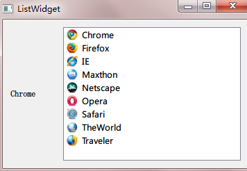
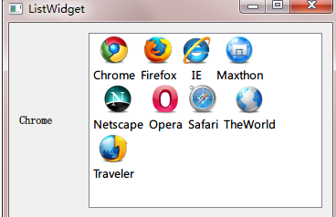
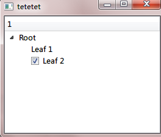
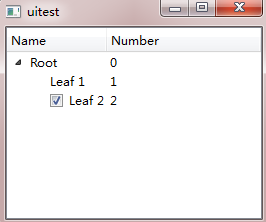
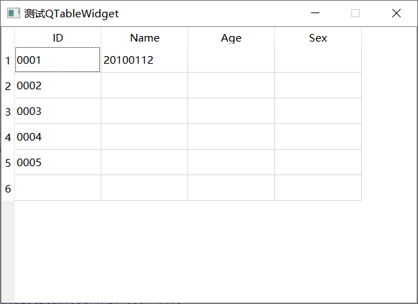
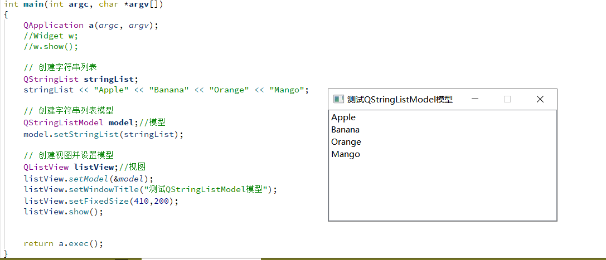

[TOC]


# QT 学习之路 2（41）：MODEL/VIEW 架构

https://www.devbean.net/2013/01/qt-study-road-2-model-view/

# QT 学习之路 2（42）：QLISTWIDGET、QTREEWIDGET 和 QTABLEWIDGET

上一章我们了解了 model/view 架构的基本概念。现在我们从最简单的`QListWidget`、`QTreeWidget`和`QTableWidget`三个类开始了解最简单的 model/view 的使用。

### `QListWidget`

我们要介绍的第一个是`QListWidget`。先来看下面的代码示例：

```cpp
label = new QLabel(this);
label->setFixedWidth(70);

listWidget = new QListWidget(this);

//方式一
new QListWidgetItem(QIcon(":/Chrome.png"), tr("Chrome"), listWidget);//1
new QListWidgetItem(QIcon(":/Firefox.png"), tr("Firefox"), listWidget);//2

//方式二(直接选择方式二)
listWidget->addItem(new QListWidgetItem(QIcon(":/IE.png"), tr("IE")));//1
listWidget->addItem(new QListWidgetItem(QIcon(":/Netscape.png"), tr("Netscape")));//3
listWidget->addItem(new QListWidgetItem(QIcon(":/Opera.png"), tr("Opera")));//4
listWidget->addItem(new QListWidgetItem(QIcon(":/Safari.png"), tr("Safari")));//5
listWidget->addItem(new QListWidgetItem(QIcon(":/TheWorld.png"), tr("TheWorld")));//6
listWidget->addItem(new QListWidgetItem(QIcon(":/Traveler.png"), tr("Traveler")));//7

//方式三
QListWidgetItem *newItem = new QListWidgetItem;
newItem->setIcon(QIcon(":/Maxthon.png"));
newItem->setText(tr("Maxthon"));
listWidget->insertItem(3, newItem);//9

QHBoxLayout *layout = new QHBoxLayout;//QHBoxLayout水平布局
layout->addWidget(label);
layout->addWidget(listWidget);

setLayout(layout);

connect(listWidget, SIGNAL(currentTextChanged(QString)),
        label, SLOT(setText(QString)));
```


`QListWidget`是简单的列表组件。当我们不需要复杂的列表时，可以选择`QListWidget`。
`QListWidget`中可以添加`QListWidgetItem`类型作为列表项，`QListWidgetItem`即可以有文本，也可以有图标。
上面的代码显示了三种向列表中添加列表项的方法（实际是两种，后两种其实是一样的），
我们的列表组件是`listWidget`，那么，向`listWidget`添加列表项可以：
第一，使用下面的语句
```cpp
new QListWidgetItem(QIcon(":/Chrome.png"), tr("Chrome"), listWidget);
```

 第二，使用
listWidget->addItem(new QListWidgetItem(QIcon(":/IE.png"), tr("IE")));
// 或者
```cpp
QListWidgetItem *newItem = new QListWidgetItem;
newItem->setIcon(QIcon(":/Maxthon.png"));
newItem->setText(tr("Maxthon"));
listWidget->insertItem(3, newItem);//insertItem函数
```
注意这两种添加方式的区别：第一种需要在构造时设置所要添加到的QListWidget对象；
第二种方法不需要这样设置，而是要调用addItem()或者insertItem()自行添加。
如果你仔细查阅QListWidgetItem的构造函数，会发现有一个默认的type参数。
该参数有两个合法值：QListWidgetItem::Type（默认）和QListWidgetItem::UserType。
如果我们继承QListWidgetItem，可以设置该参数，作为我们子类的一种区别，
以便能够在QListWidget区别处理不同子类。

我们的程序的运行结果如下：



我们可以利用QListWidget发出的各种信号来判断是哪个列表项被选择，具体细节可以参考文档。
另外，我们也可以改变列表的显示方式。前面的列表是小图标显示，
我们也可以更改为图标显示，只要添加一行语句：

listWidget->setViewMode(QListView::IconMode);



### `QTreeWidget`

我们要介绍的第二个组件是`QTreeWidget`。顾名思义，这是用来展示树型结构（也就是层次结构）的。
同前面说的`QListWidget`类似，这个类需要同另外一个辅助类`QTreeWidgetItem`一起使用。
不过，既然是提供方面的封装类，==即便是看上去很复杂的树，在使用这个类的时候也是显得比较简单的。==
当不需要使用复杂的`QTreeView`特性的时候，我们可以直接使用`QTreeWidget`代替。

下面我们使用代码构造一棵树：

```cpp
QTreeWidget treeWidget;//至此,成功建立了一颗树
treeWidget.setColumnCount(1);

QTreeWidgetItem *root = new QTreeWidgetItem(&treeWidget,
                                            QStringList(QString("Root")));//Root
new QTreeWidgetItem(root, QStringList(QString("Leaf 1")));//Leaf 1,认root为父
QTreeWidgetItem *leaf2 = new QTreeWidgetItem(root, QStringList(QString("Leaf 2")));//Leaf 2,认root为父

leaf2->setCheckState(0, Qt::Checked);

QList<QTreeWidgetItem *> rootList;
rootList << root;
treeWidget.insertTopLevelItems(0, rootList);

treeWidget.show();
```

首先，我们创建了一个`QTreeWidget`实例。然后我们调用`setColumnCount()`函数设定栏数。
这个函数的效果我们会在下文了解到。(==这个函数就是我们后面说的那个跳过去的函数==)
最后，我们向`QTreeWidget`添加`QTreeWidgetItem`。`QTreeWidgetItem`有很多重载的构造函数。
我们在这里看看其中的一个，其余的请自行查阅文档。这个构造函数的签名如下：

```
QTreeWidgetItem(QTreeWidget *parent, const QStringList &strings, int type = Type);
```

这里有 3 个参数，第一个参数用于指定这个项属于哪一个树，类似前面的`QListWidgetItem`，如果指定了这个值，则意味着该项被直接添加到树中；
第二个参数指定显示的文字；
第三个参数指定其类型，同`QListWidgetItem`的`type`参数十分类似。
值得注意的是，第二个参数是`QStringList`类型的，而不是`QString`类型。我们会在下文了解其含义。

在这段代码中，我们创建了作为根的`QTreeWidgetItem`root。
然后添加了第一个叶节点，之后又添加一个，而这个则设置了可选标记。
最后，我们将这个 root 添加到一个`QTreeWidgetItem`的列表，作为`QTreeWidget`的数据项。
此时你应该想到，既然`QTreeWidget`接受`QList`作为项的数据，它就能够支持多棵树的一起显示，而不仅仅是单根树。
下面我们来看看运行结果：



==从代码来看，我们能够想象到这个样子，只是这个树的头上怎么会有一个 1？
==还记得我们跳过去的那个函数吗？(setColumnCount())下面我们修改一下代码看看：

```cpp
//推荐写法
QTreeWidget treeWidget;

QStringList headers;
headers << "Name" << "Number";//表头
treeWidget.setHeaderLabels(headers);//将表头放到树里面

QStringList rootTextList;//根部
rootTextList << "Root" << "0";//表头有两个则根就有两个,此时,我们只是构建了QTreeWidget的第二个参数
QTreeWidgetItem *root = new QTreeWidgetItem(&treeWidget, rootTextList);//现在,我们要将根部放到树里面
//(注意:表头是表头,根部是根部,不一样的)

//QStringList() << QString("Leaf 1") << "1"这种写法非常妙,直接是将后面两个QString("Leaf 1")和"1"一起转化为QStringList()
new QTreeWidgetItem(root, QStringList() << QString("Leaf 1") << "1");//认root为父
QTreeWidgetItem *leaf2 = new QTreeWidgetItem(root,
                                   QStringList() << QString("Leaf 2") << "2");//认root为父
leaf2->setCheckState(0, Qt::Checked);//表示leaf2可以点击

QList<QTreeWidgetItem *> rootList;
rootList << root;
treeWidget.insertTopLevelItems(0, rootList);

treeWidget.show();
```

这次我们没有使用`setColumnCount()`，而是直接使用`QStringList`设置了 headers，也就是树的表头。接下来我们使用的还是`QStringList`设置数据。这样，我们实现的是带有层次结构的树状表格。利用这一属性，我们可以比较简单地实现类似 Windows 资源管理器的界面。



如果你不需要显示这个表头，可以调用`setHeaderHidden()`函数将其隐藏。

### `QTableWidget`

我们要介绍的最后一个是 `QTableWidget`。`QTableWidget`并不比前面的两个复杂到哪里去，这点我们可以从代码看出来：

```cpp
	QTableWidget tableWidget;//主角登场
    tableWidget.setColumnCount(4);//4列 => column 列
    tableWidget.setRowCount(6);//6行 => row 行
    tableWidget.setWindowTitle("测试QTableWidget");
    tableWidget.setFixedSize(600,400);//窗口大小

    QStringList headers;//表头
    headers << "ID" << "Name" << "Age" << "Sex";//每一列的标题
    tableWidget.setHorizontalHeaderLabels(headers);//放入tableWidget

    tableWidget.setItem(0, 0, new QTableWidgetItem(QString("0001")));
    tableWidget.setItem(1, 0, new QTableWidgetItem(QString("0002")));
    tableWidget.setItem(2, 0, new QTableWidgetItem(QString("0003")));
    tableWidget.setItem(3, 0, new QTableWidgetItem(QString("0004")));
    tableWidget.setItem(4, 0, new QTableWidgetItem(QString("0005")));
    tableWidget.setItem(0, 1, new QTableWidgetItem(QString("20100112")));

    tableWidget.show();
```

  这段代码运行起来是这样子的：



首先我们创建了`QTableWidget`对象，然后设置列数和行数。接下来使用一个`QStringList`，设置每一列的标题。
我们可以通过调用`setItem()`函数来设置表格的单元格的数据。这个函数前两个参数分别是行索引和列索引，
这两个值都是从 0 开始的，第三个参数则是一个`QTableWidgetItem`对象。Qt 会将这个对象放在第 row 行第 col 列的单元格中。
有关`QTableWidgetItem`的介绍完全可以参见上面的`QListWidgetItem`和`QTreeWidgetItem`。

# QT 学习之路 2（43）：QSTRINGLISTMODEL
上一章我们已经了解到有关 list、table 和 tree 三个最常用的视图类的便捷类的使用。
前面也提到过，由于这些类仅仅是提供方便，功能、实现自然不如真正的 model/view 强大。
从本章起，我们将了解最基本的 model/view 模型的使用。

既然是 model/view，我们也会分为两部分：model 和 view。本章我们将介绍 Qt 内置的最简单的一个模型：QStringListModel。(主角登场)

```cpp
// 创建字符串列表
    QStringList stringList;
    stringList << "Apple" << "Banana" << "Orange" << "Mango";

    // 创建字符串列表模型
    QStringListModel model;//模型
    model.setStringList(stringList);

    // 创建视图并设置模型
    QListView listView;//视图
    listView.setModel(&model);
    listView.setWindowTitle("测试QStringListModel模型");
    listView.setFixedSize(410,200);
    listView.show();
```


 

# QT 学习之路 2（44）：QFILESYSTEMMODEL

# QT 学习之路 2（45）：模型

# QT 学习之路 2（46）：视图和委托

# QT 学习之路 2（47）：视图选择

# QT 学习之路 2（48）：QSORTFILTERPROXYMODEL

# QT 学习之路 2（49）：自定义只读模型

# QT 学习之路 2（50）：自定义可编辑模型

