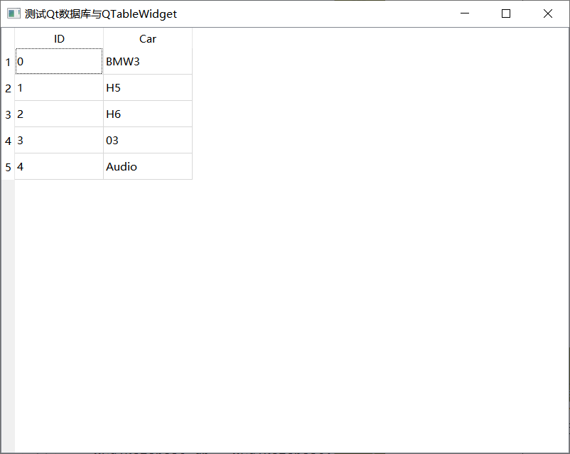
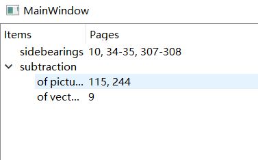
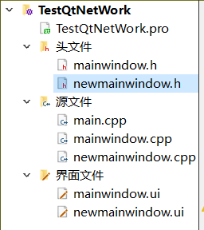
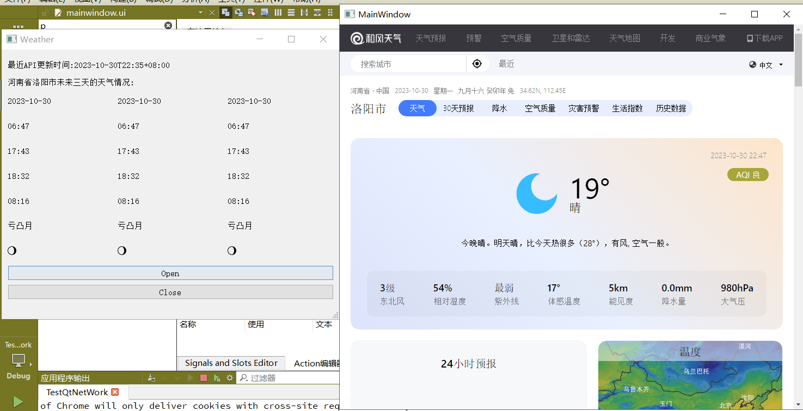
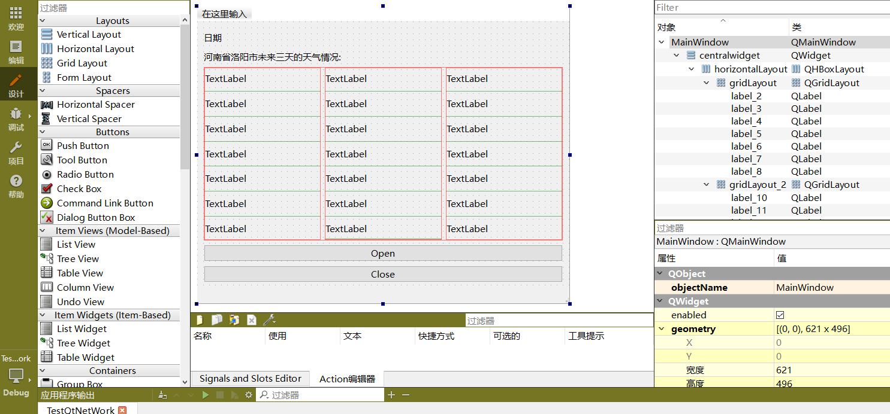
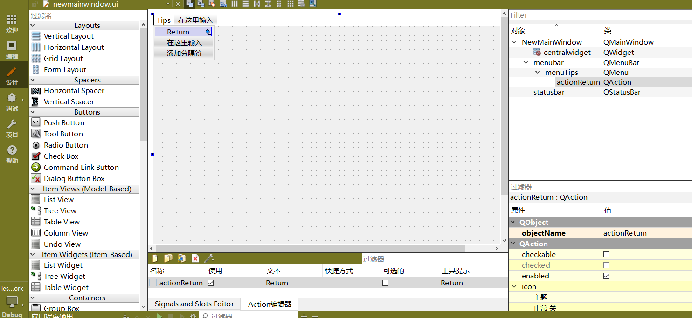

# Qt数据库操作(QSQLITE驱动)与QTablewidget相结合

```cpp
//你只需要在widget.h头文件中定义一个QTableWidget *tableWidget;其余的照着写,一模一样!
void EXEC(QSqlQuery query,QString sql)
{
    if(query.exec(sql))
    {
        qDebug()<<"语句执行 Success";
    }else{
        qDebug()<<"语句执行 Failed";
    }
}
Widget::Widget(QWidget *parent)
    : QWidget(parent)
    , ui(new Ui::Widget)
{
    ui->setupUi(this);

    QSqlDatabase db = QSqlDatabase::addDatabase("QSQLITE");//创建一个QSQLITE驱动的qt数据库实例
    db.setDatabaseName("mydatabase.db");//数据库的名字
    //必须要看的注释:对于 QSQLITE 来说,无需设置数据库名,用户名,密码,端口
    //db.setHostName("localhost");			// 主机名
    //db.setUserName("你的用户名");           // 数据库，用户名
    //db.setPassword("你的密码");				// 数据库，密码
    //db.setPort(3306);						// 数据库，端口

    if (!db.open()) {
        //说明这个qt的版本不支持该驱动
        //如果不支持驱动的话,QSqlDatabase db = QSqlDatabase::addDatabase("QMYSQL");这行代码会打印QSqlDatabase: Qxxx driver not loaded,但是不会报错
        qDebug() << "Error: Unable to open database";
        return ;
    }else{
        qDebug()<<"link success!!!";
    }

    //至此,mydatabase.db已成功创建并打开
    //必须要看的注释:(db.open()这个函数:有就打开这个数据库,没有就创建)
    QSqlQuery query;
    QString sql = "CREATE TABLE IF NOT EXISTS mytable (id INTEGER PRIMARY KEY, name TEXT)";//在当前这个库中执行sql语句
    EXEC(query,sql);

    // 假设你有一个QTableWidget对象叫做tableWidget
    tableWidget = new QTableWidget(this);
    tableWidget->setFixedSize(this->width(),this->height());
    tableWidget->setColumnCount(2);//column 列 (必须指定列,但不一定指定行)
    //tableWidget->setRowCount(5);//row 行
    //tableWidget->horizontalHeaderItem(2)->setTextAlignment(Qt::AlignCenter);//居中
    QStringList headers;//表头///////////////////QStringList/////////////////
    headers << "ID" << "Car";//每一列的标题
    tableWidget->setHorizontalHeaderLabels(headers);//放入tableWidget

    sql = "insert into mytable values(0,'BMW3');";
    EXEC(query,sql);
    sql = "insert into mytable values(1,'H5');";
    EXEC(query,sql);
    sql = "insert into mytable values(2,'H6');";
    EXEC(query,sql);
    sql = "insert into mytable values(3,'03');";
    EXEC(query,sql);
    sql = "insert into mytable values(4,'Audio');";
    EXEC(query,sql);


    sql = "SELECT * FROM mytable";
    query.exec(sql);


    while (query.next()) {
        int id = query.value(0).toInt();
        QString name = query.value(1).toString();

        int row = tableWidget->rowCount();//计算当前的tabelWidget有多少行
        qDebug()<<"row:"<<row;
        tableWidget->insertRow(row);


        tableWidget->setItem(row, 0, new QTableWidgetItem(QString::number(id)));
        tableWidget->setItem(row, 1, new QTableWidgetItem(name));

        //如果你想让每一行数据进行居中,则需要调用setTextAlignment(Qt::AlignCenter),如下:
        //QTableWidgetItem * tableWidgetItem = new QTableWidgetItem(QString::number(id));
        //tableWidgetItem->setTextAlignment(Qt::AlignCenter);//文本居中
        //QTableWidgetItem * tableWidgetItem1 = new QTableWidgetItem(name);
        //tableWidgetItem1->setTextAlignment(Qt::AlignCenter);//文本居中
        //tableWidget->setItem(row, 0,tableWidgetItem);
        //tableWidget->setItem(row, 1,tableWidgetItem1);

    }

    tableWidget->show();
    db.close();//关闭数据库
}
```



# Qt解析json文件

```json
{
   "Information": {
      "name": "John Doe",
      "age": 30,
      "city": "New York"
   },
   "Version": {
      "version": "1.1"
   }
}
```

```cpp
#include <QCoreApplication>
#include <QFile>
#include <QJsonDocument>
#include <QJsonObject>
#include <QDebug>

int main(int argc, char *argv[])
{
    QCoreApplication a(argc, argv);

    // 打开JSON文件
    QFile file("data.json");
    if (!file.open(QIODevice::ReadOnly | QIODevice::Text)) {
        qDebug() << "Could not open file";
        return -1;
    }

    // 读取文件内容
    QByteArray jsonData = file.readAll();

    // 解析JSON数据
    QJsonDocument doc = QJsonDocument::fromJson(jsonData);
    if (doc.isNull()) {
        qDebug() << "Failed to create JSON document";
        return -1;
    }

    // 获取根对象
    QJsonObject root = doc.object();

    // 获取Information部分的对象
    QJsonObject informationObj = root["Information"].toObject();/////////////1////////////

    // 从Information部分对象中获取数据
    QString name = informationObj["name"].toString();
    int age = informationObj["age"].toInt();
    QString city = informationObj["city"].toString();

    // 输出获取到的Information部分数据
    qDebug() << "Information:";
    qDebug() << "Name:" << name;
    qDebug() << "Age:" << age;
    qDebug() << "City:" << city;

    // 获取Version部分的对象
    QJsonObject versionObj = root["Version"].toObject();/////////////2////////////

    // 从Version部分对象中获取数据
    QString version = versionObj["version"].toString();

    // 输出获取到的Version部分数据
    qDebug() << "\nVersion:";
    qDebug() << "Version:" << version;

    return a.exec();
}
```


```
输出:
Information:
Name: "John Doe"
Age: 30
City: "New York"

Version:
Version: "1.1"
```


# QT 学习之路 2（59）：使用流处理 XML


使用qt读取以下`books.xml`文件:
```
<bookindex>
    <entry term="sidebearings">
        <page>10</page>
        <page>34-35</page>
        <page>307-308</page>
    </entry>
    <entry term="subtraction">
        <entry term="of pictures">
            <page>115</page>
            <page>244</page>
        </entry>
        <entry term="of vectors">
            <page>9</page>
        </entry>
    </entry>
</bookindex>
```
```cpp
//mainwindow.h
//头文件架构
#ifndef MAINWINDOW_H
#define MAINWINDOW_H

#include <QMainWindow>
#include <QTreeWidget>
#include <QXmlStreamReader>

QT_BEGIN_NAMESPACE
namespace Ui { class MainWindow; }
QT_END_NAMESPACE

class MainWindow : public QMainWindow
{
    Q_OBJECT

public:
    explicit MainWindow(QWidget *parent = nullptr);
    ~MainWindow();
    bool readFile(const QString &fileName);
private:
    Ui::MainWindow *ui;
    void readBookindexElement();
    void readEntryElement(QTreeWidgetItem *parent);
    void readPageElement(QTreeWidgetItem *parent);
    void skipUnknownElement();
    QTreeWidget *treeWidget;
    QXmlStreamReader reader;
};
#endif // MAINWINDOW_H
```

```cpp
//main.cpp
//主函数调用的业务逻辑超级简单,只需要读取xml文件,即可将xml上面的内容以QTreeWidget的形式4
//显示到mainwindow主窗口上
#include "mainwindow.h"

#include <QApplication>

int main(int argc, char *argv[])
{
    QApplication a(argc, argv);

    MainWindow w;
    w.readFile("books.xml");
    w.show();
	
    return a.exec();
}

```


```cpp
//mainwindow.cpp
#include "mainwindow.h"
#include "ui_mainwindow.h"
#include <QDir>
#include <QMessageBox>

//构造函数没什么好说的
MainWindow::MainWindow(QWidget *parent)
    : QMainWindow(parent)
    , ui(new Ui::MainWindow)
{
    ui->setupUi(this);
	//这个路径就是你应该将xml文件放在那里的路径
    QMessageBox::information(this, "Tips", QDir::currentPath());

    treeWidget = new QTreeWidget(this);
    QStringList headers;
    headers << "Items" << "Pages";
    treeWidget->setHeaderLabels(headers);
    setCentralWidget(treeWidget);//QTreeWidget这下子被mainwindow收未核心弟子了(中心组件)
}

MainWindow::~MainWindow()
{
    delete ui;
}
/*
readFile()函数用于打开给定文件。
我们使用QFile打开文件，将其设置为QXmlStreamReader的设备。
也就是说，此时QXmlStreamReader就可以从这个设备（QFile）中读取内容进行分析了。
接下来便是一个 while 循环，只要没读到文件末尾，就要一直循环处理。
首先判断是不是StartElement，如果是的话，再去处理 bookindex 标签。
注意，因为我们的根标签就是 bookindex，
如果读到的不是 bookindex，说明标签不对，就要发起一个错误（raiseError()）。
如果不是StartElement（第一次进入循环的时候，由于没有事先调用readNext()，所以会进入这个分支），
则调用readNext()。
为什么这里要用 while 循环，XML 文档不是只有一个根标签吗？
直接调用一次readNext()函数不就好了？
这是因为，XML 文档在根标签之前还有别的内容，
比如声明，比如 DTD，我们不能确定第一个readNext()之后就是根标签。
正如我们提供的这个 XML 文档，首先是 声明，其次才是根标签。如果你说，第二个不就是根标签吗？
但是 XML 文档还允许嵌入 DTD，还可以写注释，这就不确定数目了，
所以为了通用起见，我们必须用 while 循环判断。处理完之后就可以关闭文件，如果有错误则显示错误。
*/
bool MainWindow::readFile(const QString &fileName)
{
    QFile file(fileName);
    if (!file.open(QFile::ReadOnly | QFile::Text)) {
        QMessageBox::critical(this, tr("Error"),
                              tr("Cannot read file %1").arg(fileName));
        return false;
    }
    reader.setDevice(&file);
    while (!reader.atEnd()) {
        if (reader.isStartElement()) {
            if (reader.name() == "bookindex") {
                readBookindexElement();
            } else {
                reader.raiseError(tr("Not a valid book file"));
            }
        } else {
            reader.readNext();
        }
    }
    file.close();
    if (reader.hasError()) {
        QMessageBox::critical(this, tr("Error"),
                              tr("Failed to parse file %1").arg(fileName));
        return false;
    } else if (file.error() != QFile::NoError) {
        QMessageBox::critical(this, tr("Error"),
                              tr("Cannot read file %1").arg(fileName));
        return false;
    }
    return true;
}

/*
注意第一行我们加了一个断言。和cpp的断言一样 assert();
意思是，如果在进入函数的时候，reader 不是StartElement状态，或者说标签不是 bookindex，就认为出错。
然后继续调用readNext()，获取下面的数据。
后面还是 while 循环。
如果是EndElement，退出，
如果又是StartElement，说明是 entry 标签（注意我们的 XML 结构，bookindex 的子元素就是 entry），
那么开始处理 entry，否则跳过。
*/
void MainWindow::readBookindexElement()
{
    Q_ASSERT(reader.isStartElement() && reader.name() == "bookindex");
    reader.readNext();
    while (!reader.atEnd()) {
        if (reader.isEndElement()) {
            reader.readNext();
            break;
        }
        if (reader.isStartElement()) {
            if (reader.name() == "entry") {
                readEntryElement(treeWidget->invisibleRootItem());
            } else {
                skipUnknownElement();
            }
        } else {
            reader.readNext();
        }
    }
}
/*
这个函数接受一个QTreeWidgetItem指针，作为根节点。这个节点被当做这个 entry 标签在QTreeWidget中的根节点。
我们设置其名字是 entry 的 term 属性的值。然后继续读取下一个数据。
同样使用 while 循环，如果是EndElement就继续读取；
如果是StartElement，则按需调用readEntryElement()或者readPageElement()。
由于 entry 标签是可以嵌套的，所以这里有一个递归调用。
如果既不是 entry 也不是 page，则跳过位置标签。
*/
void MainWindow::readEntryElement(QTreeWidgetItem *parent)
{
    QTreeWidgetItem *item = new QTreeWidgetItem(parent);
    item->setText(0, reader.attributes().value("term").toString());
    reader.readNext();
    while (!reader.atEnd()) {
        if (reader.isEndElement()) {
            reader.readNext();
            break;
        }
        if (reader.isStartElement()) {
            if (reader.name() == "entry") {
                readEntryElement(item);
            } else if (reader.name() == "page") {
                readPageElement(item);
            } else {
                skipUnknownElement();
            }
        } else {
            reader.readNext();
        }
    }
}

/*
由于 page 是叶子节点，没有子节点，所以不需要使用 while 循环读取。
我们只是遍历了 entry 下所有的 page 标签，将其拼接成合适的字符串。
*/
void MainWindow::readPageElement(QTreeWidgetItem *parent)
{
    QString page = reader.readElementText();
    if (reader.isEndElement()) {
        reader.readNext();
    }
    QString allPages = parent->text(1);
    if (!allPages.isEmpty()) {
        allPages += ", ";
    }
    allPages += page;
    parent->setText(1, allPages);
}

/*
我们没办法确定到底要跳过多少位置标签，
所以还是得用 while 循环读取，
注意位置标签中所有子标签都是未知的，
因此只要是StartElement，都直接跳过。
*/
void MainWindow::skipUnknownElement()
{
    reader.readNext();
    while (!reader.atEnd()) {
        if (reader.isEndElement()) {
            reader.readNext();
            break;
        }
        if (reader.isStartElement()) {
            skipUnknownElement();
        } else {
            reader.readNext();
        }
    }
}
```




# QT 学习之路 2（65）：访问网络

## 访问网络

https://www.devbean.net/2013/10/qt-study-road-2-access-network-1/

提前ps:本文整篇文章都是围绕QtQNetworkAccessManager来展开的

Qt 进行网络访问的类是`QNetworkAccessManager`，这是一个名字相当长的类，
不过使用起来并不像它的名字一样复杂。
为了使用网络相关的类，你需要在 pro 文件中添加`QT += network`。


ps:这是自然


`QNetworkAccessManager`类允许应用程序发送网络请求以及接受服务器的响应。
事实上，Qt 的整个访问网络 API 都是围绕着这个类进行的。
`QNetworkAccessManager`保存发送的请求的最基本的配置信息，包含了代理和缓存的设置。
最好的是，这个 API 本身就是异步设计，这意味着我们不需要自己为其开启线程，以防止界面被锁死
（这里我们可以简单了解下，Qt 的界面活动是在一个主线程中进行。
网络访问是一个相当耗时的操作，if整个网络访问的过程以同步的形式在主线程进行，
则当网络访问没有返回时，主线程会被阻塞，界面就会被锁死，不能执行任何响应，
甚至包括一个代表响应进度的滚动条都会被卡死在那里。这种设计显然是不友好的。）。

异步的设计避免了这一系列的问题，但是却要求我们使用更多的代码来监听返回。
这类似于我们前面提到的`QDialog::exec()`和`QDialog::show()`之间的区别。
`QNetworkAccessManager`是使用信号槽来达到这一目的的。

一个应用程序仅需要一个`QNetworkAccessManager`类的实例。
所以，虽然`QNetworkAccessManager`本身没有被设计为单例，但是我们应该把它当做单例使用。

ps : 单例模式,这个很重要!!!

一旦一个`QNetworkAccessManager`实例创建完毕，我们就可以使用它发送网络请求。
这些请求都返回`QNetworkReply`对象作为响应。这个对象一般会包含有服务器响应的数据。

ps:很棒!QNetworkAccessManager用来发起请求,QNetworkReply用来作为响应。接下来我们看一下例子!

下面我们用一个例子来看如何使用`QNetworkAccessManager`进行网络访问。
这个例子不仅会介绍`QNetworkAccessManager`的使用，还将设计到一些关于程序设计的细节。

我们的程序是一个简单的天气预报的程序，使用 OpenWeatherMap 的 API 获取数据。我们可以在[这里](https://openweathermap.org/api)找到其 API 的具体介绍。


ps:如果上面的那个网站不能用了,可以试一试下面这个:

https://dev.qweather.com/docs/configuration/project-and-key/


我们前面说过，一般一个应用使用一个`QNetworkAccessManager`就可以满足需要.


## API选择

https://openweathermap.org/api

ps:每天免费调用1，000个API
超过每日限额的每API调用0.0015美元

上一章我们了解了NetWorker类的简单实现。不仅如此，我们还提到了几个 C++ 开发时常用的设计模式。这些在接下来得代码中依然会用到。

现在我们先来研究下 OpenWeatherMap 的相关 API。
之所以选择 OpenWeatherMap，主要是因为这个网站提供了简洁的 API 接口，
非常适合示例程序，并且其开发也不需要额外申请 App ID。
OpenWeatherMap 的 API 可以选择返回 JSON 或者 XML，这里我们选择使用 JSON 格式。
在进行查询时，OpenWeatherMap 支持使用城市名、地理经纬度以及城市 ID，为简单起见，
我们选择使用城市名。


ps:我觉得OpenWeatherMap不太合适,我用到是[ **和风天气开发服务**](https://dev.qweather.com/)

我们先来看一个例子：
https://devapi.qweather.com/v7/weather/3d?location=101180901&key=7d5511e63aae4a1fba275834cb9b35f9

> 补充:
>
> 如果想要最近7天的数据,就访问:
>
> https://devapi.qweather.com/v7/weather/7d?location=101180901&key=7d5511e63aae4a1fba275834cb9b35f9

```json
{
	"code":"200",#状态码
	"updateTime":"2023-10-28T17:35+08:00",#当前API的最近更新时间
	"fxLink":"https://www.qweather.com/weather/luoyang-101180901.html",#当前数据的响应式页面，便于嵌入网站或应用
	"daily":[
		{
			"fxDate":"2023-10-28",#预报日期
			"sunrise":"06:45",#日出时间
			"sunset":"17:45",#日落时间
			"moonrise":"17:23",#当天月升时间
			"moonset":"05:59",#当天月落时间
			"moonPhase":"盈凸月",#月相名称
			"moonPhaseIcon":"803",# 月相图标代码:https://icons.qweather.com/assets/icons/803.svg
			"tempMax":"26", 预报当天最高温度
			"tempMin":"11", 预报当天最低温度
			"iconDay":"100",预报白天天气状况的图标代码:https://icons.qweather.com/assets/icons/100.svg
			"textDay":"晴",预报白天天气状况文字描述，包括阴晴雨雪等天气状态的描述
			"iconNight":"150",预报夜间天气状况的图标代码:https://icons.qweather.com/assets/icons/150.svg
			"textNight":"晴",预报晚间天气状况文字描述，包括阴晴雨雪等天气状态的描述
			"wind360Day":"180",预报白天风向360角度
			"windDirDay":"南风",预报白天风向
			"windScaleDay":"1-3",预报白天风力等级
			"windSpeedDay":"16",预报白天风速，公里/小时
			"wind360Night":"238",预报夜间风向360角度
			"windDirNight":"西南风",预报夜间当天风向
			"windScaleNight":"1-3",预报夜间风力等级
			"windSpeedNight":"16",预报夜间风速，公里/小时
			"humidity":"53",相对湿度，百分比数值
            "precip":"0.0",紫外线强度指数
            "pressure":"988",大气压强，默认单位：百帕
            "vis":"25",能见度，默认单位：公里
            "cloud":"0",云量，百分比数值。可能为空
			"uvIndex":"1"紫外线强度指数
		},
		{
			"fxDate":"2023-10-29",
            "sunrise":"06:46",
            "sunset":"17:44",
            "moonrise":"17:55",
            "moonset":"07:07",
            "moonPhase":"满月",
            "moonPhaseIcon":"804",
            "tempMax":"27",
            "tempMin":"12",
            "iconDay":"100",
            "textDay":"晴",
            "iconNight":"150",
            "textNight":"晴",
            "wind360Day":"180",
            "windDirDay":"南风",
            "windScaleDay":"1-3",
            "windSpeedDay":"16",
            "wind360Night":"243",
            "windDirNight":"西南风",
            "windScaleNight":"1-3",
            "windSpeedNight":"16",
            "humidity":"50",
            "precip":"0.0",
            "pressure":"988",
            "vis":"25",
            "cloud":"0",
            "uvIndex":"4"
		},
		{
			"fxDate":"2023-10-30",
            "sunrise":"06:47",
            "sunset":"17:43",
            "moonrise":"18:32",
            "moonset":"08:16",
            "moonPhase":"亏凸月",
            "moonPhaseIcon":"805",
            "tempMax":"27",
            "tempMin":"12",
            "iconDay":"100",
            "textDay":"晴",
            "iconNight":"150",
            "textNight":"晴",
            "wind360Day":"225",
            "windDirDay":"西南风",
            "windScaleDay":"1-3",
            "windSpeedDay":"16",
            "wind360Night":"228",
            "windDirNight":"西南风",
            "windScaleNight":"1-3",
            "windSpeedNight":"16",
            "humidity":"51",
            "precip":"0.0",
            "pressure":"989",
            "vis":"25",
            "cloud":"0",
            "uvIndex":"1"
		}
	],
	"refer":{
		"sources":[
			"QWeather"   原始数据来源，或数据源说明，可能为空
        ],
        "license":[
            "CC BY-SA 4.0"  数据许可或版权声明，可能为空
        ]
    }
}
```

## 整体代码



效果如下:



mainwindow.ui:



newmainwindow.ui:



```pro
#TestQtNetWork.pro

QT       += core gui network webenginewidgets

greaterThan(QT_MAJOR_VERSION, 4): QT += widgets

CONFIG += c++17

# You can make your code fail to compile if it uses deprecated APIs.
# In order to do so, uncomment the following line.
#DEFINES += QT_DISABLE_DEPRECATED_BEFORE=0x060000    # disables all the APIs deprecated before Qt 6.0.0

SOURCES += \
    main.cpp \
    mainwindow.cpp \
    newmainwindow.cpp

HEADERS += \
    mainwindow.h \
    newmainwindow.h

FORMS += \
    mainwindow.ui \
    newmainwindow.ui

# Default rules for deployment.
qnx: target.path = /tmp/$${TARGET}/bin
else: unix:!android: target.path = /opt/$${TARGET}/bin
!isEmpty(target.path): INSTALLS += target

```
```cpp
//mainwindow.h
#ifndef MAINWINDOW_H
#define MAINWINDOW_H

#include <QMainWindow>
#include <QJsonDocument>
#include <QJsonObject>
#include <QJsonParseError>
#include <QNetworkAccessManager>
#include <QNetworkReply>
#include <QUrl>


QT_BEGIN_NAMESPACE
namespace Ui { class MainWindow; }
QT_END_NAMESPACE

class MainWindow : public QMainWindow
{
    Q_OBJECT

public:
    MainWindow(QWidget *parent = nullptr);
    ~MainWindow();
    QString NewPageStr;
public:
    Ui::MainWindow *ui;

signals:
    void changenew();
    //void changenew(QString);
    void Closenew();
private slots:

    void on_pushButton_clicked();

    void on_pushButton_2_clicked();

private:
    QNetworkAccessManager *manager;
    QNetworkReply *reply;


};
#endif // MAINWINDOW_H

```

```cpp
//newmainwindow.h
#ifndef NEWMAINWINDOW_H
#define NEWMAINWINDOW_H

#include <QMainWindow>
#include <QResizeEvent>
#include <QWebEngineView>

namespace Ui {
class NewMainWindow;
}

class NewMainWindow : public QMainWindow
{
    Q_OBJECT

public:
    explicit NewMainWindow(QWidget *parent = nullptr);
    ~NewMainWindow();

    QWebEngineView *view;  //声明view
    Ui::NewMainWindow *ui;
    void resizeEvent(QResizeEvent *event);
signals:
    void changeFirst();
private slots:
    void on_pushButton_clicked();

    void on_actionReturn_triggered();

private:


};

#endif // NEWMAINWINDOW_H

```

```cpp
//main.cpp
#include "mainwindow.h"
#include "ui_mainwindow.h"
#include "newmainwindow.h"
#include "ui_newmainwindow.h"

#include <QApplication>
#include <QJsonDocument>
#include <QJsonObject>
#include <QJsonParseError>
#include <QNetworkAccessManager>
#include <QNetworkReply>
#include <QUrl>
#include <QObject>
#include <QStringLiteral>
#include <QVBoxLayout>

int main(int argc, char *argv[])
{
    QApplication a(argc, argv);
    MainWindow w;
    NewMainWindow nw;
    //w.ui->pushButton
    w.show();

    QObject::connect(&w,&MainWindow::changenew,
    &nw,[&](){
        nw.view = new QWebEngineView(&nw);
        nw.view->load(QUrl(w.NewPageStr.toUtf8().constData()));
        nw.view->setFixedSize(nw.width(),nw.height());
        nw.view->showMaximized();
        nw.show();
    });
    QObject::connect(&w,&MainWindow::Closenew,
    &nw,[&](){
        nw.hide();
    });
    QObject::connect(&nw,&NewMainWindow::changeFirst,
     &w,[&](){
         w.show();
     });


    return a.exec();
}

```

```cpp
//mainwindow.cpp
#include "mainwindow.h"
#include "ui_mainwindow.h"


#include <QJsonArray>

MainWindow::MainWindow(QWidget *parent)
    : QMainWindow(parent)
    , ui(new Ui::MainWindow)
{
    ui->setupUi(this);
    setWindowTitle(tr("Weather"));


    manager = new QNetworkAccessManager(this);

    QUrl url("https://devapi.qweather.com/v7/weather/3d?location=101180901&key=7d5511e63aae4a1fba275834cb9b35f9"); // 替换成实际的 API 地址
    QNetworkRequest request(url);

    reply = manager->get(request);

    QObject::connect(reply, &QNetworkReply::finished, [&]() {
        if (reply->error() == QNetworkReply::NoError) {
            QByteArray responseData = reply->readAll();
            QJsonDocument jsonDocument = QJsonDocument::fromJson(responseData);

            //处理json文件
            if (!jsonDocument.isNull() && jsonDocument.isObject()) {
                QJsonObject jsonObject = jsonDocument.object();
                // 现在你可以使用 jsonObject 来访问返回的 JSON 数据
                qDebug()<<jsonObject["code"].toString();//"200"
                qDebug()<<jsonObject["updateTime"].toString();//"2023-10-28T21:35+08:00"
                ui->label->setText("最近API更新时间:"+jsonObject["updateTime"].toString());
                qDebug()<<jsonObject["fxLink"].toString();//"https://www.qweather.com/weather/luoyang-101180901.html"
                NewPageStr = jsonObject["fxLink"].toString();

                QJsonArray jsonArray = jsonObject["daily"].toArray();
                QJsonObject jObj1 = jsonArray.at(0).toObject();
                QJsonObject jObj2 = jsonArray.at(0).toObject();
                QJsonObject jObj3 = jsonArray.at(0).toObject();
                qDebug()<<jObj1["fxDate"].toString();//"2023-10-28"
                ui->label_2->setText(jObj1["fxDate"].toString());
                ui->label_3->setText(jObj1["sunrise"].toString());
                ui->label_4->setText(jObj1["sunset"].toString());
                ui->label_5->setText(jObj1["moonrise"].toString());
                ui->label_6->setText(jObj1["moonset"].toString());
                ui->label_7->setText(jObj1["moonPhase"].toString());

                // 创建一个QNetworkAccessManager来下载图标
                QNetworkAccessManager* manager = new QNetworkAccessManager(this);

                QString iconUrl = "https://icons.qweather.com/assets/icons/"
                               +jObj1["moonPhaseIcon"].toString()
                               +".svg";
                // 发送GET请求来获取图标
                QNetworkRequest request;
                request.setUrl(QUrl(iconUrl));
                QNetworkReply* reply = manager->get(request);
                //
                // 处理下载完成后的回调
                connect(reply, &QNetworkReply::finished, [=]() {
                    if (reply->error() == QNetworkReply::NoError) {
                        // 读取下载的数据
                        QByteArray data = reply->readAll();

                        // 将数据转换成QPixmap
                        QPixmap pixmap;
                        pixmap.loadFromData(data);

                        // 将图标显示在QLabel中
                        ui->label_8->setPixmap(pixmap);
                    }
                    // 清理资源
                    reply->deleteLater();
                });
                //


                qDebug()<<jObj2["fxDate"].toString();//"2023-10-28"
                ui->label_9->setText(jObj2["fxDate"].toString());
                ui->label_10->setText(jObj2["sunrise"].toString());
                ui->label_11->setText(jObj2["sunset"].toString());
                ui->label_12->setText(jObj2["moonrise"].toString());
                ui->label_13->setText(jObj2["moonset"].toString());
                ui->label_14->setText(jObj2["moonPhase"].toString());


                iconUrl = "https://icons.qweather.com/assets/icons/"
                                  +jObj2["moonPhaseIcon"].toString()
                                  +".svg";
                // 发送GET请求来获取图标
                request.setUrl(QUrl(iconUrl));
                reply = manager->get(request);
                //
                // 处理下载完成后的回调
                connect(reply, &QNetworkReply::finished, [=]() {
                    if (reply->error() == QNetworkReply::NoError) {
                        // 读取下载的数据
                        QByteArray data = reply->readAll();

                        // 将数据转换成QPixmap
                        QPixmap pixmap;
                        pixmap.loadFromData(data);

                        // 将图标显示在QLabel中
                        ui->label_15->setPixmap(pixmap);
                    }
                    // 清理资源
                    reply->deleteLater();
                });
                //

                qDebug()<<jObj3["fxDate"].toString();//"2023-10-28"
                ui->label_16->setText(jObj2["fxDate"].toString());
                ui->label_17->setText(jObj2["sunrise"].toString());
                ui->label_18->setText(jObj2["sunset"].toString());
                ui->label_19->setText(jObj2["moonrise"].toString());
                ui->label_20->setText(jObj2["moonset"].toString());
                ui->label_21->setText(jObj2["moonPhase"].toString());


                iconUrl = "https://icons.qweather.com/assets/icons/"
                          +jObj2["moonPhaseIcon"].toString()
                          +".svg";
                // 发送GET请求来获取图标
                request.setUrl(QUrl(iconUrl));
                reply = manager->get(request);
                //
                // 处理下载完成后的回调
                connect(reply, &QNetworkReply::finished, [=]() {
                    if (reply->error() == QNetworkReply::NoError) {
                        // 读取下载的数据
                        QByteArray data = reply->readAll();

                        // 将数据转换成QPixmap
                        QPixmap pixmap;
                        pixmap.loadFromData(data);

                        // 将图标显示在QLabel中
                        ui->label_22->setPixmap(pixmap);
                    }
                    // 清理资源
                    reply->deleteLater();
                });
                //

            } else {
                qDebug() << "Error: Unable to parse JSON";
            }
        } else {
            qDebug() << "Error:" << reply->errorString();
        }

        reply->deleteLater();
    });


}

MainWindow::~MainWindow()
{
    delete ui;
}


void MainWindow::on_pushButton_clicked()
{
    //this->hide();
    emit changenew();
    //emit changenew(this->NewPageStr);
}


void MainWindow::on_pushButton_2_clicked()
{
    emit Closenew();
}


```

```cpp
//newmainwindow.cpp
#include "newmainwindow.h"
#include "ui_newmainwindow.h"

NewMainWindow::NewMainWindow(QWidget *parent) :
    QMainWindow(parent),
    ui(new Ui::NewMainWindow)
{
    ui->setupUi(this);


}

NewMainWindow::~NewMainWindow()
{
    delete ui;
}

void NewMainWindow::on_pushButton_clicked()
{
    this->hide();
    emit changeFirst();
}


void NewMainWindow::on_actionReturn_triggered()
{
    //this->hide();
    emit changeFirst();
}

void NewMainWindow::resizeEvent(QResizeEvent *event)
{
    QMainWindow::resizeEvent(event); // 调用基类的 resizeEvent，确保正常的处理

    // 获取新的 mainwindow 大小
    QSize newSize = event->size();

    // 将新的大小应用于 view
    view->setFixedSize(newSize.width(), newSize.height());
}


```


