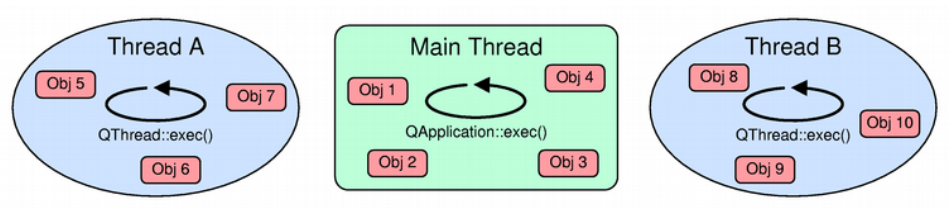

# QT 学习之路 2（69）：进程

进程是操作系统的基础之一。一个进程可以认为是一个正在执行的程序。**我们可以把进程当做计算机运行时的一个基础单位**。关于进程的讨论已经超出了本章的范畴，现在我们假定你是了解这个概念的。

在 Qt 中，我们使用`QProcess`来表示一个进程。这个类可以允许我们的应用程序开启一个新的外部程序，并且与这个程序进行通讯。下面我们用一个非常简单的例子开始我们本章有关进程的阐述:

<font color=red>这只是一个简单的例子，展示了如何使用Qt中的`QProcess`类来启动外部程序并与其通信。你可以根据具体需求进一步探索`QProcess`类的更多功能和用法。</font>

首先，我们需要包含`QProcess`类的头文件：

```cpp
#include <QProcess>
```

然后，我们可以创建一个`QProcess`对象，并使用`start()`函数来启动一个外部程序。假设我们要启动一个名为"myprogram"的外部程序，可以这样写：

```
QProcess process;
process.start("myprogram");
```

上述代码将启动"myprogram"程序。如果程序成功启动，它将在后台运行。但是，我们也可以通过`waitForStarted()`函数等待程序启动完成，以确保它已经成功启动：

```
if (process.waitForStarted()) {
    // 程序已经成功启动
} else {
    // 启动失败
}
```

接下来，我们可以使用`write()`函数向外部程序发送数据，使用`readAll()`函数读取外部程序的输出。以下是一个完整的例子，演示了如何发送数据给外部程序并读取其输出：

```cpp
QProcess process;
process.start("myprogram");

//红警超级武器-核弹进程
if (process.waitForStarted()) {
    //核弹打击程序已启动
    process.write("Hello, world!");//在启动之前,我们先向首长发去亲切的问候
    process.closeWriteChannel();//问候结束,关闭发送信息的通道

    process.waitForFinished();//等待首长指示

    //读取首长指示信息
    QByteArray output = process.readAll();
    //发送核弹打击
    qDebug() << "Output:" << output;
} else {
    //核弹打击程序未能正常启动,请相关工程师进行维护
    qDebug() << "Failed to start the program.";
}
```

在上述例子中，我们使用`write()`函数向外部程序发送了字符串"Hello, world!"，然后使用`closeWriteChannel()`关闭写通道，表示不再向外部程序发送数据。接着，我们使用`waitForFinished()`等待外部程序执行完成。最后，我们使用`readAll()`函数读取外部程序的输出，并通过`qDebug()`函数打印输出内容。


//在上述的例子中,首长(位与外部程序),你想知道首长是符合与核弹进程内进行交互的吗?


为了开启进程，我们将外部程序名字（`program`）和程序启动参数（`arguments`）作为**参数**传给`QProcess::start()`函数。当然，你也可以使用`setProgram()`和`setArguments()`进行设置。

此时，`QProcess`进入`Starting` 状态；当程序开始执行之后，`QProcess`进入`Running` 状态，并且发出`started()`信号。当进程退出时，`QProcess`进入`NotRunning`状态（也是初始状态），并且发出`finished()`信号。`finished()`信号以参数的形式提供进程的退出代码和退出状态。如果发送错误，`QProcess`会发出`error()`信号

**`QProcess`允许你将一个进程当做一个顺序访问的 I/O 设备。**

我们可以使用`write()`函数**将数据提供给进程的标准输入**；

使用`read()`、`readLine()`或者`getChar()`函数获取其标准输出。

由于**`QProcess`继承自`QIODevice**`，因此`QProcess`也可以作为`QXmlReader`的输入或者直接使用`QNetworkAccessManager`将其生成的数据上传到网络!!!


进程通常有两个预定义的通道：**标准输出通道（stdout）和标准错误通道（stderr）**。**前者就是常规控制台的输出，后者则是由进程输出的错误信息**。这两个通道都是**独立的数据流**，

我们可以通过使用`setReadChannel()`函数来**切换这两个通道**。**当进程的当前通道**可用时，

`QProcess`会**发出`readReady()`信号**。当有了新的标准输出数据时，`QProcess`会**发出`readyReadStandardOutput()`信号**；

当有了新的标准错误数据时，则会**发出`readyReadStandardError()`信号**。


我们前面的示例程序就是使用了`readReady()`信号。

通道的术语可能会引起误会。注意，**进程的输出通道对应着`QProcess`的 读 通道**，进程的**输入通道对应着`QProcess`的 写 通道**。这是因为我们**使用`QProcess`“读取”进程的输出**，而我们**针对`QProcess`的“写入”则成为进程的输入**。*`QProcess`还可以合并标准输出和标准错误通道，使用`setProcessChannelMode()`函数设置`MergedChannels`即可实现。*

另外，**`QProcess`还允许我们使用`setEnvironment()`为进程设置环境变量**，或者使用`setWorkingDirectory()`为进程设置工作目录。

前面我们所说的信号槽机制，类似于前面我们介绍的`QNetworkAccessManager`，都是**异步**的。

与`QNetworkAccessManager`不同在于，`QProcess`提供了同步函数：

- `waitForStarted()`：阻塞到进程开始；
- `waitForReadyRead()`：阻塞到可以从进程的当前读通道读取新的数据；
- `waitForBytesWritten()`：阻塞到数据写入进程；
- `waitForFinished()`：阻塞到进程结束；

注意，在主线程（调用了`QApplication::exec()`的线程）调用上面几个函数**会让界面失去响应**。  

# QT 学习之路 2（70）：进程间通信

我们将进程理解为相互独立的正在运行的程序。由于二者是相互独立的，就存在交互的可能性，也就是我们所说的进程间通信（Inter-Process Communication，IPC）。

不过也正因此，我们的一些简单的交互方式，比如普通的信号槽机制等，并不适用于进程间的相互通信。我们说过，**进程是操作系统的基本调度单元**，因此，**进程间交互不可避免与操作系统的实现息息相关**。


**Qt 提供了四种进程间通信的方式：**

1. 使用**共享内存**（shared memory）交互：这是 Qt 提供的一种各个平台均有支持的进程间交互的方式。
2. TCP/IP：其基本思想就是将**同一机器上面的两个进程** *一个当做服务器，一个当做客户端*，二者通过**网络协议**进行交互。**除了两个进程是在同一台机器上，这种交互方式与普通的 C/S 程序没有本质区别**。<font color=red>Qt 提供了 QNetworkAccessManager 对此进行支持。</font>
3. D-Bus：freedesktop 组织开发的一种低开销、低延迟的 IPC 实现。Qt 提供了 **QtDBus** 模块，**把信号槽机制扩展到进程级别**（因此我们前面强调是“普通的”信号槽机制无法实现 IPC），使得开发者可以在一个进程中发出信号，由其它进程的槽函数响应信号。

   

从上面的介绍中可以看到，通用的 IPC 实现大致只有共享内存和 TCP/IP 两种。后者我们前面已经大致介绍过（**应用程序级别的 QNetworkAccessManager 或者更底层的 QTcpSocket 等**）；本章我们主要介绍前者。

**Qt 使用`QSharedMemory`类操作共享内存段**。我们可以**把`QSharedMemory`看做一种指针，这种指针指向分配出来的一个共享内存段。而这个共享内存段是由底层的操作系统提供，可以供多个线程或进程使用**。因此，**`QSharedMemory`可以看做是专供 Qt 程序访问这个共享内存段的指针**。同时，==**`QSharedMemory`还提供了单一线程或进程互斥访问某一内存区域的能力**==。当我们**创建了`QSharedMemory`实例**后，可以使用其**`create()`函数请求操作系统分配一个共享内存段**。如果创建成功（函数返回`true`），Qt 会**自动**将系统分配的共享内存段连接（attach）到**本进程**。


下面我们通过一段经典的代码来演示共享内存的使用。这段代码修改自 Qt 自带示例程序 。程序有两个按钮，
一个按钮用于加载一张图片，然后将该图片放在共享内存段；
第二个按钮用于从共享内存段读取该图片并显示出来。

```
class QSharedMemory;

class MainWindow : public QMainWindow
{
    Q_OBJECT

public:
    MainWindow(QWidget *parent = 0);
    ~MainWindow();

private:
    QSharedMemory *sharedMemory;
};
```

头文件中，我们将`MainWindow`添加一个`sharedMemory`属性。这就是我们的共享内存段。接下来得实现文件中：

```
const char *key_shared_memory = "Shared";//字符串而已,作为QSharedMemory

MainWindow::MainWindow(QWidget *parent)//使用初始化链表初始化成员变量,第一个是他的father,也就是用Mainwindow的基类QMainWindow的构造函数来先初始化一波程序,第二个是他自己的成员变量(方向<-)
    : QMainWindow(parent),
      sharedMemory(new QSharedMemory(key_shared_memory, this))
{
    QWidget *mainWidget = new QWidget(this);
    QVBoxLayout *mainLayout = new QVBoxLayout(mainWidget);
    setCentralWidget(mainWidget);//中心部件

    QPushButton *saveButton = new QPushButton(tr("Save"), this);
    mainLayout->addWidget(saveButton);//
    QLabel *picLabel = new QLabel(this);
    mainLayout->addWidget(picLabel);//
    QPushButton *loadButton = new QPushButton(tr("Load"), this);
    mainLayout->addWidget(loadButton);//
```

构造函数初始化列表中我们将`sharedMemory`成员变量进行初始化。注意我们给出一个键（Key），前面说过，我们可以把`QSharedMemory`看做是指向系统共享内存段的指针，而<font color=red>这个键就可以看做指针的名字</font>。多个线程或进程使用同一个共享内存段时，该键值必须相同(*也就是说,这个key就是这段空闲内存的标识符*)。接下来是两个按钮和一个标签用于界面显示.

下面来看加载图片按钮的实现：

```
    connect(saveButton, &QPushButton::clicked, [=]() {//中小大
        if (sharedMemory->isAttached()) {//已经和某个线程或进程连接了
        	//通过调用 detach() 函数，当前进程将与共享内存段断开关联，不再访问共享内存中的数据。
            sharedMemory->detach();//先断开,咱们先用
        }
        //上面这段代码是先断开与之前(前任)的连接,断开就与前任彻底失去连接了,现在遇到了新的了,我们需要重新创建一块新的内存,不信,你看后面,会使用shared_Memory->create(size)!
        
        //选择一张图片
        /open文件选择对话框
        QString filename = QFileDialog::getOpenFileName(this);
        QPixmap pixmap(filename);
        picLabel->setPixmap(pixmap);//设置图片
		
		//缓冲区
		//我们可以使用QBuffer将图片文件转换为字符串
        QBuffer buffer;
        QDataStream out(&buffer);
        buffer.open(QBuffer::ReadWrite);//缓冲区可读可写
        out << pixmap;

        int size = buffer.size();
        if (!sharedMemory->create(size)) {/////////
            qDebug() << tr("Create Error: ") << sharedMemory->errorString();
        } else {
            sharedMemory->lock();//上锁
            char *to = static_cast<char *>(sharedMemory->data());
            const char *from = buffer.data().constData();
            memcpy(to, from, qMin(size, sharedMemory->size()));
            sharedMemory->unlock();//解
        }
    });
```

点击加载按钮之后，如果`sharedMemory`已经与某个线程或进程连接，则将其断开（因为我们就要向共享内存段写入内容了）。然后使用`QFileDialog`选择一张图片，<font colo=red>利用`QBuffer`将图片数据作为`char *`格式</font>。<font color=orange>在即将写入共享内存之前，我们需要请求系统创建一个共享内存段（`QSharedMemory::create()`函数），创建成功则开始写入共享内存段。</font>
需要注意的是，在读取或写入共享内存时，都需要使用`QSharedMemory::lock()`函数对共享内存段加锁。共享内存段就是一段普通内存，所以我们使用 C 语言标准函数`memcpy()`复制内存段。不要忘记之前我们对共享内存段加锁，在最后需要将其解锁。


Now,我们已经将图片放到sharedMemory->data()里面了,
接下来是从里面加载按钮的代码：
```
    connect(loadButton, &QPushButton::clicked, [=]() {
    	//sharedMemory->attach()用于将当前进程连接到共享内存段。
        if (!sharedMemory->attach()) {//连接
        	//用不了
            qDebug() << tr("Attach Error: ") << sharedMemory->errorString();
        } else {
            QBuffer buffer;
            QDataStream in(&buffer);//读取
            QPixmap pixmap;
            
            sharedMemory->lock();
            buffer.setData(static_cast<const char *>(sharedMemory->constData()), sharedMemory->size());
            buffer.open(QBuffer::ReadWrite);
            in >> pixmap;//数据流入pixmap
            sharedMemory->unlock();
            
            sharedMemory->detach();//断开
            picLabel->setPixmap(pixmap);
        }
    });
```

如果共享内存段已经连接，还是用`QBuffer`读取二进制数据，然后生成图片。注意我们在操作共享内存段时还是要先加锁再解锁。最后在读取完毕后，将共享内存段断开连接。

注意，如果某个共享内存段不是由 Qt 创建的，我们也是可以在 Qt 应用程序中使用。不过这种情况下我们必须使用`QSharedMemory::setNativeKey()`来设置共享内存段。使用原始键（native key）时，`QSharedMemory::lock()`函数就会失效，我们必须自己保护共享内存段不会在多线程或进程访问时出现问题。

IPC 使用共享内存通信是一个很常用的开发方法。多个进程间得通信要比多线程间得通信少一些，不过在某一族的应用情形下，比如 QQ 与 QQ 音乐、QQ 影音等共享用户头像，还是非常有用的。

# QT 学习之路 2（71）：线程简介

前面我们讨论了有关进程以及进程间通讯的相关问题，现在我们开始讨论线程。事实上，现代的程序中，使用线程的概率应该大于进程。特别是在多核时代，随着 CPU 主频的提升，受制于发热量的限制，CPU 散热问题已经进入瓶颈，另辟蹊径地提高程序运行效率就是使用线程，充分利用多核的优势。
有关线程和进程的区别:一个进程可以有一个或更多线程同时运行。线程可以看做是“轻量级进程”，进程完全由操作系统管理，线程即可以由操作系统管理，也可以由应用程序管理。

Qt 使用`QThread` 来**管理**线程。下面来看一个简单的例子：

```
MainWindow::MainWindow(QWidget *parent)
    : QMainWindow(parent)
{
    QWidget *widget = new QWidget(this);
    QVBoxLayout *layout = new QVBoxLayout;
    widget->setLayout(layout);//部件
    QLCDNumber *lcdNumber = new QLCDNumber(this);
    layout->addWidget(lcdNumber);//lcd
    QPushButton *button = new QPushButton(tr("Start"), this);
    layout->addWidget(button);//but
    setCentralWidget(widget);//中心部件

    QTimer *timer = new QTimer(this);//计时器
    //questio:你知道QTimer的timeout是如何触发的吗?
   	//ans:当然是发出信号了?如何发出信号?Qt进行了封装:timer->start(1);//每隔一秒就会触发一次QTimer::timeout信号
    connect(timer, &QTimer::timeout, [=]() {
        static int sec = 0;
        lcdNumber->display(QString::number(sec++));
    });
	
	//WorkerThread 是什么?<修辞手法:设置悬念>
	//不急,在后面,继承了QThread类的线程类
    WorkerThread *thread = new WorkerThread(this);
    //看到这里,大佬们可能就会疑惑了,你写了thread变量,却没使用?
    //没错!<修辞手法:先抑后扬>
    //这么写是错的,你在主程序的构造函数中循环200000000...次,只有循环完,GUI才可以点击==>照成的现象就是直接卡死了
    connect(button, &QPushButton::clicked, [=]() {
        timer->start(1);
        for (int i = 0; i < 2000000000; i++);
        timer->stop();
    });
}
```

我们的主界面有一个用于显示时间的 LCD 数字面板还有一个用于启动任务的按钮。程序的目的是用户点击按钮，开始一个非常耗时的运算（程序中我们以一个 2000000000 次的循环来替代这个非常耗时的工作，在真实的程序中，这可能是一个网络访问，可能是需要复制一个很大的文件或者其它任务），同时 LCD 开始显示逝去的毫秒数。毫秒数通过一个计时器`QTimer`进行更新。计算完成后，计时器停止。这是一个很简单的应用，也看不出有任何问题。但是当我们开始运行程序时，问题就来了：点击按钮之后，程序界面直接停止响应，直到循环结束才开始重新更新。


<前面咱家就说了,这个程序会卡死,没错,确实died了>
有经验的开发者立即指出，这里需要使用线程。这是因为 Qt 中所有界面都是在 UI 线程中（也被称为主线程，就是执行了`QApplication::exec()`的线程），在这个线程中执行耗时的操作（比如那个循环），就会阻塞 UI 线程，从而让界面停止响应。
界面停止响应，用户体验自然不好，不过更严重的是，有些窗口管理程序会检测到你的程序已经失去响应，可能会建议用户强制停止程序，这样一来你的程序可能就此终止，任务再也无法完成。所以，为了避免这一问题，我们要使用 QThread 开启一个新的线程：

```
//没错,就是他
class WorkerThread : public QThread
{
    Q_OBJECT
public:
    WorkerThread(QObject *parent = 0)
        : QThread(parent)
    {
    }
protected:
    void run()
    {
        for (int i = 0; i < 1000000000; i++);
        emit done();//发送及时结束的信号
    }
signals:
    void done();
};

MainWindow::MainWindow(QWidget *parent)
    : QMainWindow(parent)//惯用手段,调用自己的构造函数时,先调用父类的构造函数,方向<-
{
    QWidget *widget = new QWidget(this);
    QVBoxLayout *layout = new QVBoxLayout;
    widget->setLayout(layout);//
    lcdNumber = new QLCDNumber(this);
    layout->addWidget(lcdNumber);//
    QPushButton *button = new QPushButton(tr("Start"), this);
    layout->addWidget(button);//
    setCentralWidget(widget);

    QTimer *timer = new QTimer(this);
    connect(timer, &QTimer::timeout, [=]() {
        static int sec = 0;
        lcdNumber->display(QString::number(sec++));
    });

    WorkerThread *thread = new WorkerThread(this);
    connect(thread, &WorkerThread::done, timer, &QTimer::stop);//收到计时结束的信号
    connect(thread, &WorkerThread::finished, thread, &WorkerThread::deleteLater);//这样写的好处:当线程完成时,系统可以帮我们清理线程实例
    connect(button, &QPushButton::clicked, [=]() {
        timer->start(1);//每隔1s就开始执行一次
        thread->start();//线程开始
    });
}
```
## (这并不是标题,只是为了强调!!!)奇淫巧技: connect(thread, &WorkerThread::finished, thread, &WorkerThread::deleteLater);//这样写的好处:当线程完成时,系统可以帮我们清理线程实例

注意，我们增加了一个`WorkerThread`类。`WorkerThread`继承自`QThread`类，重写了其`run()`函数。我们可以认为，`run()`函数就是新的线程需要执行的代码。在这里就是要执行这个循环，然后发出计算完成的信号。(<font color=red>没错,你去看,重写父类的函数其实很简单</font>)

*考一下你,你知道默认的QThread::run函数是什么样的吗?其实没有默认的run函数,只要是使用QThread,你必须自己创建一个类然后重写!(直接使用QThread是不推荐的)*

而在按钮点击的槽函数中，使用`QThread::start()`函数启动一个线程（注意，这里不是`run()`函数）。再次运行程序，你会发现现在界面已经不会被阻塞了。另外，我们将`WorkerThread::deleteLater()`函数与`WorkerThread::finished()`信号连接起来，当线程完成时，系统可以帮我们清除线程实例。<font color=red>这里的`finished()`信号是系统发出的，与我们自定义的`done()`信号无关</font>。

这是 Qt 线程的最基本的使用方式之一（确切的说，这种使用已经不大推荐使用，不过因为看起来很清晰，而且简单使用起来也没有什么问题，所以还是有必要介绍）。代码看起来很简单，不过，如果你认为 Qt 的多线程编程也很简单，那就大错特错了。Qt 多线程的优势设计使得它使用起来变得容易，但是坑很多，稍不留神就会被绊住，尤其是涉及到与 QObject 交互的情况。稍懂多线程开发的丁真同学都会知道，调试多线程开发简直就是煎熬。下面几章，我们会更详细介绍有关多线程编程的相关内容。

# QT 学习之路 2（72）：线程和事件循环

在介绍在以前，我们要认识两个术语：

- **可重入的（Reentrant）**：如果多个线程可以在同一时刻调用一个类的所有函数，并且保证每一次函数调用都引用一个唯一的数据，就称这个类是可重入的。大多数 C++ 类都是可重入的。类似的，<font color=red>一个函数被称为可重入的，如果该函数允许多个线程在同一时刻调用，而每一次的调用都只能使用其独有的数据</font>。<font color=orange>说白了,只要是一个东西可以同时被很多人使用,那么就说这个东西是可重入的.</font>
全局变量就不是函数独有的数据，而是所以人共享的。
换句话说，这意味着类或者函数的使用者必须使用某种额外的机制（比如锁）来控制对对象的实例或共享数据的序列化访问。//序列化就是:按照顺序一个一个来
- **线程安全（Thread-safe）**：如果多个线程可以在同一时刻调用一个类的所有函数，即使每一次函数调用都引用一个共享的数据，就说这个类是线程安全的。
如果多个线程可以在同一时刻访问函数的共享数据，就称这个函数是线程安全的。


进一步说，对于一个类，如果不同的实例可以被不同线程同时使用而不受影响，就说这个类是可重入的；(*也就是说:我不挑,谁用我都行*)
如果这个类的所有成员函数都可以被不同线程同时调用而不受影响，即使这些调用针对同一个对象，那么我们就说这个类是线程安全的。
**翻译一下:类对象实例不受多线程的影响->可重入;类的所有成员函数不受多线程的影响->线程安全**

由此可以看出，线程安全的语义要强于可重入。接下来，我们从事件开始讨论。之前我们说过，Qt 是事件驱动的。
在 Qt 中，事件由一个普通对象表示（`QEvent`或其子类）。
这是事件与信号的一个很大区别：事件总是由某一种类型的对象表示，针对某一个特殊的对象，而信号则没有这种目标对象。所有`QObject`的子类都可以通过覆盖`QObject::event()`函数来控制事件的对象。

事件可以由程序生成，也可以在程序外部生成。例如：

- `QKeyEvent`和`QMouseEvent`对象表示键盘或鼠标的交互，通常由系统的窗口管理器产生；//key键盘;mouse鼠标
- `QTimerEvent`事件在定时器超时的时候,发送给`QObject`，定时器事件通常由操作系统发出；//定时器(Qt框架会在底层掌管这些机制,并将定时器事件转化为QTimerEvent事件发送给QObject)
- `QChildEvent`在增加或删除子对象时发送给一个`QObject`，这是由 Qt 应用程序自己发出的。(当你在一个 QObject 上添加或删除子对象时，Qt 框架会自动发送相应的 QChildEvent 事件给父对象。)

需要注意的是，与信号不同，<font color=red>事件并不是一产生就被分发</font>。事件产生之后被加入到一个队列中（这里的队列含义同数据结构中的概念，先进先出），该队列即被称为事件队列。
<font color=red>重点:事件分发器遍历事件队列，如果发现事件队列中有事件，那么就把这个事件发送给它的目标对象。这个循环被称作事件循环。</font>
事件循环的伪代码描述大致如下所示：

```
while (is_active)
{
    while (!event_queue_is_empty) {
        dispatch_next_event();//事件分发器
    }
    wait_for_more_events();
}
```

正如前面所说的，调用`QCoreApplication::exec()` 函数意味着进入了主循环。
我们把事件循环理解为一个无限循环，直到`QCoreApplication::exit()`或者`QCoreApplication::quit()`被调用，事件循环才真正退出。

伪代码里面的`while`会遍历整个事件队列，发送从队列中找到的事件；`wait_for_more_events()`函数则会阻塞事件循环，直到又有新的事件产生。
我们仔细考虑这段代码，在`wait_for_more_events()`函数所得到的新的事件都应该是由程序外部产生的。
因为所有内部事件都应该在事件队列中处理完毕了。因此，我们说事件循环在`wait_for_more_events()`函数进入休眠，并且可以被下面几种情况唤醒：

- 窗口管理器的动作（键盘、鼠标按键按下、与窗口交互等）；
- 套接字动作（网络传来可读的数据，或者是套接字非阻塞写等）；
- 定时器；
- 由其它线程发出的事件（我们会在后文详细解释这种情况）。

在类 UNIX 系统中，窗口管理器（比如 X11）会通过套接字（Unix Domain 或 TCP/IP）向应用程序发出窗口活动的通知，因为客户端就是通过这种机制与 X 服务器交互的。如果我们决定要实现基于内部的`socketpair(2)`函数的跨线程事件的派发，那么窗口的管理活动需要唤醒的是：

- 套接字 socket
- 定时器 timer

这也正是`select(2)`系统调用所做的：它监视窗口活动的一组描述符，如果在一定时间内没有活动，它会发出超时消息（这种超时是可配置的）。Qt 所要做的，就是把`select()`的返回值转换成一个合适的`QEvent`子类的对象，然后将其放入事件队列。好了，现在你已经知道事件循环的内部机制了。

至于为什么需要事件循环，我们可以简单列出一个清单：

- **组件的绘制与交互**：`QWidget::paintEvent()`会在发出`QPaintEvent`事件时被调用。该事件可以通过内部`QWidget::update()`调用或者窗口管理器（例如显示一个隐藏的窗口）发出。所有交互事件（键盘、鼠标）也是类似的：这些事件都要求有一个事件循环才能发出。
- **定时器**：长话短说，它们会在`select(2)`或其他类似的调用超时时被发出，因此你需要允许 Qt 通过返回事件循环来实现这些调用。
- **网络**：<font color=red>所有低级网络类（`QTcpSocket`、`QUdpSocket`以及`QTcpServer`等）都是异步的</font>。当你调用`read()`函数时，它们仅仅返回已可用的数据；当你调用`write()`函数时，它们仅仅将写入列入计划列表稍后执行。
<font color=red>只有返回事件循环的时候，真正的读写才会执行</font>。注意，这些类也有同步函数（以`waitFor`开头的函数），但是它们并不推荐使用，就是因为它们会阻塞事件循环。
高级的类，例如`QNetworkAccessManager`则根本不提供同步 API，因此必须要求事件循环。

有了事件循环，你就会想怎样阻塞它。阻塞它的理由可能有很多，例如我就想让`QNetworkAccessManager`同步执行。
在解释为什么**永远不要阻塞事件循环**之前，我们要了解究竟什么是“阻塞”。假设我们有一个按钮`Button`，这个按钮在点击时会发出一个信号。这个信号会与一个`Worker`对象连接，这个`Worker`对象会执行很耗时的操作。当点击了按钮之后，我们观察从上到下的函数调用堆栈：

```
main(int, char **)
QApplication::exec()
[…]
QWidget::event(QEvent *)//事件:二战导火索
Button::mousePressEvent(QMouseEvent *)//发现是鼠标移动事件,就调用他
Button::clicked()//发送信号
[…]
Worker::doWork()
```

我们在`main()`函数开始事件循环，也就是常见的`QApplication::exec()`函数。窗口管理器侦测到鼠标点击后，Qt 会发现并将其转换成`QMouseEvent`事件，发送给组件的`event()`函数。这一过程是通过`QApplication::notify()`函数实现的。注意我们的按钮并没有覆盖`event()`函数，因此其父类的实现将被执行，也就是`QWidget::event()`函数。这个函数发现这个事件是一个鼠标点击事件，于是调用了对应的事件处理函数，就是`Button::mousePressEvent()`函数。
我们重写了这个函数，发出`Button::clicked()`信号，
而正是这个信号会调用`Worker::doWork()`槽函数。

我们在`main()`函数开始事件循环，也就是常见的`QApplication::exec()`函数。
窗口管理器侦测到鼠标点击后，
Qt 会发现并将其转换成`QMouseEvent`事件，发送给组件的`event()`函数。
这一过程是通过`QApplication::notify()`函数实现的。
注意我们的按钮并没有覆盖`event()`函数，因此其父类的实现将被执行，也就是`QWidget::event()`函数。
这个函数发现这个事件是一个鼠标点击事件，于是调用了对应的事件处理函数，就是`Button::mousePressEvent()`函数。我们重写了这个函数，发出`Button::clicked()`信号，而正是这个信号会调用`Worker::doWork()`槽函数。

另外一种解决方案我们在前面的章节提到过：使用`QEventLoop`类重新进入新的事件循环。通过调用`QEventLoop::exec()`函数，我们重新进入新的事件循环，给`QEventLoop::quit()`槽函数发送信号则退出这个事件循环。拿前面的例子来说：

```
QEventLoop eventLoop;//实例
connect(netWorker, &NetWorker::finished,
        &eventLoop, &QEventLoop::quit);//网络连接结束
QNetworkReply *reply = netWorker->get(url);//
replyMap.insert(reply, FetchWeatherInfo);//
eventLoop.exec();//重新进入事件循环
```

  `QNetworkReply`没有提供阻塞式 API，并且<font color=red>要求有一个事件循环</font>。我们通过<font color=red>一个局部的`QEventLoop`来达到这一目的</font>：<font color=orange>当网络响应完成时，这个局部的事件循环也会退出</font>。

前面我们也强调过：通过“其它的入口”进入事件循环要特别小心：因为它会导致递归调用！

现在我们可以看看为什么会导致递归调用了。回过头来看看按钮的例子。当我们在`Worker::doWork()`槽函数中调用了`QCoreApplication::processEvents()`函数时，用户再次点击按钮，槽函数`Worker::doWork()又`**一次**被调用：

```
main(int, char **)
QApplication::exec()
[…]
QWidget::event(QEvent *)
Button::mousePressEvent(QMouseEvent *)
Button::clicked()
[…]
Worker::doWork() // 
```

**第一次调用**

```
QCoreApplication::processEvents() // 
```

**手动发出所有事件**

```
[…]
QWidget::event(QEvent * ) // 
```

  **用户又点击了一下按钮…**

```
Button::mousePressEvent(QMouseEvent *)
Button::clicked() // 
```

**又发出了信号…**

```
[…]
Worker::doWork() // 
```

**递归进入了槽函数！**

当然，这种情况也有解决的办法：我们可以在调用`QCoreApplication::processEvents()`函数时传入`QEventLoop::ExcludeUserInputEvents`参数，意思是不要再次派发用户输入事件（这些事件仍旧会保留在事件队列中）。

幸运的是，在**删除事件**（也就是由`QObject::deleteLater()`函数加入到事件队列中的事件）中，**没有**这个问题。这是因为删除事件是由另外的机制处理的。删除事件只有在事件循环有比较小的“嵌套”的情况下才会被处理，而不是调用了`deleteLater()`函数的那个循环。例如：

```
QObject *object = new QObject;
object->deleteLater();
QDialog dialog;
dialog.exec();
```

  这段代码**并不会**造成野指针（注意，`QDialog::exec()`的调用是嵌套在`deleteLater()`调用所在的事件循环之内的）。通过`QEventLoop`进入局部事件循环也是类似的。在 Qt 4.7.3 中，唯一的例外是，在没有事件循环的情况下直接调用`deleteLater()`函数，那么，之后第一个进入的事件循环会获取这个事件，然后直接将这个对象删除。不过这也是合理的，因为 Qt 本来不知道会执行删除操作的那个“外部的”事件循环，所以第一个事件循环就会直接删除对象。

# QT 学习之路 2（73）：QT 线程相关类

希望上一章有关事件循环的内容还没有把你绕晕。本章将重新回到有关线程的相关内容上面来。在前面的章节我们了解了有关`QThread`类的简单使用。不过，Qt 提供的有关线程的类可不那么简单，否则的话我们也没必要再三强调使用线程一定要万分小心，一不留神就会陷入陷阱。

事实上，Qt 对线程的支持可以追溯到2000年9月22日发布的 Qt 2.2。在这个版本中，Qt 引入了`QThread`。不过，当时对线程的支持并不是默认开启的。Qt 4.0 开始，线程成为所有平台的默认开启选项（这意味着如果不需要线程，你可以通过编译选项关闭它，不过这不是我们现在的重点）。现在版本的 Qt 引入了很多类来支持线程，下面我们将开始逐一了解它们。


`QThread`是我们将要详细介绍的第一个类。它也是 Qt 线程类中最核心的底层类。由于 Qt 的跨平台特性，`QThread`要隐藏掉所有平台相关的代码。

正如前面所说，要使用`QThread`开始一个线程，我们可以创建它的一个子类，然后覆盖其`QThread::run()`函数：

```
class Thread : public QThread
{
protected:
    void run()
    {
        /* 线程的相关代码 */
    }
};
```

//目前为止,都很easy

然后我们这样使用新建的类来开始一个新的线程：

```
Thread *thread = new Thread;
thread->start(); // 使用 start() 开始新的线程
```

注意，从 Qt 4.4 开始，`QThread`就已经不是抽象类了。`QThread::run()`不再是纯虚函数，而是有了一个默认的实现。这个默认实现其实是简单地调用了`QThread::exec()`函数，而这个函数，按照我们前面所说的，其实是开始了一个事件循环（有关这种实现的进一步阐述，我们将在后面的章节详细介绍）。
>现在的 Qt 版本中 QThread::run() 不再是纯虚函数，其默认实现是调用 QThread::exec() 开启一个事件循环。因此，继承 QThread 实现多线程已不再是推荐的做法，更加优雅的做法是将计算任务和线程管理分离，即由专门的对象处理计算任务，再由线程管理器用 QObject::moveToThread() 为其分配合适的线程。

`QRunnable`是我们要介绍的第二个类。这是一个轻量级的抽象类，用于开始一个另外线程的任务。这种任务是运行过后就丢弃的。由于这个类是抽象类，我们需要继承`QRunnable`，然后重写其纯虚函数`QRunnable::run()`：

```
class Task : public QRunnable
{
public:
    void run()
    {
        /* 线程的相关代码 */
    }
};
```

要真正执行一个`QRunnable`对象，我们需要使用`QThreadPool`类。顾名思义，这个类用于管理一个线程池。通过调用`QThreadPool::start(runnable)`函数，我们将一个`QRunnable`对象放入`QThreadPool`的执行队列。一旦有线程可用，线程池将会选择一个`QRunnable`对象，然后在那个线程开始执行。所有 Qt 应用程序都有一个全局线程池，我们可以使用`QThreadPool::globalInstance()`获得这个全局线程池；与此同时，我们也可以自己创建私有的线程池，并进行手动管理。


需要注意的是，`QRunnable`不是一个`QObject`，因此也就没有内建的与其它组件交互的机制。为了与其它组件进行交互，你必须自己编写低级线程原语，例如使用 mutex 守护来获取结果等。


`QtConcurrent`是我们要介绍的最后一个对象。这是一个高级 API，构建于`QThreadPool`之上，用于处理大多数通用的并行计算模式：map、reduce 以及 filter。它还提供了`QtConcurrent::run()`函数，用于在另外的线程运行一个函数。注意，`QtConcurrent`是一个命名空间而不是一个类，因此其中的所有函数都是命名空间内的全局函数。

不同于`QThread`和`QRunnable`，`QtConcurrent`不要求我们使用低级同步原语：所有的`QtConcurrent`都返回一个`QFuture`对象。这个对象可以用来查询当前的运算状态（也就是任务的进度），可以用来暂停/回复/取消任务，当然也可以用来获得运算结果。注意，并不是所有的`QFuture`对象都支持暂停或取消的操作。比如，由`QtConcurrent::run()`返回的`QFuture`对象不能取消，但是由`QtConcurrent::mappedReduced()`返回的是可以的。`QFutureWatcher`类则用来监视`QFuture`的进度，我们可以用信号槽与`QFutureWatcher`进行交互（注意，`QFuture`也没有继承`QObject`）。

下面我们可以对比一下上面介绍过的三种类：


| 特性                       | `QThread` | `QRunnable` | `QtConcurrent` |
| -------------------------- | --------- | ----------- | -------------- |
| 高级 API                   | ✘         | ✘           | ✔              |
| 面向任务                   | ✘         | ✔           | ✔              |
| 内建对暂停/恢复/取消的支持 | ✘         | ✘           | ✔              |
| 具有优先级                 | ✔         | ✘           | ✘              |
| 可运行事件循环             | ✔         | ✘           | ✘              |

# QT 学习之路 2（74）：线程和 QOBJECT

前面两个章节我们从事件循环和线程类库两个角度阐述有关线程的问题。本章我们将深入线程间得交互，探讨线程和`QObject`之间的关系。在某种程度上，这才是多线程编程真正需要注意的问题。


现在我们已经讨论过事件循环。我们说，每一个 Qt 应用程序至少有一个事件循环，就是调用了`QCoreApplication::exec()`的那个事件循环。
不过，`QThread`也可以开启事件循环。只不过这是一个受限于线程内部的事件循环。
因此我们将处于调用`main()`函数的那个线程，并且由`QCoreApplication::exec()`创建开启的那个事件循环成为主事件循环，或者直接叫主循环。注意，`QCoreApplication::exec()`只能在调用`main()`函数的线程调用。
主循环所在的线程就是主线程，也被成为 GUI 线程，因为所有有关 GUI 的操作都必须在这个线程进行。`QThread`的局部事件循环则可以通过在`QThread::run()`中调用`QThread::exec()`开启：

```
class Thread : public QThread
{
protected:
    void run() {
        /* ... 初始化 ... */
        exec();
    }
};
```

记得我们前面介绍过，Qt 4.4 版本以后，`QThread::run()`不再是纯虚函数，它会调用`QThread::exec()`函数。与`QCoreApplication`一样，`QThread`也有`QThread::quit()`和`QThread::exit()`函数来终止事件循环。

线程的事件循环用于为线程中的所有`QObjects`对象分发事件；默认情况下，这些对象包括线程中创建的所有对象，或者是在别处创建完成后被移动到该线程的对象（我们会在后面详细介绍“移动”这个问题）。我们说，一个`QObject`的所依附的线程（thread affinity）是指它所在的那个线程。它同样适用于在`QThread`的构造函数中构建的对象：

```
class MyThread : public QThread
{
public:
    MyThread()
    {
        otherObj = new QObject;
    }    

private:
    QObject obj;
    QObject *otherObj;
    QScopedPointer yetAnotherObj;
};
```

在我们创建了`MyThread`对象之后，`obj`、`otherObj`和`yetAnotherObj`的线程依附性是怎样的？是不是就是`MyThread`所表示的那个线程？要回答这个问题，我们必须看看究竟是哪个线程创建了它们：实际上，是调用了`MyThread`构造函数的线程创建了它们。因此，这些对象不在`MyThread`所表示的线程，而是在创建了`MyThread`的那个线程中。

我们可以通过调用`QObject::thread()`可以查询一个`QObject`的线程依附性。注意，在`QCoreApplication`对象之前创建的`QObject`没有所谓线程依附性，因此也就没有对象为其派发事件。也就是说，实际是`QCoreApplication`创建了代表主线程的`QThread`对象。



我们可以使用线程安全的`QCoreApplication::postEvent()`函数向一个对象发送事件。它将把事件加入到对象所在的线程的事件队列中，因此，如果这个线程没有运行事件循环，这个事件也不会被派发。

值得注意的一点是，虽然`QObject`是可重入的，但是 GUI 类，特别是`QWidget`及其所有的子类，都是不是可重入的。它们只能在主线程使用。由于这些 GUI 类大都需要一个事件循环，所以，调用`QCoreApplication::exec()`也必须是主线程，否则这些 GUI 类就没有事件循环了。你不能有两个线程同时访问一个`QObject`对象，除非这个对象的内部数据都已经很好地序列化（例如为每个数据访问加锁）。记住，在你从另外的线程访问一个对象时，它可能正在处理所在线程的事件循环派发的事件！基于同样的原因，你也不能在另外的线程直接`delete`一个`QObject`对象，相反，你需要调用`QObject::deleteLater()`函数，这个函数会给对象所在线程发送一个删除的事件。

`QObject`的线程依附性是可以改变的，方法是调用`QObject::moveToThread()`函数。该函数会改变一个对象及其所有子对象的线程依附性。由于`QObject`不是线程安全的，所以我们只能在该对象所在线程上调用这个函数。也就是说，我们只能在对象所在线程将这个对象移动到另外的线程，不能在另外的线程改变对象的线程依附性。还有一点是，Qt 要求`QObject`的所有子对象都必须和其父对象在同一线程。这意味着：

- 不能对有父对象（parent 属性）的对象使用`QObject::moveToThread()`函数
- 不能在`QThread`中以这个`QThread`本身作为父对象创建对象，例如下面的代码片段：这是因为`QThread`对象所依附的线程是创建它的那个线程，而不是它所代表的线程。

```
class Thread : public QThread {
    void run() {
        QObject *obj = new QObject(this); // 错误！
    }
};
```

Qt 还要求，在代表一个线程的`QThread`对象销毁之前，所有在这个线程中的对象都必须先`delete`。要达到这一点并不困难：我们只需在`QThread::run()`的栈上创建对象即可。

现在的问题是，既然线程创建的对象都只能在函数栈上，怎么能让这些对象与其它线程的对象通信呢？Qt 提供了一个优雅清晰的解决方案：我们在线程的事件队列中加入一个事件，然后在事件处理函数中调用我们所关心的函数。显然这需要线程有一个事件循环。这种机制依赖于 moc 提供的反射：因此，只有信号、槽和使用`Q_INVOKABLE`宏标记的函数可以在另外的线程中调用。

`QMetaObject::invokeMethod()`静态函数会这样调用：

```
QMetaObject::invokeMethod(object, "methodName",
                          Qt::QueuedConnection,
                          Q_ARG(type1, arg1),
                          Q_ARG(type2, arg2));
```

主意，上面函数调用中出现的参数类型都必须提供一个公有构造函数，一个公有的析构函数和一个公有的复制构造函数，并且要使用`qRegisterMetaType()`函数向 Qt 类型系统注册。

跨线程的信号槽也是类似的。当我们将信号与槽连接起来时，`QObject::connect()`的最后一个参数将指定连接类型：

- `Qt::DirectConnection`：直接连接意味着槽函数将在信号发出的线程直接调用
- `Qt::QueuedConnection`：队列连接意味着向接受者所在线程发送一个事件，该线程的事件循环将获得这个事件，然后之后的某个时刻调用槽函数
- `Qt::BlockingQueuedConnection`：阻塞的队列连接就像队列连接，但是发送者线程将会阻塞，直到接受者所在线程的事件循环获得这个事件，槽函数被调用之后，函数才会返回
- `Qt::AutoConnection`：自动连接（默认）意味着如果接受者所在线程就是当前线程，则使用直接连接；否则将使用队列连接

注意在上面每种情况中，发送者所在线程都是无关紧要的！在自动连接情况下，Qt 需要查看**信号发出的线程**是不是与**接受者所在线程**一致，来决定连接类型。注意，Qt 检查的是**信号发出的线程**，而不是信号发出的对象所在的线程！我们可以看看下面的代码：

```
class Thread : public QThread
{
Q_OBJECT
signals:
    void aSignal();
protected:
    void run() {
        emit aSignal();
    }
};

/* ... */
Thread thread;
Object obj;
QObject::connect(&thread, SIGNAL(aSignal()), &obj, SLOT(aSlot()));
thread.start();
```

`aSignal()`信号在一个新的线程被发出（也就是`Thread`所代表的线程）。注意，因为这个线程并不是`Object`所在的线程（`Object`所在的线程和`Thread`所在的是同一个线程，回忆下，信号槽的连接方式与发送者所在线程无关），所以这里将会使用队列连接。

另外一个常见的错误是：

```
class Thread : public QThread
{
Q_OBJECT
slots:
    void aSlot() {
        /* ... */
    }
protected:
    void run() {
        /* ... */
    }
};

/* ... */
Thread thread;
Object obj;
QObject::connect(&obj, SIGNAL(aSignal()), &thread, SLOT(aSlot()));
thread.start();
obj.emitSignal();
```

这里的`obj`发出`aSignal()`信号时，使用哪种连接方式？答案是：直接连接。因为`Thread`对象所在线程发出了信号，也就是信号发出的线程与接受者是同一个。在`aSlot()`槽函数中，我们可以直接访问`Thread`的某些成员变量，但是注意，在我们访问这些成员变量时，`Thread::run()`函数可能也在访问！这意味着二者并发进行：这是一个完美的导致崩溃的隐藏bug。

另外一个例子可能更为重要：

```
class Thread : public QThread
{
Q_OBJECT
slots:
    void aSlot() {
        /* ... */
    }
protected:
    void run() {
        QObject *obj = new Object;
        connect(obj, SIGNAL(aSignal()), this, SLOT(aSlot()));
        /* ... */
    }
};
```

这个例子也会使用队列连接。然而，这个例子比上面的例子更具隐蔽性：在这个例子中，你可能会觉得，`Object`所在`Thread`所代表的线程中被创建，又是访问的`Thread`自己的成员数据。稍有不慎便会写出这种代码。

为了解决这个问题，我们可以这么做：`Thread`构造函数中增加一个函数调用：`moveToThread(this)`：


```
class Thread : public QThread {
Q_OBJECT
public:
    Thread() {
        moveToThread(this); // 错误！
    }

    /* ... */
};
```

实际上，这的确可行（因为`Thread`的线程依附性被改变了：它所在的线程成了自己），但是这并不是一个好主意。这种代码意味着我们其实误解了线程对象（`QThread`子类）的设计意图：`QThread`对象不是线程本身，它们其实是用于管理它所代表的线程的对象。因此，它们应该在另外的线程被使用（通常就是它自己所在的线程），而不是在自己所代表的线程中。

上面问题的最好的解决方案是，将处理任务的部分与管理线程的部分分离。简单来说，我们可以利用一个`QObject`的子类，使用`QObject::moveToThread()`改变其线程依附性：

```
class Worker : public QObject
{
Q_OBJECT
public slots:
    void doWork() {
        /* ... */
    }
};

/* ... */
QThread *thread = new QThread;
Worker *worker = new Worker;
connect(obj, SIGNAL(workReady()), worker, SLOT(doWork()));
worker->moveToThread(thread);
thread->start();
```

# QT 学习之路 2（75）：线程总结


前面我们已经详细介绍过有关线程的一些值得注意的事项。现在我们开始对线程做一些总结。

有关线程，你可以做的是：

- 在`QThread`子类添加信号。这是绝对安全的，并且也是正确的（前面我们已经详细介绍过，发送者的线程依附性没有关系）

不应该做的是：

- 调用`moveToThread(this)`函数
- 指定连接类型：这通常意味着你正在做错误的事情，比如将`QThread`控制接口与业务逻辑混杂在了一起（而这应该放在该线程的一个独立对象中）

- 在`QThread`子类添加槽函数：这意味着它们将在错误的线程被调用，也就是`QThread`对象所在线程，而不是`QThread`对象管理的线程。这又需要你指定连接类型或者调用`moveToThread(this)`函数
- 使用`QThread::terminate()`函数

不能做的是：

- 在线程还在运行时退出程序。使用`QThread::wait()`函数等待线程结束
- 在`QThread`对象所管理的线程仍在运行时就销毁该对象。如果你需要某种“自行销毁”的操作，你可以把`finished()`信号同`deleteLater()`槽连接起来

那么，下面一个问题是：我什么时候应该使用线程？

**首先，当你不得不使用同步 API 的时候。**

如果你需要使用一个没有非阻塞 API 的库或代码（所谓非阻塞 API，很大程度上就是指信号槽、事件、回调等），那么，避免事件循环被阻塞的解决方案就是使用进程或者线程。不过，由于开启一个新的工作进程，让这个进程去完成任务，然后再与当前进程进行通信，这一系列操作的代价都要比开启线程要昂贵得多，所以，线程通常是最好的选择。

一个很好的例子是地址解析服务。注意我们这里并不讨论任何第三方 API，仅仅假设一个有这样功能的库。这个库的工作是将一个主机名转换成地址。这个过程需要去到一个系统（也就是域名系统，Domain Name System, DNS）执行查询，这个系统通常是一个远程系统。一般这种响应应该瞬间完成，但是并不排除远程服务器失败、某些包可能会丢失、网络可能失去链接等等。简单来说，我们的查询可能会等几十秒钟。

UNIX 系统上的标准 API 是阻塞的（不仅是旧的`gethostbyname(3)`，就连新的`getservbyname(3)`和`getaddrinfo(3)`也是一样）。Qt 提供的`QHostInfo`类同样用于地址解析，默认情况下，内部使用一个`QThreadPool`提供后台运行方式的查询（如果关闭了 Qt 的线程支持，则提供阻塞式 API）。

另外一个例子是图像加载和缩放。`QImageReader`和`QImage`只提供了阻塞式 API，允许我们从设备读取图片，或者是缩放到不同的分辨率。如果你需要处理很大的图像，这种任务会花费几十秒钟。

**其次，当你希望扩展到多核应用的时候。**

线程允许你的程序利用多核系统的优势。每一个线程都可以被操作系统独立调度，如果你的程序运行在多核机器上，调度器很可能会将每一个线程分配到各自的处理器上面运行。

举个例子，一个程序需要为很多图像生成缩略图。一个具有固定 n 个线程的线程池，每一个线程交给系统中的一个可用的 CPU 进行处理（我们可以使用`QThread::idealThreadCount()`获取可用的 CPU 数）。这样的调度将会把图像缩放工作交给所有线程执行，从而有效地提升效率，几乎达到与 CPU 数的线性提升（实际情况不会这么简单，因为有时候 CPU 并不是瓶颈所在）。

**第三，当你不想被别人阻塞的时候。**

这是一个相当高级的话题，所以你现在可以暂时不看这段。这个问题的一个很好的例子是在 WebKit 中使用`QNetworkAccessManager`。
WebKit 是一个现代的浏览器引擎。它帮助我们展示网页。<font color=red>Qt 中的`QWebView`就是使用的 WebKit。</font>

`QNetworkAccessManager`则是Qt 处理 HTTP请求和响应的通用类。我们可以将它看做浏览器的网络引擎。在 Qt 4.8 之前，这个类没有使用任何协助工作线程，所有的网络处理都是在`QNetworkAccessManager`及其`QNetworkReply`所在线程完成。

虽然在网络处理中不使用线程是一个好主意，但它也有一个很大的缺点：如果你不能及时从 socket 读取数据，内核缓冲区将会被填满，于是开始丢包，传输速度将会直线下降。

socket 活动（也就是从一个 socket 读取一些可用的数据）是由 Qt 的事件循环管理的。因此，阻塞事件循环将会导致传输性能的损失，因为没有人会获得有数据可读的通知，因此也就没有人能够读取这些数据。

但是什么会阻塞事件循环？最坏的答案是：WebKit 自己！只要收到数据，WebKit 就开始生成网页布局。不幸的是，这个布局的过程非常复杂和耗时，因此它会阻塞事件循环。尽管阻塞时间很短，但是足以影响到正常的数据传输（宽带连接在这里发挥了作用，在很短时间内就可以塞满内核缓冲区）。

总结一下上面所说的内容：

- WebKit 发起一次请求
- 从服务器响应获取一些数据
- WebKit 利用到达的数据开始进行网页布局，阻塞事件循环
- 由于事件循环被阻塞，也就没有了可用的事件循环，于是操作系统接收了到达的数据，但是却不能从`QNetworkAccessManager`的 socket 读取
- 内核缓冲区被填满，传输速度变慢

网页的整体加载时间被自身的传输速度的降低而变得越来越坏。

注意，由于`QNetworkAccessManager`和`QNetworkReply`都是`QObject`，所以它们都不是线程安全的，因此你不能将它们移动到另外的线程继续使用。因为它们可能同时有两个线程访问：你自己的和它们所在的线程，这是因为派发给它们的事件会由后面一个线程的事件循环发出，但你不能确定哪一线程是“后面一个”。

Qt 4.8 之后，`QNetworkAccessManager`默认会在一个独立的线程处理 HTTP 请求，所以导致 GUI 失去响应以及操作系统缓冲区过快填满的问题应该已经被解决了。

那么，什么情况下不应该使用线程呢？

**定时器**

这可能是最容易误用线程的情况了。如果我们需要每隔一段时间调用一个函数，很多人可能会这么写代码：

```cpp
// 最错误的代码
while (condition) {
    do_Work();
    sleep(1); // C 库里面的 sleep(3) 函数
}
```

当读过我们前面的文章之后，可能又会引入线程，改成这样的代码：

```
// 错误的代码
class Thread : public QThread {
protected:
    void run() {
        while (condition) {
            // 注意，如果我们要在别的线程修改 condition，那么它也需要加锁
            do_Work();
            sleep(1); // 这次是 QThread::sleep()
        }
    }
};
```

最好最简单的实现是使用定时器，比如`QTimer`，设置 1s 超时，然后将`doWork()`作为槽：

```
class Worker : public QObject
{
Q_OBJECT
public:
    Worker()
    {
        connect(&timer, SIGNAL(timeout()), this, SLOT(doWork()));
        timer.start(1000);
    }
private slots:
    void do_Work()
    {
        /* ... */
    }
private:
    QTimer timer;
};
```

我们所需要的就是开始事件循环，然后每隔一秒`do_Work()`就会被自动调用。

**网络/状态机**

下面是一个很常见的处理网络操作的设计模式：

```
socket->connect(host);
socket->waitForConnected();//wait for

data = getData();
socket->write(data);
socket->waitForBytesWritten();//wait for

socket->waitForReadyRead();
socket->read(response);

reply = process(response);

socket->write(reply);
socket->waitForBytesWritten();wait for
/* ... */
```

在经过前面几章的介绍之后，不用多说，我们就会发现这里的问题：大量的`waitFor*()`函数会阻塞事件循环，冻结 UI 界面等等。注意，上面的代码还没有加入异常处理，否则的话肯定会更复杂。这段代码的错误在于 : 我们的网络实际是异步的，如果我们非得按照同步方式处理，就像拿起枪打自己的脚。为了解决这个问题，很多人会简单地将这段代码移动到一个新的线程。

一个更抽象的例子是：

```cpp
result = process_one_thing();

if (result->something()) {
    process_this();
} else {
    process_that();
}

wait_for_user_input();
input = read_user_input();
process_user_input(input);
/* ... */
```


这段抽象的代码与前面网络的例子有“异曲同工之妙”。

让我们回过头来看看这段代码究竟是做了什么：我们实际是想创建一个`状态机`，这个`状态机`要根据用户的输入作出合理的响应。例如我们网络的例子，我们实际是想要构建这样的东西：

<font color=blue>空闲 → 正在连接（调用connectToHost()） 正在连接 → 成功连接（发出connected()信号） 成功连接 → 发送登录数据（将登录数据发送到服务器） 发送登录数据 → 登录成功（服务器返回 ACK） 发送登录数据 → 登录失败（服务器返回 NACK）</font>

以此类推。

##  (这不是标题,而是为了强调)QStateMachine状态机

既然知道我们的实际目的，我们就可以修改代码来创建一个真正的状态机（Qt 甚至提供了一个状态机类：`QStateMachine`）。==创建状态机最简单的方法是使用一个枚举来记住当前状态==。我们可以编写如下代码：

```
class Object : public QObject
{
    Q_OBJECT
    enum State {
        State1, 
        State2, 
        State3 /* ... */
    };
    State state;
public:
    Object() : state(State1)
    {
        connect(source, SIGNAL(ready()), this, SLOT(do_Work()));
    }
private slots:
    void do_Work() {
        switch (state) {
        case State1:
            /* ... */
            state = State2;
            break;
        case State2:
            /* ... */
            state = State3;
            break;
        	/* ... */
        }
    }
};
```

`source`对象是哪来的？这个对象其实就是我们关心的对象：例如，在网络的例子中，我们可能希望把 socket 的`QAbstractSocket::connected()`或者`QIODevice::readyRead()`信号与我们的槽函数连接起来。当然，我们很容易添加更多更合适的代码（比如错误处理，使用`QAbstractSocket::error()`信号就可以了）。这种代码是`真正异步、信号驱动`的设计。

**将任务分割成若干部分**

假设我们有一个很耗时的计算，

我们不能简单地将它移动到另外的线程

（或者是我们根本无法移动它，比如这个任务必须在 GUI 线程完成）。
如果我们将这个计算任务分割成小块，

那么我们就可以及时返回事件循环，

从而让事件循环继续派发事件，

调用处理下一个小块的函数。

回一下如何实现队列连接，

我们就可以轻松完成这个任务：

将事件提交到接收对象所在线程的事件循环；

当事件发出时，响应函数就会被调用。

我们可以使用`QMetaObject::invokeMethod()`函数，

通过指定`Qt::QueuedConnection`作为调用类型来达到相同的效果。

不过这要求函数必须是内省的，

也就是说这个函数要么是一个槽函数，

要么标记有`Q_INVOKABLE`宏。

如果我们还需要传递参数，

我们需要使用`qRegisterMetaType()`函数将参数注册到 Qt 元类型系统。下面是代码示例：

```
class Worker : public QObject
{
    Q_OBJECT
public slots:
    void startProcessing()
    {
        processItem(0);
    }

    void processItem(int index)
    {
        /* 处理 items[index] ... */
        if (index < numberOfItems) {
            QMetaObject::invokeMethod(this,
                                      "processItem",
                                     Qt::QueuedConnection,
                                   Q_ARG(int, index + 1));
        }
    }
};
```

由于没有任何线程调用，所以我们可以轻易对这种计算任务执行暂停/恢复/取消，以及获取结果。

至此，我们利用五个章节将有关线程的问题简单介绍了下。线程应该说是全部设计里面最复杂的部分之一，所以这部分内容也会比较困难。在实际运用中肯定会更多的问题，这就只能让我们具体分析了。

