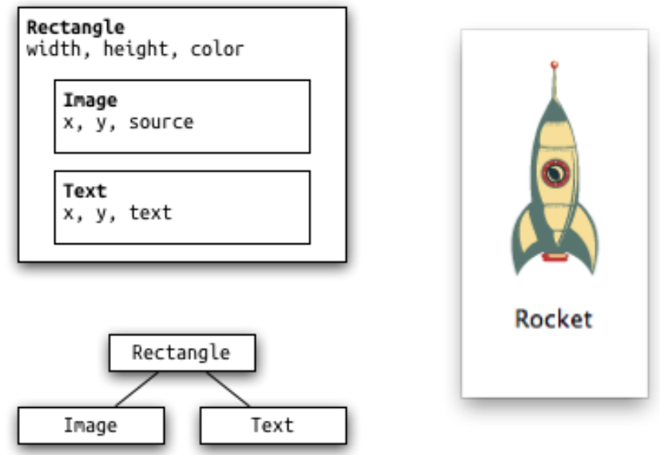
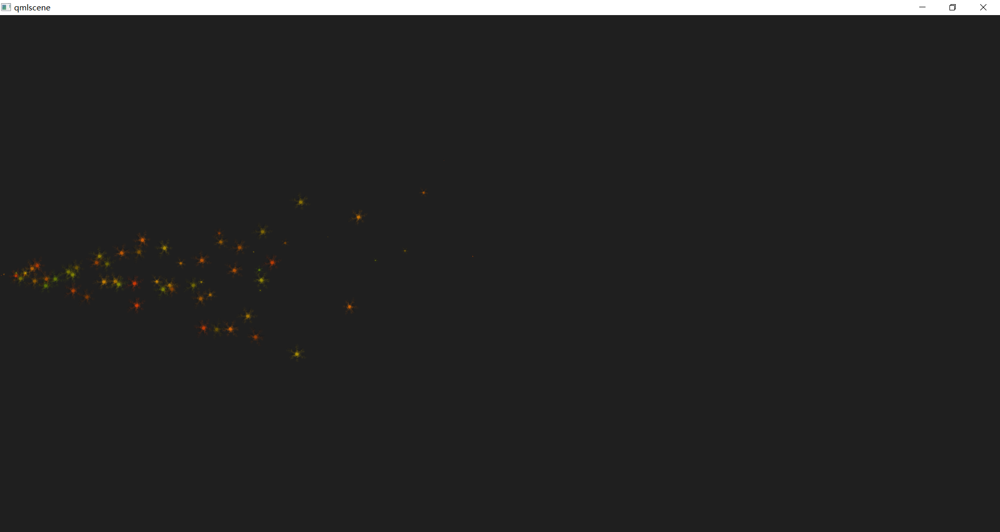

# QT 学习之路 2（76）：QML 和 QTQUICK 2

从 Qt 4.7 开始，Qt 引入了一种声明式脚本语言，称为 QML（Qt Meta Language 或者 Qt Modeling Language），作为 C++ 语言的一种替代。而 ==Qt Quick 就是使用 QML 构建的一套类库==。

QML 是一种基于 ==JavaScript== 的声明式语言。

在 Qt 5 中，QML 有了长足进步，并且同 C++ 并列成为 Qt 的首选编程语言。也就是说，使用 Qt 5，我们不仅可以使用 C++ 开发 Qt 程序，而且可以使用 QML。虽然 QML 是解释型语言，性能要比 C++ 低一些，但是新版 QML 使用 V8，Qt 5.2 又引入了专为 QML 优化的 V4 引擎，使得其性能不再有明显降低。在 Nokia 发布 Qt 4.7 的时候，QML 被用于开发手机应用程序，全面支持触摸操作、流畅的动画效果等。但是在 Qt 5 中，QML 已经不仅限于开发手机应用，也可以用户开发传统的桌面程序。

QML 文档描述了一个对象树。QML 元素包含了其构造块、图形元素（矩形、图片等）和行为（例如动画、切换等）。这些 QML 元素按照一定的嵌套关系构成复杂的组件，供用户交互。

本章我们先来编写一个简单的 QML 程序，了解 QML 的基本概念。需要注意的是，这里的 Qt Quick 使用的是 Qt Quick 2 版本.

首先，使用 Qt Creator 创建一个 Qt Quick Application。在之后的 Qt Quick Component 选项中，我们选择 Qt Quick 2.0：


我们真正关心的是 main.qml 里面的内容：

```c++
import QtQuick 2.15
import QtQuick.Window 2.15

Window {
    width: 640
    height: 480
    visible: true
    title: qsTr("Hello World")
    Text {
        text: qsTr("Hello World")
        anchors.centerIn: parent
    }
    MouseArea {
        anchors.fill: parent
        onClicked: {
            Qt.quit();
        }
    }
}


```

这段代码看起来很简单，事实也的确如此。一个 QML 文档分为 import 和 declaration 两部分。前者用于引入文档中所需要的组件（有可能是类库，也可以是一个 JavaScript 文件或者另外的 QML 文件）；后者用于声明本文档中的 QML 元素。

 

每一个 QML 有且只有一个根元素，类似于 XML 文档。这个根元素就是这个 QML 文档中定义的 QML 元素，在这个例子中就是一个`Rectangle`对象。注意一下这个 QML 文档的具体语法，非常类似于 JSON 的定义，使用键值对的形式区分元素属性。所以我们能够很清楚看到，我们定义了一个矩形，宽度为 640 像素，高度为 480像素。记得我们说过，QML 文档定义了一个对象树，所以 QML 文档中元素是可以嵌套的。在这个矩形中，我们又增加了一个`Text`元素，顾名思义，就是一个文本。`Text`显示的是 Hello World 字符串，而这个字符串是由`qsTr()`函数返回的。`qsTr()`函数就是`QObject::tr()`函数的 QML 版本，用于返回可翻译的字符串。`Text`的位置则是由锚点（anchor）定义。示例中的`Text`位置定义为 parent 中心，其中`parent`属性就是这个元素所在的外部的元素。同理，我们可以看到`MouseArea`是充满父元素的。`MouseArea`还有一个`onClicked`属性。这是一个回调，也就是鼠标点击事件。`MouseArea`可以看作是可以相应鼠标事件的区域。当点击事件发出时，就会执行`onClicked`中的代码。这段代码其实是让整个程序退出。注意我们的`MouseArea`充满整个矩形，所以整个区域都可以接受鼠标事件。

当我们运行这个项目时，我们就可以看到一个矩形，中央有一行文本，鼠标点击矩形任意区域就会使其退出：


接下来我们可以改变 main.qml 文件中的“Hello World”字符串，不重新编译直接运行，就会看到运行结果也会相应的变化。这说明 QML 文档是运行时解释的，不需要经过编译。所以，利用 QML 的解释执行的特性，QML 尤其适合于快速开发和原型建模。另外，由于 QML 比 C++ 简单很多，所以 QML 也适用于提供插件等机制。

# QT 学习之路 2（77）：QML 语法

前面我们已经见识过 QML 文档。一个 QML 文档分为 import 和对象声明两部分。如果你要使用 Qt Quick，就需要 import QtQuick 2。QML 是一种声明语言，用于描述程序界面。QML 将用户界面分解成一块块小的元素，每一元素都由很多组件构成。QML 定义了用户界面元素的外观和行为；更复杂的逻辑则可以结合 JavaScript 脚本实现。这有点类似于 HTML 和 JavaScript 的关系，前者用来显示界面，后者用来定义行为。 

QML 在最简单的元素关系是层次关系。子元素处于相对于父元素的坐标系统中。也就是说，子元素的 x 和 y 的坐标值始终相对于父元素。这一点比起 Graphics View Framework 要简单得多。



下面我们使用一个简单的示例文档来了解 QML 的语法：

```c++
// rectangle.qml
import QtQuick 2.15

// 根元素：Rectangle
Rectangle {
    // 命名根元素
    id: root // 声明属性：<name>: <value>
    width: 120; height: 240
    color: "#D8D8D8" // 颜色属性
    // 声明一个嵌套元素（根元素的子元素）
    Image {
        id: rocket
        x: (parent.width - width)/2; y: 40 // 使用 parent 引用父元素
        source: 'assets/rocket.png'
    }
    // 根元素的另一个子元素
    Text {
        // 该元素未命名
        y: rocket.y + rocket.height + 20 // 使用 id 引用元素
        width: root.width // 使用 id 引用元素
        horizontalAlignment: Text.AlignHCenter
        text: 'Rocket'
    }
}

```

第一个需要注意的是 import 语句。前面我们简单介绍过，QML 文档总要有 import 部分，用于指定该文档所需要引入的模块。通常这是一个模块名和版本号，比如这里的`QtQuick 2.15`。当然，我们也可以引入自己的模块或者其他文件，具体细节会在后面的章节中详细介绍。

QML文档的第二个部分是 QML 元素。一个 QML 文档有且只有一个根元素，类似 XML 文档的规定。QML 文档中的元素同样类似 XML 文档，构成一棵树。在我们的例子中，这个根元素就是`Rectangle`元素。QML 元素使用 {} 包围起来。{} 之中是该元素的属性；属性以键值对`name : value`的形式给出。这十分类似与 JSON 语法。QML 元素可以有一个`id`属性，作为该元素的名字。

以后我们可以直接用这个名字指代该元素，相当于该元素的指针。需要注意的是，==`id`属性在整个 QML 文档中必须是唯一的。==QML 元素允许嵌套，一个 QML 元素可以没有、可以有一个或多个子元素。子元素可以使用`parent`关键字访问其父元素。正如上面的例子中显示的那样，==我们可以用 id，也可以用`parent`关键字访问其他元素==。一个最佳实践是，将根元素的 id 命名为 root。这样我们就可以很方便地访问到根元素。

==QML 文档的注释使用`//`或者`/* */`。这同 C/C++ 或者 JavaScript 是一致的。==

QML 元素的属性就是键值对，这同 JSON 是一致的。属性是一些预定义的类型，也可以有自己的初始值。比如下面的代码：

```c++
Text {
    // (1) 标识符
    id: thisLabel
    // (2) x、y 坐标
    x: 24; y: 16
    // (3) 绑定
    height: 2 * width
    // (4) 自定义属性
    property int times: 24
    // (5) 属性别名
    property alias anotherTimes: times
    // (6) 文本和值
    text: "Greetings " + times
    // (7) 字体属性组
    font.family: "Ubuntu"
    font.pixelSize: 24
    // (8) 附加属性 KeyNavigation
    KeyNavigation.tab: otherLabel
    // (9) 属性值改变的信号处理回调
    onHeightChanged: console.log('height:', height)
    // 接收键盘事件需要设置 focus
    focus: true
    // 根据 focus 值改变颜色
    color: focus?"red":"black"
}
```

标识符 id 用于在 QML 文档中引用这个元素。==id 并不是一个字符串，而是一个特殊的标识符类型，这是 QML 语法的一部分==。如前文所述，id 在文档中必须是唯一的，并且一旦指定，不允许重新设置为另外的元素。因此，==id 很像 C++ 的指针==。==和指针类似，id 也不能以数字开头，具体规则同 C++ 指针的命名一致==。id 看起来同其它属性没有什么区别，但是，我们==不能使用`id`反查出具体的值==。例如，==`aElement.id`是不允许的==。

元素 id 应该在 QML 文档中是唯一的。实际上，QML 提供了一种动态作用域（dynamic-scoping）的机制，==后加载的文档会覆盖掉前面加载的文档的相同 id==。这看起来能够==“更改” id 的指向==，其意义是构成一个 id 的查询链。如果当前文档没有找到这个 id，那么可以在之前加载的文档中找到。这很像==全局变量==。不过，==这种代码很难维护==，因为这种机制意味着你的代码==依赖于文档的加载顺序==。不幸的是，==我们没有办法关闭这种机制==。因此，在选用 id 时，我们一定要注意==唯一==性这个要求，否则很有可能出现一些很难调试的问题。

属性的值由其类型决定。如果一个属性没有给值，则会使用属性的默认值。我们可以通过查看文档找到属性默认值究竟是什么。

==属性可以依赖于其它属性，这种行为叫作绑定。绑定类似信号槽机制==。==当所依赖的属性发生变化时，绑定到这个属性的属性会得到通知，并且自动更新自己的值。==例如上面的`height: 2 * width`。`height`依赖于`width`属性。当`width`改变时，`height`会自动发生变化，将自身的值更新为`width`新值的两倍。`text`属性也是一个绑定的例子。注意，==`int`类型的属性会自动转换成字符串==；并且在值变化时，绑定依然成立。

系统提供的属性肯定是不够的。所以 ==QML 允许我们自定义属性==。我们可以使用==`property`关键字声明一个自定义属性==，后面是==属性类型和属性名，最后是属性值==。声明自定义属性的语法是==`property <type> <name> : <value>`==。如果没有默认值，那么将给出系统类型的默认值。

我们也可以声明一个默认属性，例如：

```c++
// MyLabel.qml
import QtQuick 2.0
Text {
    default property var defaultText
    text: "Hello, " + defaultText.text
}
```

在 MyLabel .qml中，我们声明了一个默认属性`defaultText`。注意==这个属性的类型是`var`==。==这是一种通用类型，可以保存任何类型的属性值==。

默认属性的含义在于，==如果一个子元素在父元素中，但是没有赋值给父元素的任何属性，那么它就成为这个默认属性==。利用上面的`MyLabel`，我们可以有如下的代码：

```c++
MyLabel {
    Text { text: "world" }
}
```

MyLabel.qml 实际可以直接引入到另外的 QML 文档，当做一个独立的元素使用。所以，我们可以==把 MyLabel 作为根元素==。注意 ==MyLabel 的子元素 Text 没有赋值给 MyLabel 的任何属性==，所以，它将自动成为默认属性 defaultText 的值。因此，上面的代码其实==等价于==：

```cpp
MyLabel {
    defaultText：Text { text: "world" }
}
```

如果仔细查看代码你会发现，这种默认属性的写法很像==嵌套元素==。其实嵌套元素正是利用这种默认属性实现的。所有可以嵌套元素的元素都有一个==名为`data`的默认属性==。所以这些嵌套的子元素都是添加到了`data`属性中。

属性也可以有别名。我们使用==`alias`==关键字声明属性的别名：`property alias <name> : <reference>`。==别名和引用类似，只是给一个属性另外一个名字==。C++ 教程里面经常说，“引用即别名”，这里就是“==别名即引用==”。

属性也可以分组。分组可以让属性更具结构化。上面示例中的`font`属性另外一种写法是：

```cpp
font { family: "Ubuntu"; pixelSize: 24 }
```

有些属性可以附加到元素本身，

其语法是`<Element>.<property>: <value>`。

`<Element>` 是要设置属性的QML元素的名称，`<property>` 是要设置的属性名称，`<value>` 是要为该属性设置的值。

---

每一个属性都可以发出信号，因而都可以关联信号处理函数。这个处理函数将在属性值变化时调用。这种值变化的信号槽命名为 on + 属性名 + Changed，其中属性名要首字母大写。例如上面的例子中，`height`属性变化时对应的槽函数名字就是`onHeightChanged`。

QML 和 JavaScript 关系密切。我们将在后面的文章中详细解释，不过现在可以先看个简单的例子：

```cpp
Text {
    id: label
    x: 24; y: 24
    // 自定义属性，表示空格按下的次数
    property int spacePresses: 0
    text: "Space pressed: " + spacePresses + " times"
    // (1) 文本变化的响应函数
    onTextChanged: console.log("text changed to:", text)
    // 接收键盘事件，需要设置 focus 属性
    focus: true
    // (2) 调用 JavaScript 函数
    Keys.onSpacePressed: {
        increment()
    }
    // 按下 Esc 键清空文本
    Keys.onEscapePressed: {
        label.text = ''
    }
    // (3) 一个 JavaScript 函数
    function increment() {
        spacePresses = spacePresses + 1
    }
}
```

这段QML代码描述了一个Text元素，具有以下功能：

1. `id: label`：定义了该元素的ID为`label`。
2. `x: 24; y: 24`：设置了元素的位置。
3. `property int spacePresses: 0`：定义了一个自定义属性`spacePresses`，用于记录空格按下的次数，初始值为0。
4. `text: "Space pressed: " + spacePresses + " times"`：设置了文本内容，显示了空格按下的次数。
5. `onTextChanged: console.log("text changed to:", text)`：当文本内容发生变化时，会在控制台中输出相应的信息。
6. `focus: true`：使元素能够接收键盘事件，需要设置为`true`。
7. `Keys.onSpacePressed: { increment() }`：当空格键被按下时，调用了名为`increment`的JavaScript函数。
8. `Keys.onEscapePressed: { label.text = '' }`：当Esc键被按下时，清空了文本内容。
9. `function increment() { spacePresses = spacePresses + 1 }`：定义了一个JavaScript函数`increment`，用于增加`spacePresses`的值。

这段代码在QML中定义了一个可交互的文本元素，可以响应键盘事件，统计空格按下的次数，并在文本发生变化时输出信息到控制台。

# QT 学习之路 2（78）：QML 基本元素

QML 基本元素可以分为可视元素和不可视元素两类。可视元素（例如前面提到过的`Rectangle`）具有几何坐标，会在屏幕上占据一块显示区域。不可视元素（例如`Timer`）通常提供一种功能，这些功能可以作用于可视元素。

本章我们将会集中介绍集中最基本的可视元素：`Item`、`Rectangle`、`Text`、`Image`和`MouseArea`。

`Item`是所有可视元素中最基本的一个。它是所有其它可视元素的父元素，可以说是所有其它可视元素都继承`Item`。`Item`本身没有任何绘制，它的作用是定义所有可视元素的通用属性：

| 分组     | 属性                                                         |
| :------- | :----------------------------------------------------------- |
| 几何     | **`x`和`y`用于定义元素左上角的坐标**，`width`和`height`则定义了元素的范围。**`z`定义了元素上下的层叠关系。** |
| 布局     | `anchors`（具有 left、right、top、bottom、vertical 和 horizontal center 等属性）**用于定位元素相对于其它元素的`margins`的位置**。 |
| 键盘处理 | **`Key`和`KeyNavigation`属性用于控制键盘**；`focus`属性则用于启用键盘处理，也就是**获取焦点**。 |
| 变形     | 提供`scale`和`rotate`变形以及更一般的针对 x、y、z 坐标值变换以及`transformOrigin`点的`transform`属性列表。 |
| 可视化   | `opacity`属性用于控制透明度；**`visible`属性用于控制显示/隐藏元素**；`clip`属性用于剪切元素；`smooth`属性用于增强渲染质量。 |
| 状态定义 | 提供一个由状态组成的列表`states`和当前状态`state`属性；同时还有一个`transitions`列表，用于**设置状态切换时的动画效果**。 |

`Item`定义了所有可视元素都具有的属性。

除了定义通用属性，`Item`另外一个重要作用是作为其它可视元素的容器。从这一点来说，`Item`非常类似于 HTML 中 div 标签的作用。

```
<div>标签经常与其他HTML元素结合使用，例如文本、图像、表单元素等。通过将它们放在<div>标签中，可以将它们作为一个整体进行样式化、定位或应用其他操作。
```

```
<div>
  <h1>标题</h1>
  <p>段落文本</p>
  
</div>
```

```
<div class="container">
  <p>这是一个带样式的容器。</p>
</div>
```

```
<div class="float-left">左浮动元素</div>
<div class="float-right">右浮动元素</div>
<div style="clear: both;"></div>
```

`Rectangle`继承了`Item`，并在`Item`的基础之上增加了填充色属性、边框相关的属性。**为了定义圆角矩形，`Rectangle`还有一个`radius`属性。**下面的代码定义了一个宽 100 像素、高 150 像素，浅金属蓝填充，红色 4 像素的边框的矩形：

```
Rectangle {
    id: rect
    width: 100
    height: 150
    color: "lightsteelblue"
    border {
        color: "#FF0000"
        width: 4
    }
    radius: 8
}
```

QML 中的颜色值可以使用颜色名字，也可以使用 # 十六进制的形式。这里的颜色名字同 SVG 颜色定义一致，具体可以参见[这个网页](http://www.w3.org/TR/css3-color/#svg-color)。

`Rectangle`除了`color`属性之外，还有**一个`gradient`属性，用于定义使用渐变色填充**。例如：

```
Rectangle {
    width: 100
    height: 150
    gradient: Gradient {
        GradientStop { position: 0.0; color: "red" }
        GradientStop { position: 0.33; color: "yellow" }
        GradientStop { position: 1.0; color: "green" }
    }
    border.color: "slategray"
}
```

`gradient`要求一个`Gradient`对象。该对象需要**一个`GradientStop`的列表**。我们可以这样理解渐变：**所谓渐变，就是我们指定在某个位置必须是某种颜色，这期间的过渡色则由计算而得**。`GradientStop`对象**就是用于这种指定**，它需要两个属性：**`position`和`color`。前者是一个 0.0 到 1.0 的浮点数，说明 y 轴方向的位置，例如元素的最顶部是 0.0，最底部是 1.0**，介于最顶和最底之间的位置可以用这么一个浮点数表示，也就是一个比例；**后者是这个位置的颜色值**。例如上面的`GradientStop { position: 0.33; color: "yellow" }`说明在从上往下三分之一处是黄色。当前最新版本的 QML（Qt 5.2）只支持 y 轴方向的渐变，如果需要 x 轴方向的渐变，则需要执行旋转操作，我们会在后文说明。另外，当前版本 QML 也不支持角度渐变。如果你需要角度渐变，那么最好选择一张事先制作的图片。 

需要注意的是，`Rectangle`必须同时指定（显式地或隐式地）宽和高，否则的话是不能在屏幕上面显示出来的。这通常是一个常见的错误。

如果需要显示文本，你需要使用`Text`元素。`Text`元素最重要的属性当然就是`text`属性。这个属性类型是`string`。`Text`元素会根据**文本和字体**计算自己的**初始宽度和高度**。字体则可以通过字体属性组设置（例如`font.family`、`font.pixelSize`等）。如果要设置文本颜色，只需要设置`color`属性。`Text`最简单的使用如下：

```
Text {
    text: "The quick brown fox"
    color: "#303030"
    font.family: "Century"
    font.pixelSize: 28
}
```

`Text`元素中的文本可以使用`horizontalAlignment`和`verticalAlignment`属性指定对齐方式。为了进一步增强文本渲染，我们还可以使用**style和styleColor**`两个属性。这两个属性允许我们指定文本的显示样式和这些样式的颜色。对于很长的文本，通常我们会选择在文本末尾使用 ... ，此时我们需要使用`elide`属性。**`elide`属性还允许你指定 ... 的显示位置**。如果不希望使用这种显示方式，我们还可以选择通过`wrapMode属性指定换行模式。例如下面的代码：

```
Text {
    width: 160
    height: 120
    text: "A very very long text"
    elide: Text.ElideMiddle
    style: Text.Sunken
    styleColor: '#FF4444'
    verticalAlignment: Text.AlignTop
    font {
        pixelSize: 24
    }
}
```


这里的`Text`元素的文本省略号位置这一行文本的中部；具有一个 #FF4444 颜色的样式 Sunken。

`Text`元素的作用是显示文本。它不会显示文本的任何背景，这是另外的元素需要完成的事情。

`Image`元素则用于显示图像。目前 QML 支持的图像格式有 PNG、JPG、GIF 和 BMP 等。除此之外，**我们也可以直接给`source`属性一个 URL 来自动从网络加载图片**，也可以通过`fillMode`属性设置改变大小的行为。例如下面代码片段：

```
Image {
    x: 12;
    y: 12
    // width: 48
    // height: 118
    source: "assets/rocket.png"
}

Image {
    x: 112;
    y: 12
    width: 48
    height: 118/2
    source: "assets/rocket.png"
    fillMode: Image.PreserveAspectCrop
    clip: true
}
```

注意这里我们说的 URL，可以是本地路径（./images/home.png），也可以使网络路径（http://example.org/home.png）。**这也是 QML 的一大特色：网络透明。如果还记得先前我们尝试做的那个天气预报程序，那时候为了从网络加载图片，我们费了很大的精力。但是在 QML 中，这都不是问题。如果一个 URL 是网络的，QML 会自动从这个地址加载对应的资源。**

上面的代码中，我们使用了`Image.PreserveAspectCrop`，意思是等比例切割。此时，我们需要同时设置`clip`属性，避免所要渲染的对象超出元素范围。

最后一个我们要介绍的基本元素是`MouseArea`。顾名思义，这个元素用于用户交互。这是一个不可见的矩形区域，用于捕获鼠标事件。我们在前面的例子中已经见过这个元素。通常，我们会将这个元素与一个可视元素结合起来使用，以便这个可视元素能够与用户交互。例如：

```
Rectangle {
    id: rect1
    x: 12;
    y: 12
    width: 76;
    height: 96
    color: "lightsteelblue"
    MouseArea {
        /* ~~ */
    }
}
```

`MouseArea`是 QtQuick 的重要组成部分，它将可视化展示与用户输入控制解耦。通过这种技术，你可以显示一个较小的元素，但是它有一个很大的可交互区域，以便在界面显示与用户交互之间找到一个平衡（如果在移动设备上，较小的区域非常不容易被用户成功点击。苹果公司要求界面的交互部分最少要有 40 像素以上，才能够很容易被手指点中）。

# QT 学习之路 2（79）：QML 组件

前面我们简单介绍了几种 QML 的基本元素。QML 可以由这些基本元素组合成一个复杂的元素，方便以后我们的重用。这种组合元素就被称为组件。组件就是一种可重用的元素。QML 提供了很多方法来创建组件。不过，本章我们只介绍一种方式：基于文件的组件。

基于文件的组件将 QML 元素放置在一个单独的文件中，然后给这个文件一个名字。以后我们就可以通过这个名字来使用这个组件。例如，如果有一个文件名为 Button.qml，那么，我们就可以在 QML 中使用`Button { ... }`这种形式。

下面我们通过一个例子来演示这种方法。我们要创建一个带有文本说明的`Rectangle`，这个矩形将成为一个按钮。用户可以点击矩形来响应事件。

```
import QtQuick 2.0

Rectangle {
    id: root

    property alias text: label.text
    signal clicked

    width: 116; height: 26
    color: "lightsteelblue"
    border.color: "slategrey"

    Text {
        id: label
        anchors.centerIn: parent
        text: "Start"
    }
    MouseArea {
        anchors.fill: parent
        onClicked: {
            root.clicked()
        }
    }
}
```

**我们将这个文件命名为 Button.qml**，**放在 main.qml 同一目录下**。这里的 main.qml 就是 **IDE 帮我们生成的 QML 文件**。此时，我们**已经创建了一个 QML 组件**。这个组件其实就是**一个预定义好的`Rectangle`**。这是一个按钮，**有一个`Text`用于显示按钮的文本**；有一个`MouseArea`用于**接收鼠标事件**。用户可以定义按钮的文本，这是用过设置`Text`的`text`属性实现的。为了不对外暴露`Text`元素，我们给了它的`text`属性一个别名。`signal clicked`给这个`Button`一个信号。由于这个信号是无参数的，我们也可以写成`signal clicked()`，二者是等价的。注意，这个信号会在`MouseArea`的`clicked`信号被发出，具体就是在`MouseArea`的`onClicked`属性中调用个这个信号。

下面我们需要修改 main.qml 来使用这个组件：

```
import QtQuick 2.0

Rectangle {
    width: 360
    height: 360
    Button {
        id: button
        x: 12; y: 12
        text: "Start"
        onClicked: {
            status.text = "Button clicked!"
        }
    }

    Text {
        id: status
        x: 12; y: 76
        width: 116; height: 26
        text: "waiting ..."
        horizontalAlignment: Text.AlignHCenter
    }
}
```

在 main.qml 中，我们直接使用了`Button`这个组件，就像 QML 其它元素一样。由于 Button.qml 与 main.qml 位于同一目录下，所以不需要额外的操作。**但是**，如果我们将 Button.qml 放在不同目录，比如构成如下的目录结果：

```
app
 |- QML
 |   |- main.qml
 |- components
     |- Button.qml
```

**那么，我们就需要在 main.qml 的`import`部分增加一行`import ../components`才能够找到`Button`组件。**

有时候，选择一个组件的**根元素**很重要。比如我们的`Button`组件。我们**使用`Rectangle`作为其根元素**。**`Rectangle`元素可以设置背景色**等。

**但是**，==有时候我们并不允许用户设置背景色。所以，我们可以选择使用`Item`元素作为根==。事实上，`Item`元素作为根元素会更常见一些。

# QT 学习之路 2（80）：定位器

QML 提供了很多用于定位的元素。这些元素叫做定位器，都包含在 QtQuick 模块。这些定位器主要有 `Row`、`Column`、`Grid`和`Flow`等。

为了介绍定位器，我们先添加三个简单的组件用于演示：

首先是`RedRectangle`，

```
import QtQuick 2.0

Rectangle {
    width: 48
    height: 48
    color: "red"
    border.color: Qt.lighter(color)
}
```

然后是`BlueRectangle`，

```
import QtQuick 2.0

Rectangle {
    width: 48
    height: 48
    color: "blue"
    border.color: Qt.lighter(color)
}
```

```
import QtQuick 2.0

Rectangle {
    width: 48
    height: 48
    color: "green"
    border.color: Qt.lighter(color)
}
```

这三个组件都很简单，仅有的区别是颜色不同。这是一个 48x48 的矩形，分别是**红、黄、蓝**三种颜色。注意，我们把**边框颜色**设置为`Qt.lighter(color)`，也就是比**填充色亮一些的颜色，默认是填充色的 50%**。

**`Column`将子元素按照加入的顺序从上到下**，在同一列排列出来。**`spacing`属性用于定义子元素之间的间隔**：

```
import QtQuick 2.0

Rectangle {
    id: root
    width: 120
    height: 240
    color: "black"/////////////////////背景色

    Column {
        id: row
        anchors.centerIn: parent
        spacing: 8///////////////////////////////////
        //排序3个矩形
        RedRectangle { }
        GreenRectangle { width: 96 }
        BlueRectangle { }
    }
}
```

运行结果如下：


注意，我们按照红、绿、蓝的顺序加入了子组件，`Column`按照同样的顺序把它们添加进来。其中，**我们独立设置了绿色矩形的宽度，这体现了我们后来设置的属性覆盖了组件定义时设置的默认值**。`anchors`是另外一种布局方式，**指定该组件与父组件的相对关系**。我们会在后面的章节详细介绍这种布局。

与`Column`类似，`Row`将其子组件放置在一行的位置，既可以设置从左向右，也可以设置从右向左，这取决于`layoutDirection`属性。同样，它也有`spacing`属性，用于指定子组件之间的间隔：

```
//Column列，`Row`行
import QtQuick 2.0

Rectangle {
    id: root
    width: 240
    height: 120
    color: "black"

    Row {
        id: row
        anchors.centerIn: parent
        spacing: 8
        RedRectangle { }
        GreenRectangle { width: 96 }
        BlueRectangle { }
    }
}
```

这段代码与前面的非常类似。我们可以运行下看看结果：


运行结果同前面的也非常类似。这里不再赘述。

**`Grid`元素将其子元素排列为一个网格**。它**需要制定`rows`和`columns`属性，也就是行和列的数值**。如果二者有一个不显式设置，则另外一个会根据子元素的数目计算出来。例如，**如果我们设置为 3 行，一共放入 6 个元素，那么列数会自动计算为 2**。

`flow`和`layoutDirection`属性则用来控制添加到网格的元素的顺序。

同样，`Grid`元素也有`spacing`属性。我们还是看一个简单的例子：

```
import QtQuick 2.0

Rectangle {
    id: root
    width: 200
    height: 200
    color: "black"

    Grid {
        id: grid
        rows: 2
        anchors.centerIn: parent
        spacing: 8
        RedRectangle { }
        RedRectangle { }
        RedRectangle { }
        RedRectangle { }
        RedRectangle { }
    }
}
```

同前面的代码类似。需要注意的是，我们仅设定了`Grid`的`rows`属性为 2，添加了 5 个子元素，那么，它的`columns`属性会自动计算为 3。运行结果也是类似的：


-------------------------

最后一个定位器是`Flow`。顾名思义，它会将其子元素以流的形式显示出来。我们使用`flow`和`layoutDirection`两个属性来控制显示方式。它可以从左向右横向布局，也可以从上向下纵向布局，或者反之。初看起来，这种布局方式与`Column`和`Row`极其类似。不同之处在于，添加到`Flow`里面的元素，当`Flow`的宽度或高度不足时，这些元素会自动换行。因此，为了令`Flow`正确工作，我们需要指定其宽度或者高度。这种指定既可以是显式的，也可以依据父元素计算而得。来看下面的例子：

```
import QtQuick 2.0

Rectangle {
    id: root
    width: 160
    height: 160
    color: "black"

    Flow {
        anchors.fill: parent
        anchors.margins: 20
        spacing: 20
        RedRectangle { }
        BlueRectangle { }
        GreenRectangle { }
    }
}
```

运行结果是这样的：


注意，我们每个色块的边长都是 48px，整个主窗口的宽是 160px，`Flow`元素外边距 20px，因此`Flow`的宽度其实是 160px - 20px - 20px = 120px。`Flow`子元素间距为 20px，两个子元素色块所占据的宽度就已经是 48px + 20px + 48px = 116px，3 个则是 116px + 20px + 48px = 184px > 160px，因此，默认窗口大小下一行只能显示两个色块，第三个色块自动换行。

当我们拖动改变窗口大小时，可以观察`Flow`元素是如何工作的。

---

最后，我们再来介绍一个经常结合定位器一起使用的元素：`Repeater`。`Repeater`非常像一个`for`循环，它能够遍历数据模型中的元素。下面来看代码：

```
import QtQuick 2.0

Rectangle {
    id: root
    width: 252
    height: 252
    color: "black"
    property variant colorArray: ["#00bde3", "#67c111", "#ea7025"]

    Grid {
        anchors.fill: parent
        anchors.margins: 8
        spacing: 4
        Repeater {
            model: 16
            Rectangle {
                width: 56; height: 56
                property int colorIndex: Math.floor(Math.random()*3)////////////////////////////////////////////////////////////////
                color: root.colorArray[colorIndex]
                border.color: Qt.lighter(color)
                Text {
                    anchors.centerIn: parent
                    color: "black"
                    text: "Cell " + index
                }
            }
        }
    }
}
```

结合运行结果来看代码：


这里，我们将`Repeater`同`Grid`一起使用，可以理解成，**`Repeater`作为`Grid`的数据提供者**。`Repeater`的`model`可以是**任何能够接受的数据模型**，并且只能重复基于`Item`的组件。我们可以将上面的代码理解为：**重复生成 16 个如下定义的`Rectangle`元素**。首先，我们定义了一个**颜色数组`colorArray`**。`Repeater`会按照`model`属性**定义的个数**循环生成其子元素。**每一次循环，`Repeater`都会创建一个矩形作为自己的子元素**。==这个新生成的矩形的颜色按照`Math.floor(Math.random()*3)`的算法计算而得==（==因此，你在本地运行代码时很可能与这里的图片不一致==）。这个算法会得到 ==0，1，2 三者之一==，用于==选择数组`colorArray`中预定义的颜色==。**由于 JavaScript 是 QtQuick 的核心部分，所以 JavaScript 标准函数都是可用的**。

**`Repeater`会为每一个子元素注入一个`index`属性，也就是当前的循环索引（例子中即 0、1 直到 15）**。我们可以在子元素定义中直接使用这个属性，就像例子中给`Text`赋值那样。

注意，在`Repeater`时，我们可能需要注意性能问题。处理很大的数据模型，或者需要动态获取数据时，`Repeater`这种代码就非常吃力了，我们需要另外的实现。后面的章节中，我们会再来讨论这个问题。这里只需要了解，**`Repeater`不适用于处理大量数据或者动态数据，仅适用于少量的静态数据的呈现**。

# QT 学习之路 2（81）：元素布局

上一章我们介绍了 QML 中用于定位的几种元素，被称为定位器。除了定位器，QML 还提供了另外一种用于布局的机制。我们将这种机制成为锚点（anchor）。

锚点允许我们灵活地设置两个元素的相对位置。

它使两个元素之间形成一种类似于锚的关系，也就是两个元素之间形成一个固定点。锚点的行为类似于一种链接，它要比单纯地计算坐标改变更强。由于锚点描述的是相对位置，所以在使用锚点时，我们必须指定两个元素，声明其中一个元素相对于另外一个元素。锚点是`Item`元素的基本属性之一，因而适用于所有 QML 可视元素。

一个元素有 6 个主要的锚点的定位线，如下图所示：


这 6 个定位线分别是：`top`、`bottom`、`left`、`right`、`horizontalCenter`和`verticalCenter`。**对于`Text`元素，还有一个`baseline`锚点。每一个锚点定位线都可以结合一个偏移的数值。**其中，`top`、`bottom`、`left`和`right`称为外边框；`horizontalCenter`、`verticalCenter`和`baseline`称为偏移量。

下面，我们使用例子来说明这些锚点的使用。首先，我们需要重新定义一下上一章使用过的`BlueRectangle`组件：

```
import QtQuick 2.0

Rectangle {
    width: 48
    height: 48
    color: "blue"
    border.color: Qt.lighter(color)

    MouseArea {
        anchors.fill: parent//填充整个父类
        drag.target: parent//鼠标拖动MouseArea，也就是Rectangle
    }
}
```

简单来说，我们在`BlueRectangle`最后增加了一个`MouseArea`组件。前面的章节中，我们简单使用了这个组件。

顾名思义，这是一个用于处理鼠标事件的组件。之前我们使用了它处理鼠标点击事件。这里，我们使用了其拖动事件。`anchors.fill: parent`一行的含义马上就会解释；`drag.target: parent`则说明拖动目标是`parent`。我们的拖动对象是`MouseArea`的父组件，也就是`BlueRectangle`组件。

代码如下：

```
import QtQuick 2.0

Rectangle {
    id: root
    width: 220
    height: 220
    color: "black"

    Rectangle {
        id: greenRect
        x: 10
        y: 10
        width: 100
        height: 100
        color: "green"

        Rectangle {
            id: blueRect
            width: 12
            anchors.fill: parent
            anchors.margins: 8
            color: "blue"
        }
    }
}
```


在这个例子中，我们使用`anchors.fill`设置内部蓝色矩形的锚点为填充（fill），填充的目的对象是`parent`；填充边距是 8px。注意，尽管我们设置了蓝色矩形宽度为 12px，但是因为锚点的优先级要高于宽度属性设置，所以蓝色矩形的实际宽度是 100px - 8px - 8px = 84px。

第二个例子：


代码如下：

```
import QtQuick 2.0

Rectangle {
    id: root
    width: 400
    height: 400
    color: "black"

    Rectangle {
        id: greenRect
        x: 10
        y: 10
        width: 100
        height: 100
        color: "green"

        Rectangle {
            id: blueRect
            width: 48
	    height: 48
	    //x: 8
            y: 8
	    anchors.left: parent.left
 	    anchors.leftMargin: 8
            color: "blue"
        }
    }
}
```

这次，我们使用`anchors.left`设置内部蓝色矩形的锚点为父组件的左边线（parent.left）；左边距是 8px。另外，我们可以试着拖动蓝色矩形，看它的移动方式。在我们拖动时，蓝色矩形只能沿着距离父组件左边 8px 的位置上下移动，这是由于我们设置了锚点的缘故。正如我们前面提到过的，锚点要比单纯地计算坐标改变的效果更强，更优先。

第三个例子：


代码如下：

```
import QtQuick 2.0

Rectangle {
    id: root
    width: 220
    height: 220
    color: "black"

    Rectangle {
        x: 10
        y: 10
        width: 100
        height: 100
                color: "green"
         Rectangle {
            width: 48
            height: 48
            anchors.left: parent.right
            color: "blue"
        }
    }
}
```

这里，我们修改代码为`anchors.left: parent.right`，也就是将组件锚点的左边线设置为父组件的右边线。效果即如上图所示。 

# QT 学习之路 2（82）：输入元素

前面的章节中，我们看到了作为输入元素的`MouseArea`，用于接收鼠标的输入。下面，我们再来介绍关于键盘输入的两个元素：`TextInput`和`TextEdit`。

`TextInput`是单行的文本输入框，支持验证器、输入掩码和显示模式等。

```
import QtQuick 2.0

Rectangle {
    width: 200
    height: 80
    color: "linen"

    TextInput {
        id: input1
        x: 8; y: 8
        width: 96; height: 20
        focus: true
        text: "Text Input 1"
    }

    TextInput {
        id: input2
        x: 8; y: 36
        width: 96; height: 20
        text: "Text Input 2"
    }
}
```


# QT 学习之路 2（83）：QT QUICK CONTROLS

Qt 5.1 发布了 Qt Quick 的一个全新模块：Qt Quick Controls。顾名思义，这个模块提供了大量类似 Qt Widgets 模块那样可重用的组件。本章我们将介绍 Qt Quick Controls，你会发现这个模块与 Qt 组件非常类似。

```qml
import QtQuick 2.1
import QtQuick.Controls 1.1


ApplicationWindow {
    title: qsTr("Simple Editor")
    width: 640
    height: 480
	
    menuBar: MenuBar {
		Menu {
			title: qsTr("&File")
			MenuItem { action: newAction }
			MenuItem { action: exitAction }
		}
		Menu {
			title: qsTr("&Edit")
			MenuItem { action: cutAction }
			MenuItem { action: copyAction }
			MenuItem { action: pasteAction }
			MenuSeparator {}
			MenuItem { action: selectAllAction }
		}
	}

	toolBar: ToolBar {
		Row {
			anchors.fill: parent
			ToolButton { action: newAction }
			ToolButton { action: cutAction }
			ToolButton { action: copyAction }
			ToolButton { action: pasteAction }
		}
	}

	TextArea {
		id: textArea
		anchors.fill: parent
	}
	Action {
		id: exitAction
		text: qsTr("E&xit")
		onTriggered: Qt.quit()
	}
	Action {
		id: newAction
		text: qsTr("New")
		iconSource: "images/new.png"
		onTriggered: {
			textArea.text = "";
		}
	}
	Action {
		id: cutAction
		text: qsTr("Cut")
		iconSource: "images/cut.png"//
		onTriggered: textArea.cut()
	}
	Action {
		id: copyAction
		text: qsTr("Copy")
		iconSource: "images/copy.png"//
		onTriggered: textArea.copy()
	}
	Action {
		id: pasteAction
		text: qsTr("Paste")
		iconSource: "images/paste.png"//
		onTriggered: textArea.paste()
	}
	Action {
		id: selectAllAction
		text: qsTr("Select All")
		onTriggered: textArea.selectAll()
	}
}
```


# QT 学习之路 2（84）：REPEATER

前面的章节我们介绍过模型视图。这是一种数据和显示相分离的技术，在 Qt 中有着非常重要的地位。在 QtQuick 中，数据和显示的分离同样也是利用这种“模型-视图”技术实现的。对于每一个视图，数据元素的可视化显示交给代理完成。与 Qt/C++ 类似，QtQuick 提供了一系列预定义的模型和视图。

由于 QtQuick 中的模型视图的基本概念同前面的章节没有本质的区别，所以这里不再赘述这部分内容。

将数据从表现层分离的最基本方法是使用`Repeater`元素。`Repeater`元素可以用于显示一个数组的数据，并且可以很方便地在用户界面进行定位。`Repeater`的模型范围很广：从一个整型到网络数据，均可作为其数据模型。

`Repeater`最简单的用法是将一个整数作为其`model`属性的值。这个整型代表`Repeater`所使用的模型中的数据个数。例如下面的代码中，`model: 10`代表`Repeater`的模型有 10 个数据项。

```
import QtQuick 2.2

Column {
    spacing: 2
    Repeater {
        model: 10
        Rectangle {
            width: 100
            height: 20
            radius: 3
            color: "lightBlue"
            Text {
                anchors.centerIn: parent
                text: index
            }
        }
    }
}
```

现在我们设置了 10 个数据项，然后定义一个`Rectangle`进行显示。每一个`Rectangle`的宽度和高度分别为 100px 和 20px，并且有圆角和浅蓝色背景。`Rectangle`中有一个`Text`元素为其子元素，`Text`文本值为当前项的索引。代码运行结果如下：


```
import QtQuick 2.2

Column {
    spacing: 2
    Repeater {
        model: ListModel {
            ListElement { name: "Mercury"; surfaceColor: "gray" }
            ListElement { name: "Venus"; surfaceColor: "yellow" }
            ListElement { name: "Earth"; surfaceColor: "blue" }
            ListElement { name: "Mars"; surfaceColor: "orange" }
            ListElement { name: "Jupiter"; surfaceColor: "orange" }
            ListElement { name: "Saturn"; surfaceColor: "yellow" }
            ListElement { name: "Uranus"; surfaceColor: "lightBlue" }
            ListElement { name: "Neptune"; surfaceColor: "lightBlue" }
        }

        Rectangle {
            width: 100
            height: 20
            radius: 3
            color: "lightBlue"
            Text {
                anchors.centerIn: parent
                text: name
            }

            Rectangle {
                anchors.left: parent.left
                anchors.verticalCenter: parent.verticalCenter
                anchors.leftMargin: 2

                width: 16
                height: 16
                radius: 8
                border.color: "black"
                border.width: 1

                color: surfaceColor
            }
        }
    }
}
```


# QT 学习之路 2（85）：动态视图

`Repeater`适用于少量的静态数据集。

但是在实际应用中，数据模型往往数量巨大，Repeater`并不十分适合。`

QtQuick 提供了两个专门的视图元素：`ListView`和`GridView`。这两个元素都继承自`Flickable`，因此允许用户在一个很大的数据集中进行移动。

同时，`ListView`和`GridView`能够复用创建的代理，这意味着，`ListView`和`GridView`不需要为每一个数据创建一个单独的代理。这种技术减少了大量代理的创建造成的内存问题。

```
import QtQuick 2.2

Rectangle {
    width: 80
    height: 300
    color: "white"
    ListView {
        anchors.fill: parent
        anchors.margins: 20
        clip: true//更加丝滑,下面会讲
        model: 100//100个numberDelegate
        delegate: numberDelegate
        spacing: 5
    }

    Component {
        id: numberDelegate
        Rectangle {
            width: 40
            height: 40
            color: "lightGreen"
            Text {
                anchors.centerIn: parent
                font.pixelSize: 10
                text: index
            }
        }
    }
}
```


如果数据模型包含的数据不能在一屏显示完全，`ListView`只会显示整个列表的一部分。但是，作为 QtQuick 的一种默认行为，`ListView`并不能限制显示范围就在代理显示的区域内。这意味着，代理可能会在`ListView`的外部显示出来。为避免这一点，我们需要设置`clip`属性为`true`，使得超出`ListView`边界的代理能够被裁减掉。注意下图所示的行为（左面是设置了`clip`的`ListView`而右图则没有）：


对于用户而言，`ListView`是一个可滚动的区域。`ListView`支持平滑滚动，这意味着它能够快速流畅地进行滚动。默认情况下，这种滚动具有在向下到达底部时会有一个反弹的特效。这一行为由`boundsBehavior`属性控制。`boundsBehavior`属性有三个可选值：`Flickable.StopAtBounds`完全消除反弹效果；`Flickable.DragOverBounds`在自由滑动时没有反弹效果，但是允许用户拖动越界；`Flickable.DragAndOvershootBounds`则是默认值，意味着不仅用户可以拖动越界，还可以通过自由滑动越界。

当列表滑动结束时，列表可能停在任意位置：一个代理可能只显示一部分，另外部分被裁减掉。这一行为是由`snapMode`属性控制的。`snapMode`属性的默认值是`ListView.NoSnap`，也就是可以停在任意位置；`ListView.SnapToItem`会在某一代理的顶部停止滑动；`ListView.SnapOneItem`则规定每次滑动时不得超过一个代理，也就是每次只滑动一个代理，这种行为在分页滚动时尤其有效。

默认情况下，列表视图是纵向的。通过`orientation`属性可以将其改为横向。属性可接受值为`ListView.Vertical`或`ListView.Horizontal`。例如下面的代码：

```
import QtQuick 2.2

Rectangle {
    width: 480
    height: 80
    color: "white"

    ListView {
        anchors.fill: parent
        anchors.margins: 20
        clip: true
        model: 100
        orientation: ListView.Horizontal
        delegate: numberDelegate
        spacing: 5
    }
    
    Component {
        id: numberDelegate
     
        Rectangle {
            width: 40
            height: 40
            color: "lightGreen"
            Text {
                anchors.centerIn: parent
                font.pixelSize: 10
                text: index
            }
        }
    }
}
```


当列表视图横向排列时，其中的元素按照从左向右的顺序布局。使用`layoutDirection`属性可以修改这一设置。该属性的可选值为`Qt.LeftToRight`或`Qt.RightToLeft`。

在触摸屏环境下使用`ListView`，默认的设置已经足够。但是，如果在带有键盘的环境下，使用方向键一般应该突出显示当前项。这一特性在 QML 中称为“高亮”。与普通的代理类似，视图也支持使用一个专门用于高亮的代理。这可以认为是一个额外的代理，只会被实例化一次，并且只会移动到当前项目的位置。

下面的例子设置了两个属性。第一，`focus`属性应当被设置为`true`，这允许`ListView`接收键盘焦点。第二，`highlight`属性被设置为一个被使用的高亮代理。这个高亮代理可以使用当前项目的`x`、`y`和`height`属性；另外，如果没有指定`width`属性，也可以使用当前项目的`width`属性。在这个例子中，宽度是由`ListView.view.width`附加属性提供的。我们会在后面的内容详细介绍这个附加属性。

```
import QtQuick 2.2

Rectangle {
    width: 240
    height: 300
    color: "white"

    ListView {
        anchors.fill: parent
        anchors.margins: 20
        clip: true
        model: 100
        delegate: numberDelegate
        spacing: 5
        highlight: highlightComponent
        focus: true
    }
    
    Component {
        id: highlightComponent
        Rectangle {
            width: ListView.view.width
            color: "lightGreen"
        }
    }
    
    Component {
        id: numberDelegate
        Item {
            width: 40
            height: 40
            Text {
                anchors.centerIn: parent
                font.pixelSize: 10
                text: index
            }
        }
    }
}
```


按上下键可以移动,实在是太丝滑了!

在使用高亮时，QML 提供了很多属性，用于控制高亮的行为。例如，`highlightRangeMode`设置高亮如何在视图进行显示。默认值`ListView.NoHighlightRange`意味着高亮区域和项目的可视范围没有关联；`ListView.StrictlyEnforceRange`则使高亮始终可见，如果用户试图将高亮区域从视图的可视区域移开，当前项目也会随之改变，以便保证高亮区域始终可见；介于二者之间的是`ListView.ApplyRange`，它会保持高亮区域可视，但是并不强制，也就是说，如果必要的话，高亮区域也会被移出视图的可视区。

默认情况下，高亮的移动是由视图负责的。这个移动速度和大小的改变都是可控的，相关属性有`highlightMoveSpeed`，`highlightMoveDuration`，`highlightResizeSpeed`以及` highlightResizeDuration`。其中，速度默认为每秒 400 像素；持续时间被设置为 -1，意味着持续时间由速度和距离控制。同时设置速度和持续时间则由系统选择二者中较快的那个值。有关高亮更详细的设置则可以通过将`highlightFollowCurrentItem`属性设置为`false`达到。这表示视图将不再负责高亮的移动，完全交给开发者处理。下面的例子中，高亮代理的`y`属性被绑定到`ListView.view.currentItem.y`附加属性。这保证了高亮能够跟随当前项目。但是，我们不希望视图移动高亮，而是由自己完全控制，因此在`y`属性上面应用了一个`Behavior`。下面的代码将这个移动的过程分成三步：淡出、移动、淡入。注意，`SequentialAnimation`和`PropertyAnimation`可以结合`NumberAnimation`实现更复杂的移动。有关动画部分，将在后面的章节详细介绍，这里只是先演示这一效果。

```
将上面的代码中的
Component {
    id: highlightComponent
    Rectangle {
        width: ListView.view.width
        color: "lightGreen"
    }
}
替换为下面写的,会有闪烁效果:
Component {
		id: highlightComponent
		Item {
			width: ListView.view.width
			height: ListView.view.currentItem.height
			y: ListView.view.currentItem.y
				
			Behavior on y { 
				SequentialAnimation {
					PropertyAnimation { target: highlightRectangle; property: "opacity"; to: 0; duration: 200 }
					NumberAnimation { duration: 1 }
					PropertyAnimation { target: highlightRectangle; property: "opacity"; to: 1; duration: 200 }
				} 
			}
				
			Rectangle {
				id: highlightRectangle 
				anchors.fill: parent
				color: "lightGreen"
			}
		}
	}
```


最后需要介绍的是`ListView`的 header 和 footer。header 和 footer 可以认为是两个特殊的代理。虽然取名为 header 和 footer，但是这两个部分实际会添加在第一个元素之前和最后一个元素之后。也就是说，对于一个从左到右的横向列表，header 会出现在最左侧而不是上方。下面的例子演示了 header 和 footer 的位置。header 和 footer 通常用于显示额外的元素，例如在最底部显示“加载更多”的按钮。

```
import QtQuick 2.2

Rectangle {
    width: 80
    height: 300
    color: "white"

    ListView {
        anchors.fill: parent
        anchors.margins: 20
        clip: true
        model: 4
        delegate: numberDelegate
        spacing: 5
        header: headerComponent
        footer: footerComponent
    }
    
    Component {
        id: headerComponent
        Rectangle {
            width: 40
            height: 20
            color: "yellow"
        }
    }

    Component {
        id: footerComponent
        Rectangle {
            width: 40
            height: 20
            color: "red"
        }
    }
    
    Component {
        id: numberDelegate
        Rectangle {
            width: 40
            height: 40
            color: "lightGreen"
            Text {
                anchors.centerIn: parent
                font.pixelSize: 10
                text: index
            }
        }
    }
}
```


需要注意的是，header 和 footer 与`ListView`之间没有预留间距。这意味着，header 和 footer 将紧贴着列表的第一个和最后一个元素。如果需要在二者之间留有一定的间距，则这个间距应该成为 header 和 footer 的一部分。

`GridView`与`ListView`非常相似，唯一的区别在于，`ListView`用于显示一维列表，`GridView`则用于显示二维表格。相比列表，表格的元素并不依赖于代理的大小和代理之间的间隔，而是由`cellWidth`和`cellHeight`属性控制一个单元格。每一个代理都会被放置在这个单元格的左上角。

```
import QtQuick 2.2

Rectangle {
    width: 240
    height: 300
    color: "white"

    GridView {
        anchors.fill: parent
        anchors.margins: 20
        clip: true
        model: 100
        cellWidth: 45
        cellHeight: 45
        delegate: numberDelegate
    }
    
    Component {
        id: numberDelegate
        Rectangle {
            width: 40
            height: 40
            color: "lightGreen"
            Text {
                anchors.centerIn: parent
                font.pixelSize: 10
                text: index
            }
        }
    }
}
```


与`ListView`类似，`GridView`也可以设置 header 和 footer，也能够使用高亮代理和类似列表的边界行为。`GridView`支持不同的显示方向，这需要使用`flow`属性控制，可选值为`GridView.LeftToRight`和`GridView.TopToBottom`。前者按照先从左向右、再从上到下的顺序填充，滚动条出现在竖直方向；后者按照先从上到下、在从左到右的顺序填充，滚动条出现在水平方向。

# QT 学习之路 2（90）：粒子系统


粒子系统是一种计算机图形学的技术，用于模拟一些特定的模糊现象，这些现象用传统的渲染技术难以达到一定的真实感。虽然名为“粒子”，但却可以模拟爆炸、烟、水流、落叶、云、雾、流星尾迹或其它发光轨迹这样的抽象视觉效果。粒子系统的特色是“模糊”，其渲染效果并非完全取决于像素，而是使用特定的边界参数描述随机粒子。幸运的是，使用 QML 可以很方便的实现粒子系统。

粒子系统的核心是`ParticleSystem`，用于控制共享时间线。一个场景可以有多个粒子系统，每一个都有自己独立的时间线。粒子由`Emitter`元素发射，使用`ParticlePainter`进行可视化显示，这个显示可以是图像、QML 项目或者阴影元素等。`Emitter`还使用向量空间定义了粒子的方向。粒子一旦发射，就完全脱离了发射器的管理。粒子模块则提供了`Affector`，允许控制发射出的粒子。系统中的粒子可以通过`ParticleGroup`共享时间变换，默认情况下，粒子都是属于空组（即''）。


按照上面的简介，粒子系统包含以下重要的类：

- `ParticleSystem` - 管理发射器共享的时间线
- `Emitter` - 向系统中发射逻辑粒子
- `ParticlePainter` - 使用粒子画笔绘制粒子
- `Direction` - 已经发射出的粒子使用的向量空间
- `ParticleGroup` - 每一个粒子都隶属于一个组
- `Affector` - 维护已经发射出的粒子

下面我们从一个简单的示例开始。使用 Qt Quick 粒子系统非常简单，我们需要使用：

- 为模拟系统构建所有元素的`ParticleSystem`
- 向系统中发射粒子的`Emitter`
- 继承自`ParticlePainter`的元素，用于实现粒子可视化的

```
import QtQuick 2.0
import QtQuick.Particles 2.0

Rectangle {
    id: root;
    width: 300; height: 160
    color: "#1f1f1f"

    ParticleSystem {
        id: particles
    }

    Emitter {
        id: emitter
        anchors.centerIn: parent
        width: 160; height: 80
        system: particles
        emitRate: 10
        lifeSpan: 1000
        lifeSpanVariation: 500
        size: 16
        endSize: 32

        Rectangle {
            anchors.fill: parent
            color: 'transparent'
            border.color: 'green'
            border.width: 2
            opacity: 0.8
        }
    }

    ItemParticle {
        system: particles
        delegate: Rectangle {
            id: rect
            width: 10
            height: 10
            color: "red"
            radius: 10
        }
    }
}
```

是动态的,但是我还不会捕捉动图:


首先，我们创建了一个 300x160 的深色矩形作为背景；然后声明一个`ParticleSystem`组件。通常这是使用粒子系统的第一步：正是`ParticleSystem`组件连接起其它元素。第二步一般是创建`Emitter`，定义了一个粒子发射区域以及发射粒子的相关参数。`Emitter`使用`system`属性将其自己与一个粒子系统关联起来。在这个例子中，发射器所定义的区域每秒发射 10 个粒子（`emitRate: 10`），每个粒子的生命周期是 1000 毫秒（`lifeSpan : 1000`），发射出的粒子的生命周期变动区间为 500 毫秒（`lifeSpanVariation: 500`）。每一个粒子发出时的起始大小为 16px（`size: 16`），消失时的大小为 32px（`endSize: 32`）。

为了显示出发射器的范围，我们特意添加了一个绿色矩形，用于标记处发射器的边框。注意观察，大部分粒子都会出现在这个绿色矩形内，但是也会有少量粒子超出边界。粒子渲染的位置取决于其生命周期和粒子的方向。我们会在后面详细介绍有关粒子方向的概念。

发射器仅仅发射逻辑上的粒子，每一个逻辑粒子都要通过`ParticlePainter`绘制出来，以便可视化显示。在这个例子中，我们使用了`ItemParticle`类型。`ItemParticle`可以设置一个代理，用于渲染每个粒子。注意，我们同样使用`system`属性，将`ItemParticle`与`ParticleSystem`关联起来。

下面着重说明几个参数：

- `emitRate`：每秒钟射出的粒子数（默认是每秒 10 个）
- `lifeSpan`：粒子生命周期的毫秒数（默认是 1000 毫秒），注意，这个参数是一个“建议值”，系统并不会严格设置每一个粒子都是这么长的生命周期，可以看作有一个误差范围
- `size`，`endSize`：粒子的起始大小和终止大小（默认是 16px）

修改这些参数，可以非常明显的影响到一个粒子系统的运行行为。例如，==我们将上面的`Emitter`修改为==：  

```
    Emitter {
        id: emitter
        anchors.centerIn: parent
        width: 160; height: 80
        system: particles
        emitRate: 40
        lifeSpan: 2000
        lifeSpanVariation: 500
        Rectangle {
            anchors.fill: parent
            color: 'transparent'
            border.color: 'green'
            border.width: 2
            opacity: 0.8
        }
    }
```


注意观察由于增大了`emitRate`，同时延长了`lifeSpan`和`lifeSpanVariation`，系统中同时存在的粒子比之前的版本增加了很多。

除了`ItemParticle`，我们还可以使用`ImageParticle`。顾名思义，`ImageParticle`使用图像渲染粒子。我们可以设置其`source`属性指定图像，例如下面的代码片段：

```
将ItemParticle换成下面这个:
ImageParticle {
    system: particles
    source: "star.png"
}
```

其中，star.png 图像放在下面，有兴趣的话可以右键另存为保存在本地运行代码。


代码运行结果如下：


如果所有粒子都使用同一个图像，这个粒子系统会显得很假。事实上，即便使用图像，粒子也可以设置其颜色，例如，下面我们将粒子的主体颜色设置为金色，但是允许一个 +/-60% 的误差范围：

```
color: '#FFD700'
colorVariation: 0.6
```

为了让场景更生动，我们还可以旋转粒子：将每一个粒子顺时针旋转 15 度，另外有一个 +/-5 度的误差范围；然后，这些粒子继续以每秒 45 度的速度旋转。这个速度因粒子而异，会有一个 +/-15 度每秒的误差范围。

```
rotation: 15
rotationVariation: 5
rotationVelocity: 45
rotationVelocityVariation: 15
```

我们还可以修改粒子进入场景的效果。当粒子的生命周期开始时，就会应用这个效果。在这个例子中，我们希望添加一个缩放效果：

```
entryEffect: ImageParticle.Scale
```

最后，我们的代码变成了这个样子：

```
ImageParticle {
    system: particles
    source: "star.png"
    color: '#FFD700'
    colorVariation: 0.6
    rotation: 0
    rotationVariation: 45
    rotationVelocity: 15
    rotationVelocityVariation: 15
    entryEffect: ImageParticle.Scale
}
```


现在，我们介绍了两种粒子：基于代理的`ItemParticle`和基于图像的`ImageParticle`。==另外还有第三种粒子，基于着色器的`CustomParticle`==。

==`CustomParticle`使用 OpenGL 着色器语言定义，由于这部分内容需要结合 GLSL 语言，感兴趣的朋友可以自己查阅相关文档，这里不再详述。==

# QT 学习之路 2（91）：粒子系统（续）

上一章我们介绍了粒子的旋转。粒子的旋转作用于每一个粒子，除此之外，我们还可以设置粒子轨迹的方向。轨迹取决于一个指定的向量空间，该向量空间定义了粒子的速度和加速度，以及一个随机的方向。QML 提供了三个不同的向量空间，用于定义粒子的速度和加速度：

- `PointDirection`：使用 x 和 y 值定义的方向
- `AngleDirection`：使用角度定义的方向
- `TargetDirection`：使用一个目标点坐标定义的方向


下面我们详细介绍这几种向量空间。

首先，我们讨论`AngleDirection`。要使用`AngleDirection`，我们需要将其赋值给`Emitter`的`velocity`属性：

```
velocity: AngleDirection { }
```

粒子发射角度使用`angle`属性定义。`angle`属性的取值范围是[0, 360)，0 为水平向右。在我们例子中，我们希望粒子向右发射，因此`angle`设置为 0；粒子发射范围则是 +/-5 度：

```
velocity: AngleDirection {
    angle: 0
    angleVariation: 15
}
```

现在我们设置好了方向，下面继续设置粒子速度。粒子的速度由`magnitude`属性决定。`magnitude`单位是像素/秒。如果我们的场景宽度是 640px，那么将`magnitude`设置为 100 或许还不错。这意味着，粒子平均需要耗费 6.4 秒时间从场景一端移动到另一端。为了让粒子速度更有趣，我们还要设置`magnitudeVariation`属性。这会为该速度设置一个可变的范围区间：

```
velocity: AngleDirection {
    ...
    magnitude: 100
    magnitudeVariation: 50
}
```

下面是`Emitter`的完整代码。

```
    Emitter {
        id: emitter
        anchors.left: parent.left
        anchors.verticalCenter: parent.verticalCenter
        width: 1; height: 1
        system: particleSystem//注意这里要换成id
        lifeSpan: 6400
        lifeSpanVariation: 400
        size: 32
        velocity: AngleDirection {
            angle: 0
            angleVariation: 15
            magnitude: 100
            magnitudeVariation: 50
        }
    }
```

==要运行上面的代码，只需要将上一章的示例程序中`Emitter`替换下即可==。根据前面的描述，由于我们将`magnitude`设置为 100，因此粒子的平均生命周期为 6.4 秒。另外，我们将发射器的宽度和高度都设置为 1px，意味着所有粒子都会从相同位置发射，也就具有相同的轨迹起点。

```
完整代码:
import QtQuick 2.0
import QtQuick.Particles 2.0

Rectangle {
    id: root;
    width: 300; height: 160
    color: "#1f1f1f"

    ParticleSystem {
        id: particles
    }

	Emitter {
        id: emitter
        anchors.left: parent.left
        anchors.verticalCenter: parent.verticalCenter
        width: 1; height: 1
        system: particles
        lifeSpan: 6400
        lifeSpanVariation: 400
        size: 32
        velocity: AngleDirection {
            angle: 0
            angleVariation: 15
            magnitude: 100
            magnitudeVariation: 50
        }
    }

    ImageParticle {
		system: particles
		source: "star.png"
		color: '#FFD700'
		colorVariation: 0.6
		rotation: 0
		rotationVariation: 45
		rotationVelocity: 15
		rotationVelocityVariation: 15
		entryEffect: ImageParticle.Scale
	}
}
```




有一说一,确实美!

接下来我们来看加速度。加速度为每一个粒子增加一个加速度向量，该向量会随时间的流逝而改变速度。例如，我们创建一个类似星轨的轨迹，为了达到这一目的，我们将速度方向修改为 -45 度，并且移除速度变量区间：

```
velocity: AngleDirection {
    angle: -45
    magnitude: 100
}
```

```
acceleration: AngleDirection {
    angle: 90
    magnitude: 25
}
```

那么，这段代码的执行结果如下所示：


至于为什么这个加速度能够形成这样的轨迹，已经超出了本文的范围，这里不再赘述。

`下面介绍另外一种方向的定义。PointDirection`使用 x 和 y 值导出向量空间。例如，你想要让粒子轨迹沿着 45 度角的方向，那么就需要将 x 和 y 设置成相同的值。在我们的例子中，我们希望粒子轨迹从左向右，成为一个 15 度的角。为了设置粒子轨迹，首先我们需要将`PointDirection`赋值给`Emitter`的`velocity`属性：

```
velocity: PointDirection { }
```

为了指定粒子速度为 100px 每秒，我们将`x`的值设置为 100。15 度是 90 度的六分之一，因此我们将 y 的变化范围（`yVariation`）指定为 100/6：

```
    Emitter {
        id: emitter
        anchors.left: parent.left
        anchors.verticalCenter: parent.verticalCenter
        width: 1; height: 1
        system: particles
        lifeSpan: 6400
        lifeSpanVariation: 400
        size: 16
        velocity: PointDirection {
            x: 100
            y: 0
            xVariation: 0
            yVariation: 100/6
        }
    }
```

代码运行结果如下：


最后是`TargetDirection`。`TargetDirection`使用相对于发射器或某个项目的 x 和 y 坐标指定一个目标点。如果指定的是一个项目，那么这个项目的中心会成为目标点。使用`TargetDirection`可以达到一些特殊的效果。例如下面的代码：

```
velocity: TargetDirection {
    targetX: 100
    targetY: 0
    targetVariation: 100/6
    magnitude: 100
}
```

我们使用`TargetDirection`，将目标点的 x 坐标设置为 100，y 坐标为 0，因此这是一个水平轴上的点。`targetVariation`值为 100/6，这会形成一个大约 15 度的范围。代码运行结果如下：


上一章提到，粒子由发射器发射。一旦粒子发射出来，发射器的任务就已经完成，不会再对粒子有任何影响。如果我们需要影响已经发射出的粒子，需要使用影响器（affector）。影响器有很多种类：

- `Age`：改变粒子的生命周期，一般用于提前结束粒子的生命周期
- `Attractor`：将粒子吸引到一个指定的点
- `Friction`：按比例降低粒子的当前速度
- `Gravity`：添加一个有一定角度的加速度
- `Turbulence`：为粒子增加一个图像噪音
- `Wander`：随机改变粒子轨迹
- `GroupGoal`：改变粒子组的状态
- `SpriteGoal`：改变精灵粒子的状态

`Age`可以改变粒子的生命周期，`lifeLeft`属性指定粒子还能存活还有多少时间。例如：


在这个例子中，我们利用影响器`Age`，将粒子的生命周期缩短到 3200 毫秒（`lifeLeft`指定）。当粒子进入影响器的范围时，其生命周期只剩下 3200 毫秒。将`advancePosition`设置为`true`，我们会看到一旦粒子的生命周期只剩下 3200 毫秒，粒子又会在其预期的位置重新出现。

影响器`Attractor`将粒子吸引到使用`pointX`和`pointY`定位的指定点，该点的坐标相对于`Attractor`。`strength`属性指定`Attractor`吸引的强度。

```
    Attractor {
        anchors.horizontalCenter: parent.horizontalCenter
        width: 160; height: 70
        system: particles
        pointX: 0
        pointY: 0
        strength: 1.0
        Rectangle {
            anchors.fill: parent
            color: 'transparent'
            border.color: 'green'
            border.width: 2
            opacity: 0.8
        }
    }
```

在我们的例子中，粒子从左向右发射，`Attractor`在界面上半部分。只有进入到影响器范围内的粒子才会受到影响，这种轨迹的分离使我们能够清楚地看到影响器的作用。


影响器`Friction`会按照一定比例降低粒子的速度。例如：

```
    Friction {
        anchors.horizontalCenter: parent.horizontalCenter
        width: 240; height: 120
        system: particles
        factor : 0.8
        threshold: 25
        Rectangle {
            anchors.fill: parent
            color: 'transparent'
            border.color: 'green'
            border.width: 2
            opacity: 0.8
        }
    }
```


上面的代码中，粒子会按照`factor`为 0.8 的比例降低粒子的速度，直到降低到 25 像素/秒（由`threshold`属性指定）。其运行结果如下：


影响器`Gravity`为粒子添加一个加速度。例如：

```
    Gravity {
        width: 240; height: 90
        system: particles
        magnitude: 50
        angle: 90
        Rectangle {
            anchors.fill: parent
            color: 'transparent'
            border.color: 'green'
            border.width: 2
            opacity: 0.8
        }
    }
```

在这个例子中，所有进入到影响器范围内的粒子都会添加一个加速度，角度是 90 度（向下），取值 50。代码运行结果是：


影响器`Turbulence`为每个粒子添加一个力向量。每个粒子所获得的随机力向量都是随机的，这由一个噪音图像决定，使用`noiseSource`属性可以自定义这个噪音图像。`strength`属性定义了作用到粒子上面的向量有多强。例如：

```
    Turbulence {
        anchors.horizontalCenter: parent.horizontalCenter
        width: 240; height: 120
        system: particles
        strength: 100
        Rectangle {
            anchors.fill: parent
            color: 'transparent'
            border.color: 'green'
            border.width: 2
            opacity: 0.8
        }
    }
```

运行这段代码，观察粒子轨迹就会发现，一旦进入到影响器的范围内，粒子就像发疯一样到处乱穿，而不是原本按照从左向右的方向保持一个大致的轨迹。


影响器`Wander`控制轨迹。`affectedParameter`属性指定`Wander`可以控制哪一个属性（速度、位置或者加速度等）；`pace`属性指定每秒该属性变化的最大值；`yVariance`和`yVariance`指定粒子轨迹 x 和 y 坐标的浮动区间。例如：

```
    Wander {
        anchors.horizontalCenter: parent.horizontalCenter
        width: 240; height: 120
        system: particles
        affectedParameter: Wander.Position
        pace: 200
        yVariance: 240
        Rectangle {
            anchors.fill: parent
            color: 'transparent'
            border.color: 'green'
            border.width: 2
            opacity: 0.8
        }
    }
```


在这个例子中，影响器作用于粒子轨迹的位置属性，轨迹位置会以每秒 200 次的频率，在 y 方向上随机震动。


粒子是用于模拟很多自然现象，比如云、烟、火花等的强有力的工具。Qt 5 内置的粒子系统让我们可以轻松完成这些工作。同时，适当的粒子往往会成为用户界面上最吸引人的部分，尤其对于一些游戏应用，粒子特效更是不可或缺。应该说，游戏才是粒子的最佳应用环境。

# QT 学习之路 2（92）：QML 存储

对于很多应用程序，存储数据的能力是必须的。比如，你需要保存下用户设置的参数等。Qt/C++ 提供了强大的`QSettings`类，用于将用户数据保存在本地文件或操作系统提供的数据结构中（比如 Windows 的注册表）。但是，Qt Quick 只提供了有限的直接访问本地数据的能力。它没有提供像 C++ 那样，能够直接读写操作系统本地文件的功能，这有点类似于浏览器。因此，在很多应用中，读写文件只能通过 C++ 完成：使用 Qt Quick 实现前端界面，C++ 完成后端实际存储的功能。

另一方面，几乎所有应用程序都需要存储或多或少的数据。这些数据可以存储在本地文件中，也可以存储在本地或者远程的服务器。有些数据很简单（例如很多设置信息都是以键值对的形式存储），另外一些则非常复杂（例如我们想要保存一本书的全部信息，包括书名、作者、出版社、出版年、内容简介，甚至封面信息等）。针对这类数据，Qt Quick 提供了自己的解决方案。

前面我们说到，Qt/C++ 提供了强大的`QSettings`类。`QSettings`可以帮助我们以独立于操作系统的方式，将程序数据存储到本地。它利用的是操作系统相关的存储结构，或者是以一种通用的 INI 文件保存。

Qt 5.2 起，QML 引入了一个新的类`Settings`，顾名思义，它就是`QSettings`的 QML 版本。**值得注意的是，直到目前最新的 Qt 5.5.1，Settings依然是试验性质 API，所以，它的 API 可能会在未来版本中有所变化。**使用`Settings`需要添加`import Qt.labs.settings 1.0`语句。

下面我们创建一个带有颜色的矩形。用户点击这个矩形时，都会生成一个随机的颜色。当应用程序关闭时，当前颜色会保存在本地；重新打开程序，矩形会显示上一次最后的颜色。当程序第一次启动时，矩形会显示默认颜色 #000000；第二次启动时，将会从`Settings`读取到存储的值并自动绑定到矩形的属性。这是通过属性别名实现的。

```
import QtQuick 2.0
import Qt.labs.settings 1.0

Rectangle {
    id: root
    width: 320; height: 240
    color: '#000000'
    Settings {
        id: settings
        property alias color: root.color
    }
    MouseArea {
        anchors.fill: parent
        onClicked: root.color = Qt.hsla(Math.random(), 0.5, 0.5, 1.0);
    }
}
```

上面的实现中，每次值改变，`Settings`都会直接存储在本地。很多时候，我们并不希望这种实现，而是希望在我们需要的时候保存即可。为了达到这一目的，我们不能使用属性别名，而是需要提供一个额外的辅助函数，在恰当的时刻调用即可：

```
Rectangle {
    id: root
    color: settings.color
    Settings {
        id: settings
        property color color: '#000000'
    }
    function storeSettings() { // executed maybe on destruction
        settings.color = root.color
    }
}
```

`Settings`同样支持按组分类存储：

```
Settings {
    category: 'window'
    property alias x: window.x
    property alias y: window.x
    property alias width: window.width
    property alias height: window.height
}
```

类似`QSettings`，`Settings`同样根据应用名字、组织名字和域名存储数据。这种区分主要用于操作系统提供的数据结构，例如 Windows 平台的注册表的键值。这些信息需要在 C++ 代码中设置：

```
int main(int argc, char** argv) {
    ...
    QCoreApplication::setApplicationName("Awesome Application");
    QCoreApplication::setOrganizationName("Awesome Company");
    QCoreApplication::setOrganizationDomain("org.awesome");
    ...
}
```

`Settings`适合保存简单的键值对信息，对于复杂的结构化数据显得力不从心。HTML 5 增加了 localStorage API，用于浏览器存储结构化数据。Qt Quick 借鉴了 localStorage API，提供了类似的解决方案，名字也被称为 LocalStorage。为了使用该 API，需要添加语句`import QtQuick.LocalStorage 2.0`。

LocalStorage 使用 SQLite 数据库保存数据。这个数据库的文件按照给定的数据库名字和版本保存在系统的指定位置，使用唯一 ID 标识。但是，系统并不允许列出或删除已创建的数据库。可以使用 C++ 的`QQmlEngine::offlineStoragePath()`函数查看数据库文件存储路径。

为了使用 SQLite 数据库，首先使用 API 创建数据库对象，然后开始一个事务。每一个事务都可以包含一条或多条 SQL 语句。事务中出现任何失败时，整个事务都会回滚。例如，我们要从一个简单的 notes 表中读取数据，就可以使用下面的代码：

```
import QtQuick 2.2
import QtQuick.LocalStorage 2.0

Item {
    Component.onCompleted: {
        var db = LocalStorage.openDatabaseSync("MyExample", "1.0", "Example database", 10000);
        db.transaction( function(tx) {
            var result = tx.executeSql('select * from notes');
            for(var i = 0; i < result.rows.length; i++) {
                print(result.rows[i].text);
            }
       });
   }
}
```

下面的例子中，我们假设需要保存场景中矩形的位置。

```
import QtQuick 2.2

Item {
    width: 400
    height: 400

    Rectangle {
        id: crazy
        objectName: 'crazy'
        width: 100
        height: 100
        x: 50
        y: 50
        color: "#53d769"
        border.color: Qt.lighter(color, 1.1)
        Text {
            anchors.centerIn: parent
            text: Math.round(parent.x) + '/' + Math.round(parent.y)
        }
        MouseArea {
            anchors.fill: parent
            drag.target: parent
        }
    }
}
```

我们可以使用鼠标将这个矩形到处拖动。当应用关闭、重新打开时，矩形会出现在关闭时的位置。现在，我们希望将矩形的坐标保存在 SQL 数据库中。为了达到这一目的，我们需要在组件创建完成时初始化一个数据库、读取数据库中的数据，在组件销毁时将其坐标写入数据库

```
import QtQuick 2.2
import QtQuick.LocalStorage 2.0

Item {
    // 数据库对象的引用
    property var db;

    function initDatabase() {
        // 初始化数据库对象
    }

    function storeData() {
        // 将数据保存到数据库
    }

    function readData() {
        // 从数据库读取数据并使用数据
    }


    Component.onCompleted: {
        initDatabase();
        readData();
    }

    Component.onDestruction: {
        storeData();
    }
}
```

由于这些代码都是业务逻辑相关的，当然可以将这些数据库相关代码放到一个单独的 JS 文件中。事实上，将它们放在独立的 JS 文件中更好一些，不过这里我们就不涉及这些软件工程方面的问题了。

在`initDatabase`函数中，我们需要完成数据库的初始化，同时要保证数据表存在：

```
function initDatabase() {
    print('initDatabase()')
    db = LocalStorage.openDatabaseSync("CrazyBox", "1.0", "A box who remembers its position", 100000);
    db.transaction( function(tx) {
        print('... create table')
        tx.executeSql('CREATE TABLE IF NOT EXISTS data(name TEXT, value TEXT)');
    });
}
```

接下来，程序会从数据库读取已有数据。这里需要有一个判断：数据库中是否真的有数据。这里，我们仅仅通过数据的条数来简单判断一下。

```
function readData() {
    print('readData()')
    if (!db) { return; }
    db.transaction( function(tx) {
        print('... read crazy object')
        var result = tx.executeSql('select * from data where name="crazy"');
        if (result.rows.length === 1) {
            print('... update crazy geometry')
            // 读取数据
            var value = result.rows[0].value;
            // 转换成 JS 对象
            var obj = JSON.parse(value)
            // 将数据应用到矩形对象
            crazy.x = obj.x;
            crazy.y = obj.y;
        }
    });
}
```

我们并没有将组件的坐标值按照 x 和 y 分开存储，而是以 JSON 的格式保存。对于 SQL 而言，这并不算一个好主意，但是能够很好的适用于 JS 代码。所以，为了简单起见，我们利用 JSON 相关函数，将对象转换成 JSON 格式之后才真正写入数据库。在读取时，要反过来将读取到的 JSON 转换成对象之后，才能应用到矩形。

为了保存数据，我们需要区分究竟应该执行插入还是更新。如果已有数据，需要更新；如果没有数据，则需要插入：

```
function storeData() {
    print('storeData()')
    if (!db) { return; }
    db.transaction( function(tx) {
        print('... check if a crazy object exists')
        var result = tx.executeSql('SELECT * from data where name = "crazy"');
        // 创建一个包含需要保存的数据的对象，之后需要将这个对象转换成 JSON
        var obj = { x: crazy.x, y: crazy.y };
        if (result.rows.length === 1) { // 已有数据，更新
            print('... crazy exists, update it')
            result = tx.executeSql('UPDATE data set value=? where name="crazy"', [JSON.stringify(obj)]);
        } else { // 没有数据，插入
            print('... crazy does not exists, create it')
            result = tx.executeSql('INSERT INTO data VALUES (?,?)', ['crazy', JSON.stringify(obj)]);
        }
    });
}
```

上面的代码在检查是否存在数据时，检索出整条记录，我们也可以通过`SELECT COUNT(*) from data where name = "crazy"`语句，仅仅返回检索条数，来获得更好的性能。关于 SQL 已经超出了本文的范畴，这里不再赘述。在`UPDATE`和`INSERT`语句中，我们使用了`?`作为占位符。

下面可以执行程序，看程序是如何运行的。

有关 QML 的存储，我们已经介绍了两种最主要的方式。如果这些还是不能满足你的需求，那么我们还有最后一招，能够满足你的各种奇葩需求：使用 C++ 访问你想访问的任何存储系统。我们会在后面详细介绍如何使用 C++ 扩展 Qt Quick。


# QT 学习之路 2（93）：使用 C++ 扩展 QML


QML 只能运行在一个受限环境中，这是由于 QML 语言本身有一些限制。为了解决这一问题，我们可以使用 C++ 编写一些功能，供 QML 运行时调用。(==也就是说qml是主体,cpp提供辅助.==)

为了能够利用 C++ 扩展 QML，首先我们需要理解 QML 的运行机制。

与 C++ 不同，QML 运行在自己的运行时环境中。这个运行时在 QtQml 模块，由 C++ 实现，包含一个负责执行 QML 的引擎，为每个组件保存可访问属性的上下文，以及实例化的 QML 元素组件。

在 Qt Creator 中，我们创建 Qt Quick Application 项目，打开 Qt Creator 自动帮我们生成的 main.cpp，可以看到类似下面的代码（由于版本问题，这段代码可能会有所不同）：

```
#include <QGuiApplication>
#include <QQmlApplicationEngine>

int main(int argc, char *argv[])
{
    QGuiApplication app(argc, argv);

    QQmlApplicationEngine engine;
    engine.load(QUrl(QStringLiteral("qrc:/main.qml")));

    return app.exec();
}
```

在这段代码中，`QGuiApplication`封装了有关应用程序实例的相关信息（比如程序名字、命令行参数等）。`QQmlApplicationEngine`管理带有层次结构的上下文和组件。`QQmlApplicationEngine`需要一个 QML 文件，将其加载作为应用程序的入口点。在这个例子中，这个文件就是 main.qml。Qt Creator 帮我们生成的 QML 文件被作为资源文件，因此需要使用“qrc”前缀访问到。这个 QML 文件内容如下：

```
import QtQuick 2.3
import QtQuick.Window 2.2

Window {
    visible: true

    MouseArea {
        anchors.fill: parent
        onClicked: {
            Qt.quit();
        }
    }

    Text {
        text: qsTr("Hello World")
        anchors.centerIn: parent
    }
}
```

这个 QML 文件根元素是`Window`项目，包含了一个`MouseArea`和`Text`。

对于根元素是`Item`的 QML 文件，使用`QmlApplicationEngine`加载并不会显示任何内容，甚至连窗口都不会显示。这是由于，单独一个`Item`不能作为独立的窗口，因而没有渲染的容器。

`QmlApplicationEngine`可以加载不带有任何界面的 QML 文件（比如纯逻辑代码），正因为如此，它才不会为你建立一个默认的窗口（这一点与 Qt/C++ 有些不同，Qt/C++ 会为一个独立的`QLabel`创建默认窗口，不过这一点也有些争议，因此`QLabel`其实也是一个界面元素）。

另一方面，如果我们直接使用 IDE 运行根元素是`Item`的 QML 文件，会开启一个 qmlscene 或者新的 QML 运行时，这个新的进程会首先检查主 QML 文件是不是包含窗口作为其根元素，如果没有，则会为其创建一个默认窗口，如果已经有了则会直接设置根元素。这是使用`QmlApplicationEngine`代码运行和利用 IDE 的 qmlscene 运行二者的区别。

在这个 QML 文件中，我们引入了两个声明：`QtQuick`和`QtQuick.Window`。这些声明会触发一个在引入路径上面的查找模块的动作，如果成功，则将所需插件加载到 QML 引擎。这些类型的加载实际是由配置文件 qmldir 管理的。

除了这种常规方式，我们也可以使用 C++ 代码直接将插件交给 QML 引擎加载。例如，如果我们有一个父类为`QObject`的`CurrentTime`类，就可以使用 C++ 这样加载：

```
QQmlApplicationEngine engine;
qmlRegisterType<CurrentTime>("org.example", 1, 0, "CurrentTime");
engine.load(source);
```

```
import org.example 1.0

CurrentTime {
    //
}
```

如果你还想更懒一些，那么也可以直接使用上下文属性加载类型：

```
QScopedPointer<CurrentTime> current(new CurrentTime());
QQmlApplicationEngine engine;
engine.rootContext().setContextProperty("current", current.value())
engine.load(source);
```

注意，不要将`setContextProperty()`和`setProperty()`两个函数混淆：前者用于 QML 上下文设置上下文属性，后者则是通常意义上的给`QObject`添加动态属性。但是这里是不适用动态属性的。

多亏了上下文的层次结构，我们添加到根上下文中的属性可以在整个应用中使用：

```
import QtQuick 2.4
import QtQuick.Window 2.0

Window {
    visible: true
    width: 512
    height: 300

    Component.onCompleted: {
        console.log('current: ' + current)
    }
}
```

看！现在你连`import`语句和对象的声明都省掉了！

扩展 QML 一般有三种方式：

- 上下文属性：`setContextProperty()`
- 向引擎注册类型：在 main.cpp 调用`qmlRegisterType`
- QML 扩展插件

对于小型应用，上下文属性即可满足需要。上下文属性不会造成很大的影响，你只是将自己的系统 API 暴露成全局对象。因此，需要注意的就是，确保系统中不会有名字冲突（例如，像 jQuery 一样，使用特殊符号`$`指代`this`，就像`$.currentTime`）。`$`的确是一个合法的 JS 变量。

注册 QML 类型允许用户使用 QML 控制 C++ 对象的生命周期。使用上下文属性是不能达到这一目的的。另外，这种实现也不会污染全局命名空间。但是，所有类型在使用前都必须注册；因此，所有的库都必须在应用程序启动时链接。不过，在大多数情况下，这都不是个问题。

QML 扩展插件是最灵活的方式。当 QML 文件第一次调用`import`语句时，插件才会被加载，而类型注册则发生在插件中。另外，通过使用 QML 单例，也无需污染全局命名空间。插件允许跨项目复用模块，这对于使用 QML 开发的多个项目极其有用。

在下面的文章中，我们主要关注 QML 扩展插件，因为它们提供了最大的灵活性和可复用性。

插件是一种满足预定义接口的库，在需要时由系统进行加载。这是插件与普通库的区别之一：普通库在应用启动时就会被链接、加载。在 QML 中，插件必须满足的接口是`QQmlExtensionPlugin`。我们主要关心接口中的两个函数：`initializeEngine()`和`registerTypes()`。当插件被系统加载时，首先会调用`initializeEngine()`；该函数允许我们访问 QML 引擎，以便将插件对象暴露给根上下文。大多数情况我们只需要使用`registerTypes()`函数；该函数允许我们提供一个 URL，以便向 QML 引擎注册自定义 QML 类型。

在前面的章节，我们提到，QML 缺少直接读取本地文件的功能。下面，我们就利用插件实现一个简单的读写文本文件的 QML 插件。首先，我们先定义一个 QML 插件的占位符：

```
// FileIO.qml (看起来不错)
QtObject {
    function write(path, text) {};
    function read(path) { return "TEXT"}
}
```

这是一个基于 C++ QML API 的纯 QML 实现，可以对外暴露其 API。可以看到，我们需要两个接口的实现：`read`和`write`。`write`函数接受两个参数：写入路径`path`和写入内容`text`；`read`函数接受一个参数：读取路径`path`，返回读取到的文本。由于`path`和`text`都是通用参数，那么，我们就可以将其提升为属性：

```
// FileIO.qml (更好一些)
QtObject {
    property url source
    property string text
    function write() {
        // 打开文件，写入 text
    };
    function read() {
        // 读取文件，赋值给 text
    };
}
```

没错，这下更像 QML API 了。使用属性，我们就可以允许数据绑定和监听属性值的改变。

下一步，我们需要使用 C++ 创建这个 API：

```
class FileIO : public QObject {
    ...
    Q_PROPERTY(QUrl source READ source WRITE setSource NOTIFY sourceChanged)
    Q_PROPERTY(QString text READ text WRITE setText NOTIFY textChanged)
    ...
public:
    Q_INVOKABLE void read();
    Q_INVOKABLE void write();
    ...
}
```

`FileIO`类需要注册到 QML 引擎。我们想将其注册到“org.example.io”模块，也就是可以这么使用：

```
import org.example.io 1.0

FileIO {
}
```

一个插件可以在一个模块暴露多种类型，但是不允许在一个插件暴露多个模块。因此，模块与插件是一种一对一的关系，而这种关系就是由模块标识符表示的。

最新版的 Qt Creator 提供了一个创建 QtQuick 2 QML Extension Plugin 的向导。利用它，我们可以创建一个名为 fileio 的插件。这个插件包含一个叫作`FileIO`的对象，该对象位于模块“org.example.io”。

插件类继承`QQmlExtensionPlugin`，实现了`registerTypes()`函数。`Q_PLUGIN_METADATA`一行强制将该插件识别为一个 QML 扩展插件。除此以外，这段代码并没有什么特别之处。

```
#ifndef FILEIO_PLUGIN_H
#define FILEIO_PLUGIN_H

#include <QQmlExtensionPlugin>

class FileioPlugin : public QQmlExtensionPlugin
{
    Q_OBJECT
    Q_PLUGIN_METADATA(IID "org.qt-project.Qt.QQmlExtensionInterface")

public:
    void registerTypes(const char *uri);
};

#endif // FILEIO_PLUGIN_H
```

`registerTypes()`函数实现很简单，我们使用`qmlRegisterType()`函数注册了`FileIO`类。

```
#include "fileio_plugin.h"
#include "fileio.h"

#include <qqml.h>

void FileioPlugin::registerTypes(const char *uri)
{
    // @uri org.example.io
    qmlRegisterType<FileIO>(uri, 1, 0, "FileIO");
}
```

到目前为止，我们还没有见到模块 URI，也就是前面提到的“org.example.io”标识符。事实上，这个标识符是在外部文件定义的。我们检查项目目录，可以找到一个 qmldir 文件。这个文件指定了 QML 插件的内容以及插件的 QML 方面的描述。该文件内容大致如下：

```
module org.example.io
plugin fileio
```

第一行指定了别人在使用你的插件时，需要使用哪一个 URI；第二行则必须与你的插件的文件名一致（Mac 系统中，这个插件的文件名可能是 libfileio_debug.dylib，而在 qmldir 文件中，我们需要填写 fileio）。事实上，这些文件都是由 Qt Creator 基于我们给出的信息自动生成的。模块的 URI 也可以在 .pro 文件中使用，用于构建安装目录。

当在构建文件夹中执行`make install`命令时，生成的插件文件将会被复制到 Qt 的 qml 文件夹（Mac 系统中路径可能是 ~/Qt5.5.1/5.5/clang_64/qml，Windows 中可能是 C:\Qt5.5.1\5.5\msvc2013\qml），这个路径实际取决于 Qt 的安装位置和构建时使用的编译器。安装完毕之后，该文件夹下会有“org/example/io”文件夹，其中有两个文件（以 Mac 系统为例）：

- libfileio_debug.dylib
- qmldir

当需要导入名为“org.example.io”的模块时，QML 引擎会在预定义的导入路径中进行查找，直到找到一个包含有 qmldir 文件的“org/example/io”文件夹。这个 qmldir 文件告诉 QML 引擎，使用哪个 URI 加载哪个模块作为 QML 扩展插件。如果两个模块有相同的 URI，它们就会相互覆盖。

`FileIO`的实现并不复杂，最终创建的 API 应该类似于这样：

```
class FileIO : public QObject {
    ...
    Q_PROPERTY(QUrl source READ source WRITE setSource NOTIFY sourceChanged)
    Q_PROPERTY(QString text READ text WRITE setText NOTIFY textChanged)
    ...
public:
    Q_INVOKABLE void read();
    Q_INVOKABLE void write();
    ...
}
```

我们不去解释`source`、`text`属性，因为它们只是简单的 setter 和 getter 函数。

`read()`函数用于以读方式打开文件，然后使用一个文本流读取文件中的数据：

```
void FileIO::read()
{
    if (m_source.isEmpty()) {
        return;
    }
    QFile file(m_source.toLocalFile());
    if (!file.exists()) {
        qWarning() << "Does not exits: " << m_source.toLocalFile();
        return;
    }
    if (file.open(QIODevice::ReadOnly)) {
        QTextStream stream(&file);
        m_text = stream.readAll();
        emit textChanged(m_text);
    }
}
```

当文本发生改变时，我们可以使用`emit textChanged(m_text)`发出一个信号，通知外界有关信息。事实上，这是必要的步骤，否则我们就不能使用 QML 的数据绑定机制了。

`write()`函数也是类似的，它会以写的方式打开文件，使用流将内容写入文件：

```cpp
void FileIO::write()
{
    if(m_source.isEmpty()) {
        return;
    }
    QFile file(m_source.toLocalFile());
    if(file.open(QIODevice::WriteOnly)) {
        QTextStream stream(&file);
        stream << m_text;
    }
}
```

==插件编译之后，需要调用`make install`命令，自动将其复制到 qml 文件夹，否则的话，QML 引擎就不能找到这个模块了。如果没有`make`命令（比如 Windows 平台），则可以手动将编译生成的插件和 qmldir 文件复制到对应文件夹下。==

默认情况下，QML 引擎会在应用所在目录以及 Qt 系统目录两个位置搜索 QML 模块，如果没有的话就会报错。其中，Qt 系统目录是在 Qt 安装目录的 qml 文件夹下。模块目录结构必须满足 URI 格式。例如，我们的插件 URI 是 org.example.io，那么对应目录应该是 org/example/io，因此在复制文件时，需要将生成的 dll 和 qmldir 文件复制到 org/example/io 目录下即可。

 